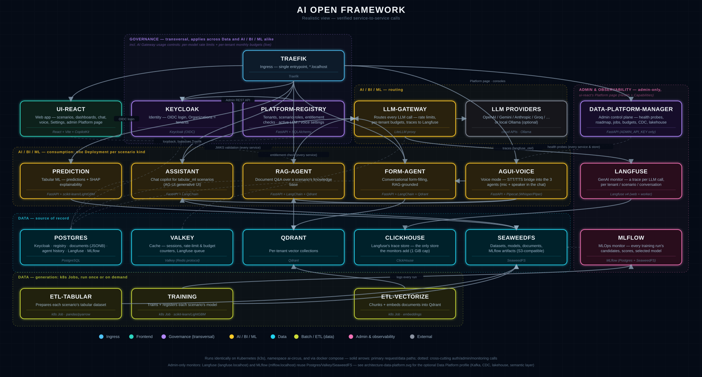
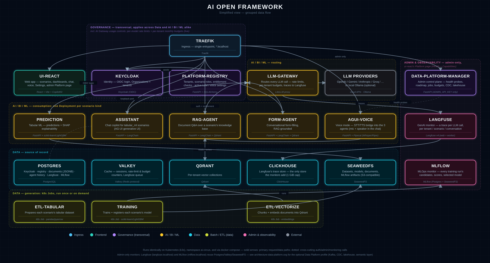
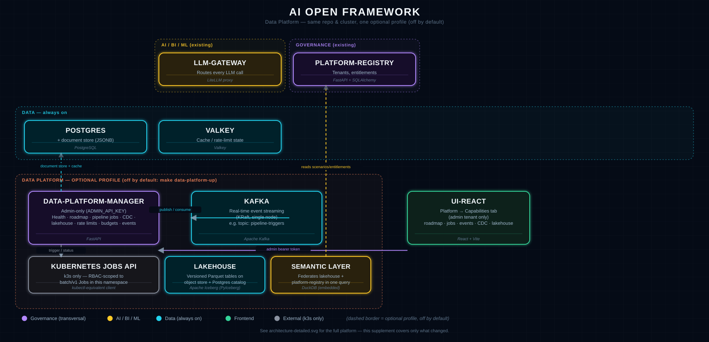

# AI Open Framework

> Formerly known as **ai-circus-framework**.

> **🚧 Work in progress.** This is a personal, evolving open-source project — architecture,
> scenarios, and UI are all still moving. Expect rough edges, and treat anything here as a
> snapshot rather than a finished product.

A scalable, multi-tenant microservices platform for building and demoing data-science and
GenAI **scenarios** (tabular ML dashboards, agentic RAG chatbots, assisted-form intake flows,
...) behind a real login.

<p align="center">
  
</p>

---

## Table of contents

- [Tour of the platform](#tour-of-the-platform)
- [Scenario catalog](#scenario-catalog)
- [Getting started](#getting-started)
- [Architecture](#architecture)
- [LLM providers](#llm-providers)
- [Adding a new scenario or service](#adding-a-new-scenario-or-service)
- [Testing & CI](#testing--ci)
- [Reserved for later](#reserved-for-later-documented-not-built)
- [Why this exists](#why-this-exists)
- [Contributing](#contributing)
- [Author & license](#author--license)

---

## Tour of the platform

### Login

A single branded entry point: **Keycloak**-managed sign-in for real users/organizations, or the
**admin key** shortcut for quick local demos — both resolve through the exact same identity path
on the backend, so nothing is a security bypass, just a different way in.

<p align="center"></p>

### Scenario gallery

Every scenario a tenant is entitled to, rendered generically from `scenarios/*/scenario.yaml` —
no per-scenario UI code. Tabular ML scenarios show their task type (classification/regression);
the conversational scenario shows up alongside them.

<p align="center"></p>

### Data

Dataset summary stats, a filterable/queryable row explorer, a build-your-own chart dashboard, and
credit for the original public dataset — all generated from the scenario's schema, not hand-built
per dataset.

<p align="center"></p>

### ML predictions & explainability

Run the live trained model on one record (or a batch), and see *why* it predicted what it did via
a real, per-prediction SHAP breakdown — plus global feature importance and partial-dependence
sweeps computed from live API calls, not precomputed synthetic charts.

<p align="center"></p>
<p align="center"></p>

### Settings & LLM providers

Every configured LLM provider's live routing status in one place, a per-provider **Test** button
(a real completion round-trip), and instant switching of the *active* model — the same screen
that makes step 3 of Getting Started concrete.

<p align="center"></p>

### Platform dashboard & monitors (admin)

Logged in as `admin`, a **Platform** button next to Settings opens a live health dashboard of
every microservice, store and monitor — up / degraded / down, probe latency, and (on k3s) each
pod's readiness and restart count, re-checked every 15 s — with one-click links to the admin
consoles: **Langfuse** (the GenAI monitor: every LLM call, per tenant/scenario/conversation),
**MLflow** (the MLOps monitor: every training run's candidates, scores and selected model),
Keycloak and the object store. See [Observability](#observability-admin-only) below.

### Themes

The whole app is skinned from one `Theme` object (colors + a logo, see `ui-react/src/themes/`) —
switching themes in **Settings → Appearance** is instant, no rebuild. Two ship today: **Tron**
(the neon dark default) and **White Tron**, the same blue/cyan branding on flat, light,
corporate-friendly surfaces.

### Conversational assistant

A real LangChain tool-calling agent, not a fixed "always retrieve" pipeline — it decides whether
a question needs retrieval at all, grounded in the scenario's own reference documents.

<p align="center"></p>

Inside any `tabular_ml` scenario, that same assistant is also wired to the live model via
**AG-UI** (CopilotKit) generative UI: it can call the real `prediction` API on your behalf and
render the result as an actual chart or sortable table in the chat — not markdown pasted into
prose — using the exact same Plotly/table components as the Data tab.

<p align="center">
  
</p>

### Assisted forms

A third scenario kind, alongside `tabular_ml` and `conversational_rag`: a generic form rendered
entirely from a scenario's `form:` config, paired with a chat assistant that can fill fields in
live as you describe your request in plain language — classifying it via RAG over a small
reference catalog, and highlighting which fields it just filled in versus what's still missing.
**Public Service Request Portal** (`service_request`) is the reference example: report a
streetlight outage, request an address registration, or apply for a permit, and watch the form
fill itself in as you type.

<p align="center">
  
</p>

---

## Scenario catalog

Three kinds of scenario exist today — adding a new one is a YAML file, never new UI or container
code (see [Adding a new scenario](#adding-a-new-scenario-or-service)).

| Scenario | Kind / task | What it predicts | Source |
|---|---|---|---|
| **Customer Churn Prediction** (`churn`) | `tabular_ml` — classification | Bank customer churn risk | Kaggle — Sonali Dasgupta |
| **Machine Predictive Maintenance** (`mpm`) | `tabular_ml` — classification | Industrial machine failure risk | Kaggle — AI4I 2020 |
| **Supply Chain Shipping ETA** (`supply_chain`) | `tabular_ml` — regression | Days to delivery | AWS SageMaker workshop (synthetic) |
| **Supermarket Weekly Sales** (`supermarket_sales`) | `tabular_ml` — regression | Weekly department sales | Kaggle — Walmart dataset |
| **Electric Motor Speed** (`electric_motor`) | `tabular_ml` — regression | Motor rotational speed (rpm) | Kaggle — Electric Motor Temperature |
| **Building Energy Consumption** (`energy_building`) | `tabular_ml` — regression | Appliance energy use (Wh) | UCI — Appliances Energy Prediction |
| **CNC Turning Surface Finish** (`cnc_surface_finish`) | `tabular_ml` — regression | Machined-part surface roughness (Ra) | Original content (synthetic, physically grounded) |
| **Steel Plate Defect Triage** (`steel_defects`) | `tabular_ml` — classification | Unrecognized optical-scan defect flag | UCI — Steel Plates Faults |
| **Turbofan Engine Remaining Useful Life** (`turbofan_rul`) | `tabular_ml` — regression | Jet engine RUL (operating cycles) | NASA C-MAPSS FD001 |
| **Regional Electricity Demand Forecasting** (`luznova_regional_demand`) | `tabular_ml` — regression | Daily electricity demand per region (MWh) — with a live Spain regional map tab | Original content (synthetic, real Spain geography) |
| **Gas Meter Anomaly Detection** (`luznova_gas_anomaly`) | `tabular_ml` — classification | Anomalous gas meter reading probability | Original content (synthetic, physically grounded) |
| **EV Charging Session Energy Prediction** (`luznova_ev_charging`) | `tabular_ml` — regression | Energy delivered per charging session (kWh) | Original content (synthetic, physically grounded) |
| **AI Open Framework Reference Guide** (`ai_circus_reference`) | `conversational_rag` | N/A — agentic Q&A over this project's own dev/ML/GenAI reference notes | Original content |
| **Public Service Request Portal** (`service_request`) | `assisted_form` | N/A — the assistant fills out and classifies a service-request form live, from conversation | Original content |

Most `tabular_ml` scenarios above are ported from a real public dataset — full credit/link lives in
each `scenarios/<slug>/scenario.yaml`'s `credits` field and is surfaced in the Data tab. A few
(`cnc_surface_finish` and the three `luznova_*` utility scenarios) are original content instead: a
physically-grounded synthetic generator (real geography/tariff structure, a designed formula, no
real customer data) rather than a ported dataset — each one's `scenario.yaml` discloses this, and
its generator script lives at `scripts/generate_<slug>.py`.

**One consolidated service instance serves every scenario of a given kind** — `prediction` and
`assistant` both load every `tabular_ml` scenario from the same running container, routed by a
`{scenario_slug}` path segment; `rag-agent` does the same for every `conversational_rag` scenario,
and `form-agent` does the same for every `assisted_form` scenario.

**Two scenarios carry an opt-in 5th workspace tab** (`ui_extras` in `scenario.yaml`, still no
per-scenario UI code — see below): `luznova_regional_demand`'s "Regional Map" tab batch-predicts
all 17 Comunidades Autónomas at once and plots them on a Spain bubble map; `mpm`'s "Live Plant" tab
simulates a fictional factory floor of machines ticking every few seconds, each scored by the same
unmodified `/predict/mpm`, with a client-side-only "Shut down" demo control.

---

## Getting started

### Prerequisites

- **Kubernetes (recommended)** — Docker, [`k3d`](https://k3d.io/#installation), `kubectl`, `make`.
- **Docker Compose (alternative)** — Docker + Docker Compose, `make`.
- **At least one LLM provider**, either way — a free API key (Google Gemini's free tier is
  easiest) *or* the bundled local Ollama fallback. Chat features simply won't answer without one.
- **To contribute** (not just run): `git-flow` (AVH), `uv`, Node.js 22 — all installed by step 0.

Already have all that? Skip to step 1. Otherwise step 0 provisions a fresh Ubuntu machine —
native, VM, or WSL2 — in a few minutes.

### 0. Provision the machine (fresh Ubuntu 24.04+ — native, VM, or WSL2)

**On Windows**, first enable WSL2 with an Ubuntu distro — steps 1–6 of
[`docs/windows-wsl.md`](docs/windows-wsl.md), including the `.wslconfig` RAM/CPU limits — and do
*everything* below inside that distro (its own filesystem, its own `git`; the doc explains why).
No Docker Desktop needed or wanted. The doc also covers the one WSL-specific chore that bites
later: the distro's virtual disk grows on the Windows drive and never shrinks by itself.

`git` is preinstalled on Ubuntu images (`sudo apt install -y git` if not); the setup scripts
live in the repo, so clone first:

```bash
mkdir -p ~/PROJECTS && cd ~/PROJECTS && git clone https://github.com/angelmtenor/ai-circus-framework && cd ai-circus-framework
```

Two idempotent, non-interactive scripts, split by privilege level — the **root half** (system
update; `make`, `git-flow`, `curl`, compilers, `python3`, `pipx`, UTC timezone) and the **user
half** (`uv`, `nvm` + Node.js 22, `~/.local/bin` on `PATH`, git defaults — it warns if
`user.name`/`user.email` are unset, so set those first):

```bash
sudo ./scripts/setup_sudo.sh
```

```bash
./scripts/setup_user.sh && source ~/.bashrc
```

**Docker Engine** is deliberately *not* in the scripts — install it from the official
[Install Docker Engine on Ubuntu](https://docs.docker.com/engine/install/ubuntu/) guide (apt
repository method), then the official
[post-install step](https://docs.docker.com/engine/install/linux-postinstall/#add-your-user-to-the-docker-group)
so every `make` target here can call `docker` without `sudo`:

```bash
sudo groupadd docker; sudo usermod -aG docker $USER
```

…and log out and back in (on WSL: `wsl --terminate <distro>` from PowerShell, then relaunch).

For the **Kubernetes (recommended)** path, add [`k3d`](https://k3d.io/#installation) and
[`kubectl`](https://kubernetes.io/docs/tasks/tools/install-kubectl-linux/):

```bash
curl -s https://raw.githubusercontent.com/k3d-io/k3d/main/install.sh | bash
```

```bash
curl -LO "https://dl.k8s.io/release/$(curl -L -s https://dl.k8s.io/release/stable.txt)/bin/linux/amd64/kubectl" && sudo install -o root -g root -m 0755 kubectl /usr/local/bin/kubectl && rm kubectl
```

Confirm the whole toolchain answers before moving on:

```bash
docker run --rm hello-world && docker compose version && make --version | head -1 && git flow version && uv --version && node --version && k3d version && kubectl version --client
```

### 1. Clone and bootstrap the environment

```bash
git clone https://github.com/angelmtenor/ai-circus-framework && cd ai-circus-framework   # skip if you did step 0
make bootstrap   # copies .env.example -> .env
```

Open the new `.env` — every setting has a comment explaining it. You don't need to touch most of
it to get a working demo; the two things that matter most (an LLM key, and which deployment path
below) are covered next.

### 2. Choose your LLM and set its API key — **this step is required**

`assistant` (tabular chat) and `rag-agent` (document Q&A) won't answer anything until one model
is actually reachable. Pick **one** of these:

| Option | What to do |
|---|---|
| **Cloud provider (recommended)** | Get a free API key from [Google AI Studio](https://aistudio.google.com/) (or OpenAI/Anthropic/DeepSeek/Groq/OpenRouter/Azure), paste it into `.env` as `GOOGLE_API_KEY=...`, and set `LLM_MODEL=gemini-flash`. See the [LLM providers](#llm-providers) table below for every option and its exact env var. |
| **No API key at all** | Run `make ollama-up` — starts a bundled, local, free Ollama container and pulls a small model automatically. Leave `LLM_MODEL=llama3` (the default). |

You can change your mind later from the app itself: **Settings → LLM Provider Settings** shows
every provider's live status and lets you switch the *active* model instantly, without a restart
(see the [Settings screenshot](#settings--llm-providers) above) — new keys still require editing
`.env` and restarting `llm-gateway`, though.

### 3. Start the platform

Two paths get you to the same app — pick one.

#### Kubernetes (recommended)

A local [k3d](https://k3d.io/) (k3s-in-Docker) cluster running the exact same stateless services,
via plain Kustomize manifests — see [`k8s/README.md`](k8s/README.md) for the full manifest
reference and design notes.

```bash
make k3s-cluster    # create the local k3d cluster (port 80, ./scenarios bind-mounted)
make k3s-build      # build every service image locally
make k3s-import     # import them into the cluster's containerd
make k3s-secrets    # generate k8s Secrets from .env/infra
make k3s-up         # kubectl apply -k k8s/base
make k3s-wait       # wait for every pod to actually be Ready
make k3s-verify     # curl-check the admin tenant end-to-end, same as `make verify` below
make k3s-pipeline   # optional: (re)runs the ETL -> training pipeline for the tabular_ml scenarios
```

Or run the first six of those (cluster through wait) in one shot: `make k3s-all`.

Not working the demo but staying in WSL? Pause the cluster's containers (frees CPU/RAM, keeps all
state) instead of tearing it down:

```bash
make k3s-pause      # stop the cluster — resume later with `make k3s-resume`
make k3s-resume     # start it back up
```

**Before opening the app in a browser**, start a standing port-forward — `platform-registry`'s
browser-facing API isn't reachable through Traefik or `k3s-verify`'s own (command-scoped)
port-forward:

```bash
kubectl -n ai-circus port-forward svc/platform-registry 8010:8000 &
```

Skipping this shows up as a client-side `Failed to fetch` right on the login screen even though
every other check passes — see [`k8s/README.md`](k8s/README.md)'s "Design notes" for why.

This is dev-parity, single-node only today (no registry — images are built locally and imported
straight into the cluster; no Helm chart, no multi-node/HA) — not yet a drop-in production
manifest set. It's still the recommended path because it's the same manifests you'd adapt for a
real cluster (remote k3s, managed cloud Kubernetes, OpenShift): `kubectl apply -k k8s/base`
already targets whatever `kubeconfig` context is active, local or not.

#### Docker Compose (alternative)

Simplest option for iterating on a single service without rebuilding into a cluster image each
time.

```bash
make up                              # every backend service + both UIs
make pipeline                        # (re)runs the ETL -> training pipeline for the tabular_ml scenarios
docker compose up --build etl-vectorize   # vectorizes every conversational_rag scenario's reference docs,
                                           # plus any assisted_form scenario's RAG catalog (e.g. service_request)
```

`make all` (infra + services + both pipelines + an end-to-end admin-tenant check) runs this whole
compose path in the right order for you, waiting for each container to actually be ready before
moving to the next — safe to re-run any time. If something's clearly broken (stale volumes,
half-applied `.env` change), `make reset-all` tears everything down — **including data in
postgres/keycloak/qdrant/seaweedfs** — and reruns `make all` from a clean slate.

### 4. Open the app

**[http://aiopen.localhost](http://aiopen.localhost)**

For a quick look without configuring an identity provider at all, use the login screen's **User**
dropdown: pick **admin** and enter the key from `.env`'s `ADMIN_API_KEY` (`angel2026` by
default) as the password — it comes pre-granted access to every scenario. For real
multi-user/multi-tenant login, see "First-time Keycloak setup" further down.

Logged in as `admin`, the topbar's **Platform** button is the health dashboard of every service
and store, with links to the monitors it also watches — **Langfuse** at
[http://langfuse.localhost](http://langfuse.localhost) (sign in with `.env`'s
`LANGFUSE_INIT_USER_EMAIL`/`LANGFUSE_INIT_USER_PASSWORD`) and **MLflow** at
[http://mlflow.localhost](http://mlflow.localhost) (the console Basic-Auth user from
`make bootstrap`, like `admin.keycloak.localhost`). Out of the box every one of these local
sign-ins shares the same demo password, `angel2026` — the `admin` API key, the Keycloak
bootstrap admin (`admin`) and realm owner user (`KEYCLOAK_OWNER_EMAIL`), Langfuse's initial user
(`LANGFUSE_INIT_USER_EMAIL`, same email) and the console Basic Auth (`admin`) — one credential to
remember locally, all rotated together for a [public deployment](#public-deployment). If you
bootstrapped `.env` before these existed, copy the `LANGFUSE_*`/`CLICKHOUSE_PASSWORD` block from
`.env.example` into it first — see [Observability](#observability-admin-only). Langfuse and
Keycloak only apply their `*_INIT_*`/bootstrap values on a first boot against an empty database,
so changing them in `.env` afterwards needs a `make reset-all` (or changing the password inside
that tool's own UI) to take effect.

The dropdown's other option, **demo engineering**, is the same bypass mechanism scoped to a
narrower demo tenant — entitled to only the three engineering scenarios (Predictive Maintenance,
Electric Motor Speed, Building Energy Consumption), not every scenario. Its key/password is
`.env`'s `ENGINEERING_DEMO_API_KEY` (`ai-circus-engineering-2026` by default; leave it blank to
disable this login option). It's provisioned automatically wherever `ADMIN_API_KEY` is — no
separate setup step — and `make verify` (part of `make all`) checks that it's scoped correctly:
entitled to exactly those three scenarios, and rejected (403) on any other. This is meant as a
template for adding your own narrower demo tenants: pick a name, an env var, and a scenario slug
set in `services/platform-registry/src/platform_registry/core/seed.py`'s
`ENGINEERING_DEMO_SCENARIOS`.

> **"Failed to fetch" after logging in?** That's the browser's network-level error, not an
> application error — it means a request never reached a server at all.
>
> **On Kubernetes**, this almost always means the standing `platform-registry` port-forward from
> step 3 above isn't running — see [`k8s/README.md`](k8s/README.md)'s "Design notes".
>
> **On Docker Compose**, run `make verify` (or just `make all` again) to pinpoint which service
> isn't answering; the most common causes are: (1) you tested right after `make up`, before every
> container was actually ready — `make all`/`make verify` wait for that, plain `docker compose up
> -d` doesn't; (2) `postgres-data` (or another) volume already existed from an earlier partial
> run, so its one-time init script never reran — `make reset-all` fixes this; (3) something else
> on the machine is already bound to port 80 (Traefik's entrypoint), 8010 (platform-registry), 6333
> (Qdrant), or 4000 (llm-gateway) — the latter three are loopback-only, for local non-Docker dev;
> (4) the app was opened via an origin other than `http://aiopen.localhost` (e.g. plain
> `http://localhost`) — every backend's CORS allow-list is keyed to that exact hostname.

Local (non-Docker) development: each generated service under `services/*/` has its own
`make run` — run it directly with `uv run` from inside that service's directory while the infra
containers stay up via `make up-infra`.

### First-time Keycloak setup

Both deployment paths bring up Keycloak already bootstrapped: `infra/keycloak/realm-export.json`
is loaded declaratively via `start --import-realm` on first boot, so the `ai-circus` realm,
the `organization`/`platform-backend` client scopes (Organization membership + Audience
mappers), and the `ui-react` SPA client all exist the moment the container is healthy — no
manual Admin Console click-through. `http://keycloak.localhost` is the sign-in page,
`http://admin.keycloak.localhost` the Admin Console (Basic-Auth-gated, same as before).

Two things the static realm export can't do for you:

1. **One-time, manual, via the Admin Console** (redo after any `make reset-all`, since it wipes
   Keycloak's own data): the M2M client (`KEYCLOAK_M2M_CLIENT_ID`/`SECRET` in `.env`) has no
   admin rights of its own — grant its service-account user the
   `manage-users`/`manage-organizations`/`manage-realm`/`manage-clients` realm-management client
   roles, signed in as the container's own bootstrap admin
   (`KEYCLOAK_ADMIN_USERNAME`/`KEYCLOAK_ADMIN_PASSWORD`). Nothing below works until this is done.
2. Real users, and the `scenario:<slug>` realm roles derived from `scenarios/*/scenario.yaml`,
   are one command:
   ```bash
   make -C services/platform-registry provision-owner-user
   ```
   Set `KEYCLOAK_OWNER_EMAIL`/`KEYCLOAK_OWNER_PASSWORD` in `.env` first. Idempotent — safe to
   re-run any time. It creates `scenario:<slug>` as plain realm roles for every scenario's
   `role_required` (Keycloak's Organizations API has no org-scoped role endpoint, so entitlement
   roles are assigned per-user, not per-organization-membership — a deliberate simplification, see
   `libs/shared`'s `auth.py` docstring), creates (or finds) an `owner` Organization and that
   Keycloak user, adds them to the Organization, assigns every `scenario:*` role directly to the
   user, and syncs the result into local `entitlements` — so signing in through Keycloak's hosted
   page with that email lands on every scenario, the same as the `ADMIN_API_KEY` bypass. For any
   *other* user/Organization you want scoped differently, do that one by hand in the Admin
   Console: add them to an Organization and assign only the `scenario:*` realm role(s) you want
   them entitled to — that assignment *is* what grants access to a scenario.

### Public deployment

Deploying this as-is to a public VM or behind a public minikube
Ingress is still just `make up` — there's no separate compose file or `up` variant — but it
needs a few `.env` values changed first, since `APP_ENVIRONMENT: docker` in
`docker-compose.yml` is identical for local dev and a real deployment and so can't be used to
tell them apart. (The same `.env` values apply if you adapt `k8s/base/` for a real cluster — but
see the Kubernetes step above: today's manifests are dev-parity/single-node only, not yet a
production-ready starting point on their own.)

1. Rotate (or blank, to disable the shortcut outright) `ADMIN_API_KEY`/
   `ENGINEERING_DEMO_API_KEY` away from their shipped demo values, and confirm
   `AUTH_DISABLED=false`.
2. Regenerate the Basic Auth credential Traefik puts in front of Keycloak's Admin Console and
   SeaweedFS's console — both are otherwise purely-administrative UIs, always reachable on the
   Traefik entrypoint (Keycloak's Admin Console in particular lets whoever holds the bootstrap
   admin credentials fully control the identity system, so it's gated even locally, just with a
   shipped demo credential you must rotate here):
   ```bash
   make generate-console-auth   # prints a one-time random password — save it, it isn't stored anywhere
   ```
   (Locally, `make generate-console-auth CONSOLE_PASSWORD=angel2026` reproduces the shipped
   demo credential instead — never do that for a public deployment.)
3. Set `DEPLOYMENT_TARGET=public` in `.env` — this arms every service's boot-time refusal to
   start if you missed step 1 (see `libs/shared/src/ai_circus_shared/deployment_guard.py`), so
   a mistake here is a startup crash with a clear message, not a silent hole.
4. `make check-public-ready` sanity-checks all three steps above without starting/stopping
   anything, then deploy with the usual `make up` (or `make all`).

SeaweedFS's S3 API route (as opposed to its console) is deliberately left without Basic Auth — see
the comment on its Traefik labels in `docker-compose.yml` for why.

---

## Architecture

Runs on a local Kubernetes (k3s/k3d) cluster, namespace `ai-circus` — the recommended path, see
[Getting started](#getting-started) — and identically via `docker compose up`: the same stateless,
env-configured microservices either way, just a different orchestrator.

The whole platform is built from two layers plus one cross-cutting concern, not three parallel
silos:

- **Data** — the source/generation layer: object/relational/non-relational/vector storage, the
  cache, and everything that produces or moves data (batch ETL, model training, event streaming,
  CDC, the lakehouse).
- **AI / BI / ML** — consumption, built on top of that data: the scenario-serving stack (tabular ML
  inference, the conversational/RAG and assisted-form agents, voice), the AI Gateway that routes
  every LLM call, and the semantic/BI query layer.
- **Governance** — transversal, not a third layer: identity/tenancy, ingress, and AI Gateway usage
  controls (rate limits, budgets) apply *across* both of the above.

`data-platform-manager`'s **Settings → Data Platform → Capability roadmap** is the live,
machine-readable version of this split (see `core/roadmap.py`) — which capabilities are live,
partial, or still planned, grouped exactly this way.

<p align="center">
  
</p>

Solid arrows are primary request/data paths; dotted arrows are cross-cutting auth/admin calls or
traffic leaving the cluster. Every scenario service independently validates the caller's token
against Keycloak and re-checks the entitlement with `platform-registry` — never just trusting
what the UI already filtered.

<details>
<summary>Simplified view — grouped data flow</summary>
<p align="center">
  
</p>
</details>

A tenant (Keycloak **Organization**, or the shared admin credential) only sees the scenarios its
members have been granted the matching `scenario:<slug>` role for — enforced both in the UI (what's
shown) and at each backend service's API (what's allowed).

### Foundations chosen for future SaaS scale

These are in place from day one — not deferred — because they're cheap to build correctly now and
expensive to retrofit once single-tenant assumptions are baked in.

- **Tenancy**: Keycloak **Organizations** model tenants; `scenario:*` entitlement roles are plain
  realm roles assigned per-user (Keycloak's Organizations API has no org-scoped role endpoint).
- **Object storage**: all datasets/models/documents live in **SeaweedFS** (S3-compatible), never on a
  service's local disk — keeps services stateless and horizontally scalable.
- **Scenario/entitlement registry**: `platform-registry` owns a Postgres schema
  (`tenants`/`scenarios`/`entitlements`); `scenarios/*.yaml` is only the human-editable seed
  format, not read directly by any other service.
- **Ingress**: **Traefik** is the only container reachable from outside the host — a 1:1 mapping
  onto a Kubernetes Ingress later. A few services additionally publish a **loopback-only** port
  (`platform-registry`, `qdrant`, `llm-gateway`) purely so services running outside Docker (local,
  non-container dev) can still reach them directly; none of those three has auth strong enough to
  be safe on Traefik's public entrypoint, so they must never gain a `traefik.enable=true` label.
- **`infra/{postgres,keycloak,qdrant,seaweedfs,traefik}/`**: reserved per-service config directories —
  `infra/postgres/` (a multi-database init script), `infra/keycloak/` (the declarative
  `realm-export.json` bootstrap), and `infra/seaweedfs/` (the generated S3 gateway credentials
  file) have content; the others' config is inline in `docker-compose.yml`
  (command args/env/labels) until each grows enough to warrant its own files.
- **Admin credential**: `ADMIN_API_KEY` (default `angel2026` — rotate before any real
  deployment) is a shared bearer token resolving to a fixed `admin` tenant, auto-granted access to
  *every* scenario `platform-registry` seeds — a real, auditable entitlement row, not a bypass of
  the entitlement check. `ENGINEERING_DEMO_API_KEY` is the same mechanism scoped to a narrower
  `engineering-demo` tenant, entitled to only the engineering scenarios — a template for adding
  more scoped demo tenants without touching Keycloak.

### Shared code

Every backend service is generated via real **cookiecutter** generation against
[`ai-circus-template`](https://github.com/angelmtenor/ai-circus-template) (see
`scripts/new_service.sh`), so each stays an independent `uv` project with its own
`pyproject.toml`/`uv.lock`/Dockerfile — no monorepo-wide uv workspace. That template is itself
built on the conventions from [`ai-circus`](https://github.com/angelmtenor/ai-circus), my
Python best-practices reference repo. Common code (Keycloak token validation, SeaweedFS client,
entitlement-check client, scenario schema, cache/document-store/event-streaming helpers) lives in
`libs/shared` (`ai-circus-shared`), added to each service as a local **non-editable** `uv` path
dependency.

### Data Platform (optional profile)

<p align="center">
  
</p>

Two more storage kinds — **Valkey** (cache/key-value; Redis itself is no longer OSI-licensed) and
a **document store** (Postgres JSONB, via `ai_circus_shared.document_store`) — round out the
tenant-scoped data layer and are **on by default**, same footprint class as Postgres/Qdrant.

A heavier tier sits behind its own **optional profile**, off by default so the base platform stays
laptop-sized: real-time event streaming (**Apache Kafka**, KRaft mode, no Zookeeper) plus a new
admin-only service, **`data-platform-manager`**, that exposes it —

```bash
make data-platform-up      # docker compose --profile data-platform up -d kafka
make k3s-data-platform-up  # kubectl apply -f k8s/data-platform/kafka.yaml (k3s target)
```

`data-platform-manager` (gated on `ADMIN_API_KEY`, never a Keycloak end-user token) is reachable
both as an API and from **Settings → Data Platform** in `ui-react` once logged in as `admin`:

- **Capability roadmap** — every capability across all three pillars ([Architecture](#architecture)
  above), grouped by Data / AI-BI-ML / Governance, live/partial/planned, read from the running
  service, not a static doc.
- **Pipeline job status/trigger** for `etl-tabular`/`training`/`etl-vectorize` — via the real
  Kubernetes Jobs API (RBAC-scoped to `batch/v1` Jobs only), so k3s only; in docker-compose, run
  `make pipeline` directly.
- **AI Gateway rate limits** — a read-only report of `litellm_config.yaml`'s per-model `rpm`/`tpm`
  ceilings.
- **Recent events** — every pipeline trigger is published to Kafka as well as recorded durably
  (Postgres); this panel reads the topic directly, proving the stream is real.
- **Change-Data-Capture** — a genuine Postgres logical-replication read (the built-in
  `test_decoding` output plugin, no extra extension/image needed — see
  `ai_circus_shared.cdc`) over the document store's own table, forwarded to Kafka on demand
  (`POST /cdc/poll`); this is a real WAL read, not the application re-publishing its own writes.
  On-demand rather than a background loop — see [Reserved for later](#reserved-for-later-documented-not-built).
- **Lakehouse Table Format** — real, versioned **Apache Iceberg** tables (`PyIceberg`) over the
  *existing* object store, no new stateful container: the catalog (table/schema/snapshot metadata)
  is a `SqlCatalog` in this service's own Postgres database, and the data files (Parquet + Iceberg
  JSON metadata) land in a new SeaweedFS bucket via Iceberg's own `S3FileIO`. `POST
  /lakehouse/ingest` snapshots the document store's demo collection into a table — every call
  appends a new snapshot rather than overwriting, so row/snapshot counts genuinely grow run over
  run (see `core/lakehouse.py`).
- **Semantic Modeling & Query Federation** — a small named catalog of business-friendly queries
  (`GET /semantic/views`), each run (`POST /semantic/views/{name}/query`) through an embedded
  **DuckDB** engine that federates two genuinely separate sources in one SQL statement, without
  copying either into a new store: the lakehouse's own Iceberg table (handed to DuckDB directly as
  an Arrow table) and `platform-registry`'s real `entitlements`/`scenarios` tables (a different
  service's Postgres database, reached over the same shared cluster credentials every service
  already has). `tenant_activity_360` is the one that actually federates both — per-tenant pipeline
  activity next to how many scenarios that tenant is entitled to, joined by `org_id` in a single
  query (see `core/semantic.py`).

**Try it** (k3s; see [Getting started > Kubernetes](#getting-started)): `make k3s-data-platform-up`,
then trigger the `churn` reference scenario's `etl-tabular` job from **Settings → Data Platform** —
the run shows up under **Pipeline jobs**, as a real Kafka message under **Recent events**, and
(once you click **Poll now**) as a captured row-level change under **Change-Data-Capture**. Click
**Ingest now** under **Lakehouse Table Format** to snapshot that same data into a real Iceberg
table — repeat it and watch the snapshot count climb. Then run any query under **Semantic Modeling
& Query Federation** to see it joined live against `platform-registry`'s real tenant data.

The roadmap panel above is the live source of truth for exactly what's built versus planned.

### Observability (admin-only)

Three admin-only monitors, always on (`k8s/base` and `docker-compose.yml` alike) and sized for a
single laptop — every new container carries `resources.limits`, and the stack reuses the Postgres,
Valkey and SeaweedFS the platform already runs instead of bringing its own:

| Monitor | What it shows | Where | Backed by |
| --- | --- | --- | --- |
| **Platform dashboard** | Health of every microservice / store / monitor: up, degraded, down, not deployed; probe latency; on k3s also pod readiness + restarts | `ui-react` → **Platform** (admin) | `data-platform-manager`'s admin-gated `GET /platform/status` (`core/platform_status.py`) probing each component over the cluster network, plus a read-only pod listing via RBAC |
| **GenAI monitor — Langfuse v4** | A trace per LLM call (prompt, completion, tokens, cost, latency), grouped into sessions per conversation, filterable by tenant (`org:<id>`), scenario (`scenario:<slug>`) and service | `http://langfuse.localhost` (Langfuse's own sign-in; user/password from `.env`'s `LANGFUSE_INIT_USER_*`) | `llm-gateway`'s LiteLLM `langfuse_otel` callback — switched on at start-up when `LANGFUSE_PUBLIC_KEY`/`LANGFUSE_SECRET_KEY` are set (`app.py`); the agent services attach tenant/scenario/thread as request `metadata` (`ai_circus_shared.observability.langfuse_request_metadata`). Stores: the shared Postgres (`langfuse` db), Valkey (`langfuse:` keys), SeaweedFS (`langfuse` bucket) and one new **ClickHouse** container (`k8s/base/langfuse.yaml`) |
| **MLOps monitor — MLflow** | One experiment per scenario, one run per tenant × training: every candidate's held-out score, the selected model, dataset size, `metadata.json`, and the SeaweedFS keys + checksums of the served artifacts | `http://mlflow.localhost` (behind the same `admin-basicauth` gate as the Keycloak/SeaweedFS consoles — MLflow has no auth of its own) | `training` mirrors each run when `MLFLOW_TRACKING_URI` is set (`core/mlflow_tracking.py`, never fails the job); the server is `infra/mlflow/Dockerfile` (official MLflow + Postgres driver + boto3), run metadata in the shared Postgres (`mlflow` db), artifacts in SeaweedFS (`mlflow` bucket) |

Because *every* LLM call in the system — `assistant`, `rag-agent`, `form-agent`, and voice
through `agui-voice` — goes through `llm-gateway`, one callback there covers every scenario kind;
no service links a Langfuse SDK. Langfuse v2's Postgres-only mode is end-of-life (Q1 2025), so
v4's ClickHouse is the one genuinely new store; it runs with a low-memory `config.d`
(`infra/clickhouse/`, mirrored in the k8s ConfigMap) and a 1 GiB cap. Existing Postgres volumes
get the two new databases created on first start by an idempotent init container, so a cluster
created before this needs no `make reset-all`.

**Keycloak SSO for Langfuse** and **prediction-time drift monitoring** (Langfuse and MLflow both
see training/inference *events*, not live feature distributions) are the natural next steps —
see [Reserved for later](#reserved-for-later-documented-not-built).

---

## LLM providers

`llm-gateway` execs the real **LiteLLM** proxy — every consumer (`assistant`, `rag-agent`,
`ui-react`) calls its OpenAI-compatible API by `model_name`, never a provider SDK directly (see
`services/llm-gateway/litellm_config.yaml` for the routing table).

| `model_name` | Provider | Key needed | Notes |
|---|---|---|---|
| `gemini-flash` | Google Gemini | `GOOGLE_API_KEY` | **Default free-tier pick** |
| `gpt-4o-mini` | OpenAI | `OPENAI_API_KEY` | |
| `claude-haiku` | Anthropic | `ANTHROPIC_API_KEY` | Fast/cheap Claude tier |
| `deepseek-chat` | DeepSeek | `DEEPSEEK_API_KEY` | |
| `groq-llama` | GroqCloud | `GROQ_API_KEY` | Free tier, very low latency |
| `openrouter` | OpenRouter | `OPENROUTER_API_KEY` | One key, many vendors |
| `azure-gpt4o` | Azure OpenAI | `AZURE_OPENAI_API_KEY` + `AZURE_OPENAI_API_BASE` | Also edit the `azure/<deployment>` line in `litellm_config.yaml` |
| `llama3` | Ollama (local) | none | **Optional**, off by default — see below |

`ollama` is **not started by `make up`** — it's a real container with real RAM/disk cost, gated
behind the `ollama` compose profile. `make ollama-up` starts it and pulls a small model
automatically on first run.

Runtime key *rotation* from the browser isn't possible (this deployment doesn't run LiteLLM's
DB-backed proxy mode) — a new key always means edit `.env`, then
`docker compose up -d llm-gateway`. Switching which *already-configured* provider is active,
though, is instant from **Settings**.

---

## Adding a new scenario or service

- **New backend service**: `make new-service NAME=my-service` — wraps real cookiecutter
  generation from `ai-circus-template`, wires in `libs/shared`, and adapts the Dockerfile for this
  repo's build-context conventions. Then add it to `docker-compose.yml`.
- **New scenario**: add `scenarios/<slug>/scenario.yaml` (see `churn`/`mpm` for `tabular_ml`,
  `ai_circus_reference` for `conversational_rag`, `service_request` for `assisted_form`) with a
  `chat:` block (`context` + `sample_questions`), restart `platform-registry` (it seeds on
  startup), and create the matching `scenario:<slug>` Keycloak realm role. **No new container, no UI code** — the existing
  `prediction`/`assistant`, `rag-agent`, or `form-agent` instance picks it up automatically, and
  `ui-react` renders its form/chat generically. An `assisted_form` scenario additionally needs a
  `form:` block (field catalog + validation rules) and, if it's RAG-classified like
  `service_request`, a `documents:`/`vector_store:` block for `etl-vectorize` to index.

## Testing & CI

Every backend service is an independent `ai-circus-template` project with its own QA stack — from
inside `services/<name>/`:

```bash
make check   # pre-commit (ruff, pyrefly, gitleaks, checkmake) + settings.yaml/data_model.py drift check + pytest
```

`make check-all` (from the repo root) runs this for every service in sequence. `ui-react` has its
own `npm run build` (type-checks via `tsc -b` then builds via Vite).

`.github/workflows/ci.yml` runs the same checks per service as a matrix job, builds `ui-react`,
and validates `docker-compose.yml`, on every push/PR to `main`/`develop`.

## Reserved for later (documented, not built)

A Helm chart (plain YAML + Kustomize exists instead — see
[Getting started > Kubernetes](#getting-started) and [`k8s/README.md`](k8s/README.md) — for local
dev-parity; Helm would only matter for a real multi-environment/production rollout), a
task queue for on-demand tenant-triggered jobs, cross-service distributed
tracing/OpenTelemetry beyond the LLM calls Langfuse already traces (see
[Observability](#observability-admin-only)), Keycloak SSO into Langfuse (today it has its own
seeded admin sign-in), prediction-time data/model drift monitoring (Evidently-style — `prediction`
doesn't log inference rows yet, so there is nothing to compare against training), evaluation
tooling (Opik/Giskard),
voice/multimodal agents (Pipecat), per-tenant billing/metering (AI Gateway *rate* limits are
built — see [Data Platform](#data-platform-optional-profile) — per-tenant *budgets* still need
litellm's DB-backed proxy mode), a background CDC loop (today's `POST /cdc/poll` is a real,
on-demand Postgres-to-Kafka change read — see [Data Platform](#data-platform-optional-profile) —
continuous polling is the natural next step, not a redesign), and (optional) extracting embedded
images out of uploaded PDFs in the chat attachment flow — today
`platform_registry.core.document_extraction` only pulls text/OCR out of a PDF, so a figure or
diagram embedded in an otherwise text-native page never reaches a vision-capable model. (The
AG-UI/CopilotKit runtime bridge for `ui-react`'s chat, a custom in-app admin screen, a shared cache
for multi-replica deployments, a real Postgres-to-Kafka change-data-capture feed, a lakehouse table
format over the object store, and a semantic-modeling/query-federation layer over both the
lakehouse and platform-registry's own Postgres tables, previously listed here, are built — see
`ChatPanel.tsx`/`chatGenerativeUi.tsx`, [Data Platform](#data-platform-optional-profile) (three
times), and `ai_circus_shared.cache` respectively.)

---

## Why this exists

I'm **Angel Martinez-Tenor** ([github.com/angelmtenor](https://github.com/angelmtenor)) — for
the last decade I've worked as a tech lead on data, analytics, ETL, ML, and GenAI projects
across many clients and industries. This repo is my attempt to distill that experience into
something open, reusable, and free for anyone to learn from or build on — the same way open
source has given a huge amount back to me over the years.

It's also an experiment in applying **vibe coding** to a methodology I've been refining and
teaching for a long time, not a methodology invented for this repo:

- **2017** — my first "agnostic" data-science project: one set of ML templates, reused across a
  wide variety of business scenarios instead of one-off notebooks per client.
- Later — building blocks for **AI ethics**: explainability (SHAP/LIME) and interval/uncertainty
  predictions as first-class citizens, not an afterthought bolted on at the end.
- Later — **GenAI** layered on top, with interactive dashboards for exploring models and data.
- **Now** — taking that same agnostic-scenario philosophy into agentic, tool-calling GenAI, with
  **AG-UI** (via CopilotKit) now wired end to end for `ui-react`'s chat — streaming replies and
  real generative UI (the chatbot renders live charts/tables, not just prose).

The constant across all of it: build **vendor-agnostic**, scenario-driven foundations, keep them
open source, and let the plumbing (auth, storage, ingress, entitlements) be boring and correct so
the interesting part — the ML/GenAI scenario itself — can be swapped freely. `ai-circus-framework`
is one concrete example of what that foundation looks like today: mostly Python on the backend,
and — new for this project — **vibe-coded** microservices for everything around it (identity
provider wiring, the React frontend, infra).

## Contributing

- [AGENTS.md](AGENTS.md) — mandates for AI-assisted and human contributions alike.
- [styleguide.md](styleguide.md) — commit message conventions (Conventional Commits).
- [docs/windows-wsl.md](docs/windows-wsl.md) — contributing (or just running the platform) from
  Windows via WSL2.

The flow, in short — git-flow per `AGENTS.md` §5:

1. Fork the repo, clone **your fork** (step 0 above provisions the toolchain), then once per
   clone: `git flow init -d` — it refuses on unstaged changes to tracked files, so run it before
   editing anything (on a fresh clone also `git branch --track develop origin/develop` first, or
   it creates `develop` from `main`).
2. `git flow feature start <name>` — branches from `develop`; commit with Conventional Commits.
3. Before opening a PR: `make check` inside every service you touched (`make check-all` from
   the root for cross-service changes), `npm run build` in `ui-react/` for frontend changes, and
   an actual `docker compose up` smoke test of the affected service(s) — CI's `compose-validate`
   never boots containers.
4. Push `feature/<name>` to your fork and open a pull request against **`develop`** (never
   `main`).

## Author & license

Created and maintained by **Angel Martinez-Tenor** —
[github.com/angelmtenor](https://github.com/angelmtenor).

Licensed under the [MIT License](LICENSE).

> **Disclaimer:** I am currently Head of Data & AI at Getronics. A separate, Getronics-branded
> fork of this framework is being developed there for production-grade use.
