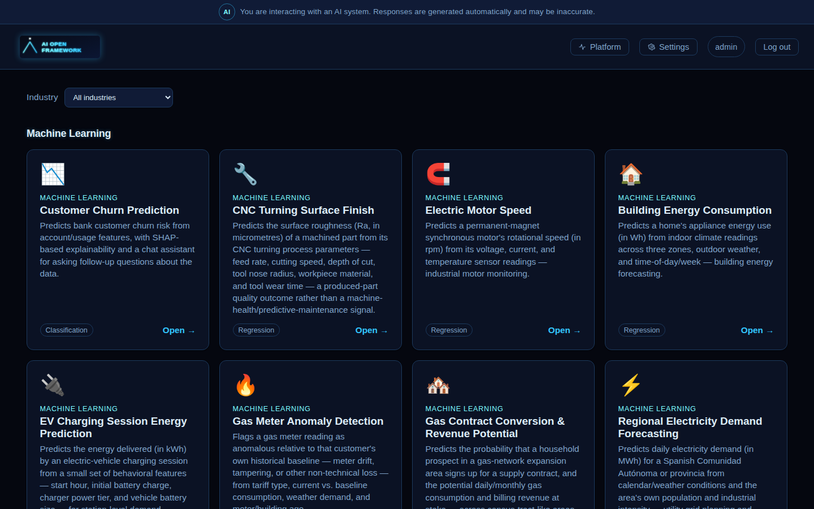
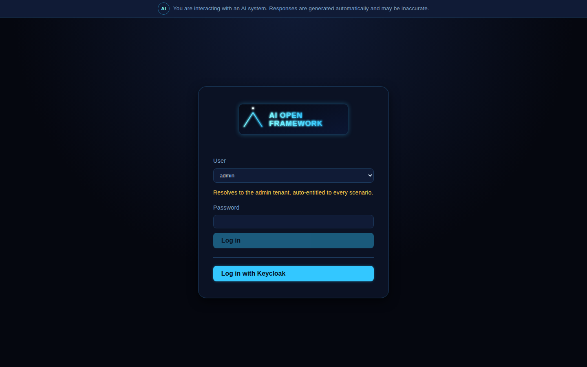
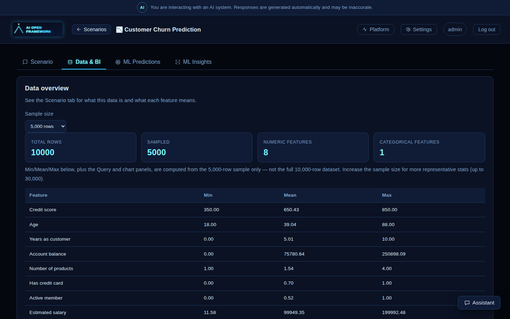
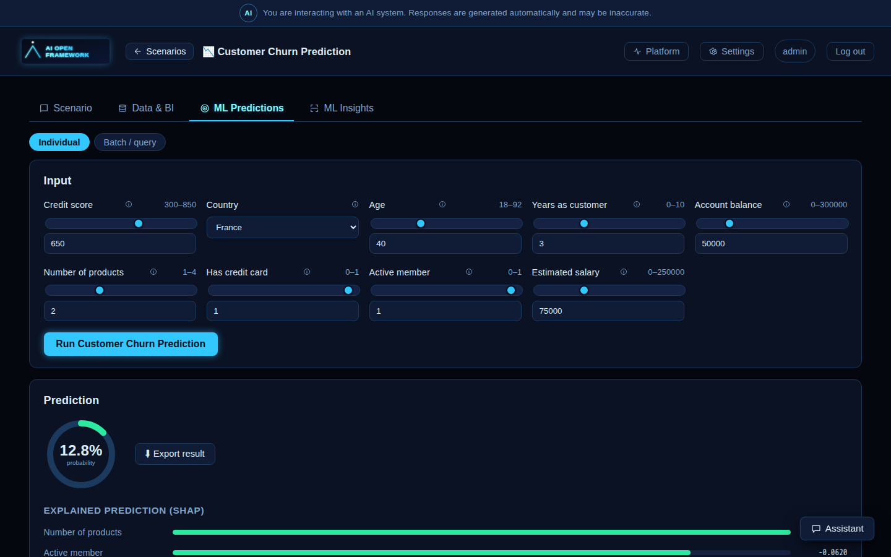
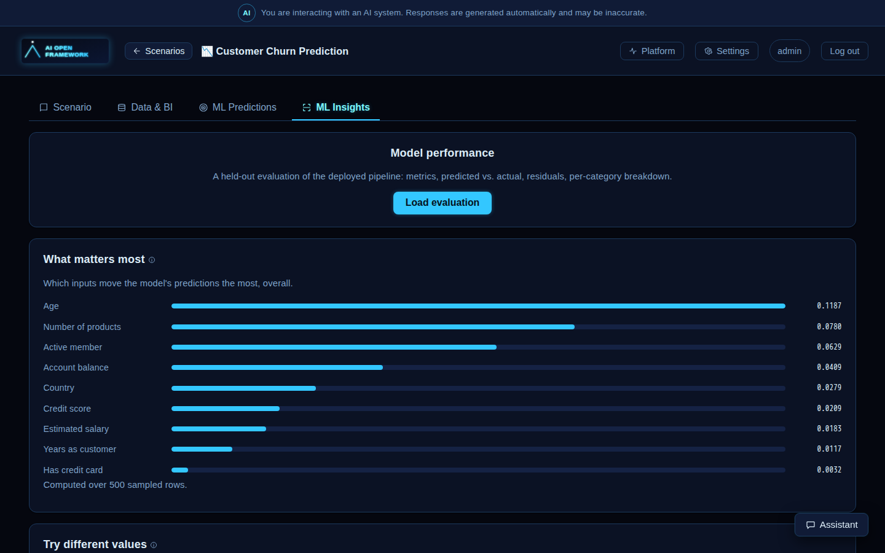
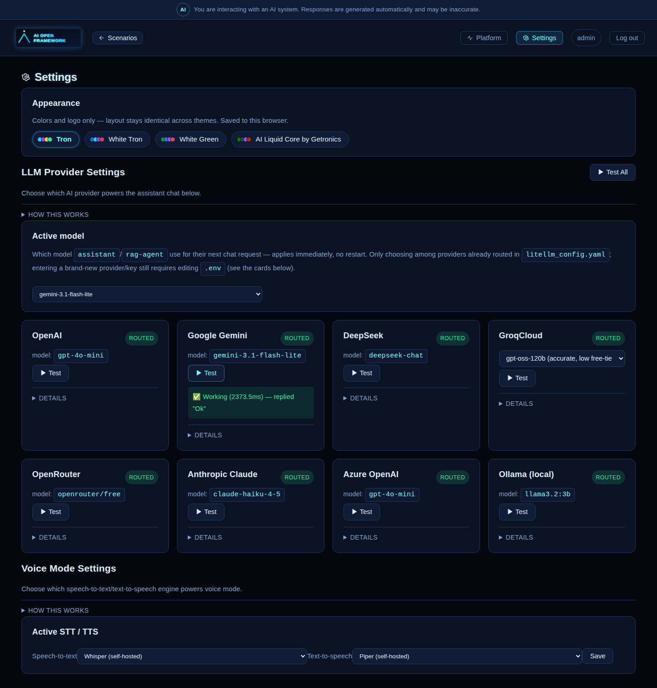
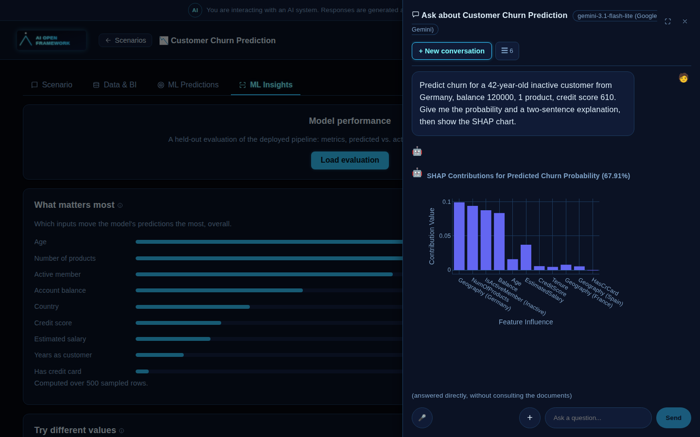
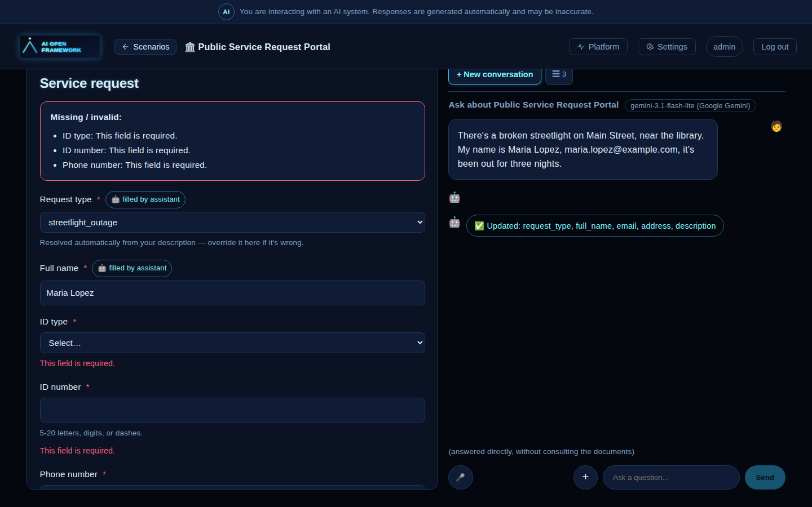
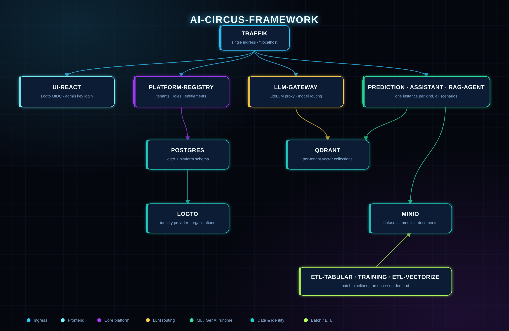

# ai-circus-framework

> **🚧 Work in progress.** This is a personal, evolving open-source project — architecture,
> scenarios, and UI are all still moving. Expect rough edges, and treat anything here as a
> snapshot rather than a finished product.

A scalable, multi-tenant microservices platform for building and demoing data-science and
GenAI **scenarios** (tabular ML dashboards, agentic RAG chatbots, assisted-form intake flows,
...) behind a real login.

<p align="center">
  
</p>

---

## Table of contents

- [Tour of the platform](#tour-of-the-platform)
- [Scenario catalog](#scenario-catalog)
- [Getting started](#getting-started)
- [Architecture](#architecture)
- [LLM providers](#llm-providers)
- [Adding a new scenario or service](#adding-a-new-scenario-or-service)
- [Testing & CI](#testing--ci)
- [Kubernetes path](#kubernetes-path-documented-not-yet-built)
- [Reserved for later](#reserved-for-later-documented-not-built)
- [Why this exists](#why-this-exists)
- [Contributing](#contributing)
- [Author & license](#author--license)

---

## Tour of the platform

### Login

A single branded entry point: **Logto**-managed sign-in for real users/organizations, or the
**admin key** shortcut for quick local demos — both resolve through the exact same identity path
on the backend, so nothing is a security bypass, just a different way in.

<p align="center"></p>

### Scenario gallery

Every scenario a tenant is entitled to, rendered generically from `scenarios/*/scenario.yaml` —
no per-scenario UI code. Tabular ML scenarios show their task type (classification/regression);
the conversational scenario shows up alongside them.

<p align="center"></p>

### Data

Dataset summary stats, a filterable/queryable row explorer, a build-your-own chart dashboard, and
credit for the original public dataset — all generated from the scenario's schema, not hand-built
per dataset.

<p align="center"></p>

### ML predictions & explainability

Run the live trained model on one record (or a batch), and see *why* it predicted what it did via
a real, per-prediction SHAP breakdown — plus global feature importance and partial-dependence
sweeps computed from live API calls, not precomputed synthetic charts.

<p align="center"></p>
<p align="center"></p>

### Settings & LLM providers

Every configured LLM provider's live routing status in one place, a per-provider **Test** button
(a real completion round-trip), and instant switching of the *active* model — the same screen
that makes step 3 of Getting Started concrete.

<p align="center"></p>

### Themes

The whole app is skinned from one `Theme` object (colors + a logo, see `ui-react/src/themes/`) —
switching themes in **Settings → Appearance** is instant, no rebuild. Two ship today: **Tron**
(the neon default) and **Getronics**, a light corporate theme built from Getronics' own public
brand palette.

<p align="center"></p>

> **Disclaimer:** I currently work at Getronics. I built the Getronics theme — using only
> public brand colors pulled from getronics.com's own published CSS, no confidential or internal
> material — to show what this kind of open-source foundation can look like when skinned for an
> enterprise. It's a personal demo, not an official Getronics product or endorsement. For
> enterprise-grade work along these lines, reach me at **angel.martinez-tenor@getronics.com**.

### Conversational assistant

A real LangChain tool-calling agent, not a fixed "always retrieve" pipeline — it decides whether
a question needs retrieval at all, grounded in the scenario's own reference documents.

<p align="center"></p>

Inside any `tabular_ml` scenario, that same assistant is also wired to the live model via
**AG-UI** (CopilotKit) generative UI: it can call the real `prediction` API on your behalf and
render the result as an actual chart or sortable table in the chat — not markdown pasted into
prose — using the exact same Plotly/table components as the Data tab.

<p align="center">
  
</p>

### Assisted forms

A third scenario kind, alongside `tabular_ml` and `conversational_rag`: a generic form rendered
entirely from a scenario's `form:` config, paired with a chat assistant that can fill fields in
live as you describe your request in plain language — classifying it via RAG over a small
reference catalog, and highlighting which fields it just filled in versus what's still missing.
**Public Service Request Portal** (`service_request`) is the reference example: report a
streetlight outage, request an address registration, or apply for a permit, and watch the form
fill itself in as you type.

<p align="center">
  
</p>

---

## Scenario catalog

Three kinds of scenario exist today — adding a new one is a YAML file, never new UI or container
code (see [Adding a new scenario](#adding-a-new-scenario-or-service)).

| Scenario | Kind / task | What it predicts | Source |
|---|---|---|---|
| **Customer Churn Prediction** (`churn`) | `tabular_ml` — classification | Bank customer churn risk | Kaggle — Sonali Dasgupta |
| **Machine Predictive Maintenance** (`mpm`) | `tabular_ml` — classification | Industrial machine failure risk | Kaggle — AI4I 2020 |
| **Supply Chain Shipping ETA** (`supply_chain`) | `tabular_ml` — regression | Days to delivery | AWS SageMaker workshop (synthetic) |
| **Supermarket Weekly Sales** (`supermarket_sales`) | `tabular_ml` — regression | Weekly department sales | Kaggle — Walmart dataset |
| **Electric Motor Speed** (`electric_motor`) | `tabular_ml` — regression | Motor rotational speed (rpm) | Kaggle — Electric Motor Temperature |
| **Building Energy Consumption** (`energy_building`) | `tabular_ml` — regression | Appliance energy use (Wh) | UCI — Appliances Energy Prediction |
| **AI Circus Reference Guide** (`ai_circus_reference`) | `conversational_rag` | N/A — agentic Q&A over this project's own dev/ML/GenAI reference notes | Original content |
| **Public Service Request Portal** (`service_request`) | `assisted_form` | N/A — the assistant fills out and classifies a service-request form live, from conversation | Original content |

Every `tabular_ml` scenario above is ported from a real public dataset rather than original
content — full credit/link lives in each `scenarios/<slug>/scenario.yaml`'s `credits` field and is
surfaced in the Data tab.

**One consolidated service instance serves every scenario of a given kind** — `prediction` and
`assistant` both load every `tabular_ml` scenario from the same running container, routed by a
`{scenario_slug}` path segment; `rag-agent` does the same for every `conversational_rag` scenario,
and `form-agent` does the same for every `assisted_form` scenario.

---

## Getting started

### Prerequisites

- Docker + Docker Compose
- `make`
- **At least one LLM provider** — a free API key (Google Gemini's free tier is easiest) *or* the
  bundled local Ollama fallback (see step 3 below). Chat features simply won't answer without one.

### The fast path

```bash
git clone <this-repo-url> && cd ai-circus-framework
make bootstrap   # copies .env.example -> .env — add an LLM key first if you have one (step 3 below)
make all         # infra + services + both pipelines + an end-to-end admin-tenant check
```

`make all` runs every step below in the right order, waits for each container to actually be
ready (not just started) before moving to the next, and finishes by curling the admin tenant
through the same path the browser's login screen uses — so a broken setup fails loudly here,
with logs to check, instead of as a "Failed to fetch" in the UI later. Safe to re-run any time.
If something's clearly broken (stale volumes, half-applied `.env` change), `make reset-all` tears
everything down — **including data in postgres/logto/qdrant/minio** — and reruns `make all` from a
clean slate; that's also the right thing to run before sharing this repo, to prove it boots clean.

The rest of this section is the same sequence broken into individual steps, useful if you want
finer control (e.g. iterating on one service without rebuilding everything).

### 1. Clone and bootstrap the environment

```bash
git clone <this-repo-url> && cd ai-circus-framework
make bootstrap   # copies .env.example -> .env
```

Open the new `.env` — every setting has a comment explaining it. You don't need to touch most of
it to get a working demo; the two things that matter most are covered next.

### 2. Start the platform infrastructure

```bash
make up-infra    # postgres, logto (identity), qdrant (vectors), minio (storage), traefik (ingress)
```

### 3. Choose your LLM and set its API key — **this step is required**

`assistant` (tabular chat) and `rag-agent` (document Q&A) won't answer anything until one model
is actually reachable. Pick **one** of these:

| Option | What to do |
|---|---|
| **Cloud provider (recommended)** | Get a free API key from [Google AI Studio](https://aistudio.google.com/) (or OpenAI/Anthropic/DeepSeek/Groq/OpenRouter/Azure), paste it into `.env` as `GOOGLE_API_KEY=...`, and set `LLM_MODEL=gemini-flash`. See the [LLM providers](#llm-providers) table below for every option and its exact env var. |
| **No API key at all** | Run `make ollama-up` — starts a bundled, local, free Ollama container and pulls a small model automatically. Leave `LLM_MODEL=llama3` (the default). |

You can change your mind later from the app itself: **Settings → LLM Provider Settings** shows
every provider's live status and lets you switch the *active* model instantly, without a restart
(see the [Settings screenshot](#settings--llm-providers) above) — new keys still require editing
`.env` and restarting `llm-gateway`, though.

### 4. Start everything else and load some data

```bash
make up                              # every backend service + both UIs
make pipeline                        # (re)runs the ETL -> training pipeline for the tabular_ml scenarios
docker compose up --build etl-vectorize   # vectorizes every conversational_rag scenario's reference docs,
                                           # plus any assisted_form scenario's RAG catalog (e.g. service_request)
```

### 5. Open the app

**[http://react.localhost](http://react.localhost)**

For a quick look without configuring an identity provider at all, use the login screen's **User**
dropdown: pick **admin** and enter the key from `.env`'s `ADMIN_API_KEY` (`ai-circus-2026` by
default) as the password — it comes pre-granted access to every scenario. For real
multi-user/multi-tenant login, see "First-time Logto setup" further down.

The dropdown's other option, **demo engineering**, is the same bypass mechanism scoped to a
narrower demo tenant — entitled to only the three engineering scenarios (Predictive Maintenance,
Electric Motor Speed, Building Energy Consumption), not every scenario. Its key/password is
`.env`'s `ENGINEERING_DEMO_API_KEY` (`ai-circus-engineering-2026` by default; leave it blank to
disable this login option). It's provisioned automatically wherever `ADMIN_API_KEY` is — no
separate setup step — and `make verify` (part of `make all`) checks that it's scoped correctly:
entitled to exactly those three scenarios, and rejected (403) on any other. This is meant as a
template for adding your own narrower demo tenants: pick a name, an env var, and a scenario slug
set in `services/platform-registry/src/platform_registry/core/seed.py`'s
`ENGINEERING_DEMO_SCENARIOS`.

> **"Failed to fetch" after logging in?** That's the browser's network-level error, not an
> application error — it means a request never reached a server at all. Run `make verify`
> (or just `make all` again) to pinpoint which service isn't answering; the most common causes
> are: (1) you tested right after `make up`, before every container was actually ready — `make
> all`/`make verify` wait for that, plain `docker compose up -d` doesn't; (2) `postgres-data` (or
> another) volume already existed from an earlier partial run, so its one-time init script never
> reran — `make reset-all` fixes this; (3) something else on the machine is already bound to port
> 80 (Traefik's entrypoint), 8010 (platform-registry), 6333 (Qdrant), or 4000 (llm-gateway) —
> the latter three are loopback-only, for local non-Docker dev; (4) the app was opened via an origin other
> than `http://react.localhost` (e.g. plain `http://localhost`) — every backend's CORS allow-list
> is keyed to that exact hostname.

Local (non-Docker) development: each generated service under `services/*/` has its own
`make run` — run it directly with `uv run` from inside that service's directory while the infra
containers stay up via `make up-infra`.

### First-time Logto setup

`make up-infra` brings up Logto at `http://logto.localhost` (sign-in) and
`http://admin.logto.localhost` (Admin Console). One-time, via the Admin Console:

1. Sign up as the Console's first user (this is what makes you the tenant owner), enable
   **Organizations**, then create a **Machine-to-Machine** application with Management API
   access — note its ID/secret for `LOGTO_M2M_APP_ID`/`LOGTO_M2M_APP_SECRET` in `.env`. This step
   is Console-only (no valid credential exists yet to script it) and must be redone any time
   Logto's own data is wiped, e.g. by `make reset-all`.
2. Under **Sign-in Experience**, upload your logo/colors — end users get this branded, hosted
   page; no custom login screen is built in this repo (managed auth over custom auth, on purpose).
3. Everything else — registering the `LOGTO_API_RESOURCE_INDICATOR` API resource, creating
   organization roles named `scenario:<slug>` for every `scenarios/*/scenario.yaml`'s
   `role_required`, and provisioning a real user — is now one command instead of manual Console
   clicking: set `LOGTO_OWNER_EMAIL`/`LOGTO_OWNER_PASSWORD` in `.env`, then
   ```bash
   make -C services/platform-registry provision-owner-user
   ```
   Idempotent — safe to re-run any time (e.g. after redoing step 1 post-reset). It creates (or
   finds) an `owner` Organization, creates (or finds) that Logto user, adds them to the
   Organization, assigns every `scenario:*` role, and syncs the result into local `entitlements`
   — so signing in through Logto's hosted page with that email lands on every scenario, the same
   as the `ADMIN_API_KEY` bypass. For any *other* user/Organization you want scoped differently,
   do that one by hand: add them to an Organization and assign only the `scenario:*` role(s) you
   want them entitled to — that assignment *is* what grants access to a scenario.

### Public deployment

Deploying this as-is to a public VM or behind a public minikube
Ingress is still just `make up` — there's no separate compose file or `up` variant — but it
needs a few `.env` values changed first, since `APP_ENVIRONMENT: docker` in
`docker-compose.yml` is identical for local dev and a real deployment and so can't be used to
tell them apart:

1. Rotate (or blank, to disable the shortcut outright) `ADMIN_API_KEY`/
   `ENGINEERING_DEMO_API_KEY` away from their shipped demo values, and confirm
   `AUTH_DISABLED=false`.
2. Regenerate the Basic Auth credential Traefik puts in front of Logto's Admin Console and
   MinIO's console — both are otherwise purely-administrative UIs, always reachable on the
   Traefik entrypoint (Logto's Admin Console in particular lets *whoever reaches it first*
   become the identity-system owner, so it's gated even locally, just with a shipped demo
   credential you must rotate here):
   ```bash
   make generate-console-auth   # prints a one-time password — save it, it isn't stored anywhere
   ```
3. Set `DEPLOYMENT_TARGET=public` in `.env` — this arms every service's boot-time refusal to
   start if you missed step 1 (see `libs/shared/src/ai_circus_shared/deployment_guard.py`), so
   a mistake here is a startup crash with a clear message, not a silent hole.
4. `make check-public-ready` sanity-checks all three steps above without starting/stopping
   anything, then deploy with the usual `make up` (or `make all`).

MinIO's S3 API route (as opposed to its console) is deliberately left without Basic Auth — see
the comment on its Traefik labels in `docker-compose.yml` for why.

---

## Architecture

<p align="center">
  
</p>

Runs today via `docker compose up`; designed — not yet built — to migrate to
minikube/Kubernetes later (see [Kubernetes path](#kubernetes-path-documented-not-yet-built)).

A tenant (Logto **Organization**, or the shared admin credential) only sees the scenarios its
members have been granted the matching `scenario:<slug>` role for — enforced both in the UI (what's
shown) and at each backend service's API (what's allowed).

### Foundations chosen for future SaaS scale

These are in place from day one — not deferred — because they're cheap to build correctly now and
expensive to retrofit once single-tenant assumptions are baked in.

- **Tenancy**: Logto **Organizations** model tenants; roles are assigned per-organization.
- **Object storage**: all datasets/models/documents live in **MinIO** (S3-compatible), never on a
  service's local disk — keeps services stateless and horizontally scalable.
- **Scenario/entitlement registry**: `platform-registry` owns a Postgres schema
  (`tenants`/`scenarios`/`entitlements`); `scenarios/*.yaml` is only the human-editable seed
  format, not read directly by any other service.
- **Ingress**: **Traefik** is the only container reachable from outside the host — a 1:1 mapping
  onto a Kubernetes Ingress later. A few services additionally publish a **loopback-only** port
  (`platform-registry`, `qdrant`, `llm-gateway`) purely so services running outside Docker (local,
  non-container dev) can still reach them directly; none of those three has auth strong enough to
  be safe on Traefik's public entrypoint, so they must never gain a `traefik.enable=true` label.
- **`infra/{postgres,logto,qdrant,minio,traefik}/`**: reserved per-service config directories —
  today only `infra/postgres/` has content (a multi-database init script); the others' config is
  inline in `docker-compose.yml` (command args/env/labels) until each grows enough to warrant its
  own files.
- **Admin credential**: `ADMIN_API_KEY` (default `ai-circus-2026` — rotate before any real
  deployment) is a shared bearer token resolving to a fixed `admin` tenant, auto-granted access to
  *every* scenario `platform-registry` seeds — a real, auditable entitlement row, not a bypass of
  the entitlement check. `ENGINEERING_DEMO_API_KEY` is the same mechanism scoped to a narrower
  `engineering-demo` tenant, entitled to only the engineering scenarios — a template for adding
  more scoped demo tenants without touching Logto.

### Shared code

Every backend service is generated via real **cookiecutter** generation against
[`ai-circus-template`](https://github.com/angelmtenor/ai-circus-template) (see
`scripts/new_service.sh`), so each stays an independent `uv` project with its own
`pyproject.toml`/`uv.lock`/Dockerfile — no monorepo-wide uv workspace. That template is itself
built on the conventions from [`ai-circus`](https://github.com/angelmtenor/ai-circus), my
Python best-practices reference repo. Common code (Logto token validation, MinIO client,
entitlement-check client, scenario schema) lives in `libs/shared` (`ai-circus-shared`), added to
each service as a local **non-editable** `uv` path dependency.

---

## LLM providers

`llm-gateway` execs the real **LiteLLM** proxy — every consumer (`assistant`, `rag-agent`,
`ui-react`) calls its OpenAI-compatible API by `model_name`, never a provider SDK directly (see
`services/llm-gateway/litellm_config.yaml` for the routing table).

| `model_name` | Provider | Key needed | Notes |
|---|---|---|---|
| `gemini-flash` | Google Gemini | `GOOGLE_API_KEY` | **Default free-tier pick** |
| `gpt-4o-mini` | OpenAI | `OPENAI_API_KEY` | |
| `claude-haiku` | Anthropic | `ANTHROPIC_API_KEY` | Fast/cheap Claude tier |
| `deepseek-chat` | DeepSeek | `DEEPSEEK_API_KEY` | |
| `groq-llama` | GroqCloud | `GROQ_API_KEY` | Free tier, very low latency |
| `openrouter` | OpenRouter | `OPENROUTER_API_KEY` | One key, many vendors |
| `azure-gpt4o` | Azure OpenAI | `AZURE_OPENAI_API_KEY` + `AZURE_OPENAI_API_BASE` | Also edit the `azure/<deployment>` line in `litellm_config.yaml` |
| `llama3` | Ollama (local) | none | **Optional**, off by default — see below |

`ollama` is **not started by `make up`** — it's a real container with real RAM/disk cost, gated
behind the `ollama` compose profile. `make ollama-up` starts it and pulls a small model
automatically on first run.

Runtime key *rotation* from the browser isn't possible (this deployment doesn't run LiteLLM's
DB-backed proxy mode) — a new key always means edit `.env`, then
`docker compose up -d llm-gateway`. Switching which *already-configured* provider is active,
though, is instant from **Settings**.

---

## Adding a new scenario or service

- **New backend service**: `make new-service NAME=my-service` — wraps real cookiecutter
  generation from `ai-circus-template`, wires in `libs/shared`, and adapts the Dockerfile for this
  repo's build-context conventions. Then add it to `docker-compose.yml`.
- **New scenario**: add `scenarios/<slug>/scenario.yaml` (see `churn`/`mpm` for `tabular_ml`,
  `ai_circus_reference` for `conversational_rag`, `service_request` for `assisted_form`) with a
  `chat:` block (`context` + `sample_questions`), restart `platform-registry` (it seeds on
  startup), and create the matching Logto role. **No new container, no UI code** — the existing
  `prediction`/`assistant`, `rag-agent`, or `form-agent` instance picks it up automatically, and
  `ui-react` renders its form/chat generically. An `assisted_form` scenario additionally needs a
  `form:` block (field catalog + validation rules) and, if it's RAG-classified like
  `service_request`, a `documents:`/`vector_store:` block for `etl-vectorize` to index.

## Testing & CI

Every backend service is an independent `ai-circus-template` project with its own QA stack — from
inside `services/<name>/`:

```bash
make check   # pre-commit (ruff, pyrefly, gitleaks, checkmake) + settings.yaml/data_model.py drift check + pytest
```

`make check-all` (from the repo root) runs this for every service in sequence. `ui-react` has its
own `npm run build` (type-checks via `tsc -b` then builds via Vite).

`.github/workflows/ci.yml` runs the same checks per service as a matrix job, builds `ui-react`,
and validates `docker-compose.yml`, on every push/PR to `main`/`develop`.

## Kubernetes path (documented, not yet built)

Every service already reads all config from env vars and is stateless (artifacts live in
MinIO/Qdrant/Postgres, never only on local disk) — the only piece that needs re-expressing for a
minikube/Kubernetes move is Traefik's Docker-label routing, which becomes Ingress resources (or a
Traefik Kubernetes CRD). No Helm chart exists yet.

## Reserved for later (documented, not built)

Kubernetes/Helm manifests, a custom in-app admin screen, a task queue for on-demand
tenant-triggered jobs, distributed tracing/OpenTelemetry, evaluation tooling (Opik/Giskard),
voice/multimodal agents (Pipecat), per-tenant billing/metering, and a shared cache (e.g. Redis)
for multi-replica deployments. (The AG-UI/CopilotKit runtime bridge for `ui-react`'s chat,
previously listed here, is built — see `ChatPanel.tsx`/`chatGenerativeUi.tsx`.)

---

## Why this exists

I'm **Angel Martinez-Tenor** ([github.com/angelmtenor](https://github.com/angelmtenor)) — for
the last decade I've worked as a tech lead on data, analytics, ETL, ML, and GenAI projects
across many clients and industries. This repo is my attempt to distill that experience into
something open, reusable, and free for anyone to learn from or build on — the same way open
source has given a huge amount back to me over the years.

It's also an experiment in applying **vibe coding** to a methodology I've been refining and
teaching for a long time, not a methodology invented for this repo:

- **2017** — my first "agnostic" data-science project: one set of ML templates, reused across a
  wide variety of business scenarios instead of one-off notebooks per client.
- Later — building blocks for **AI ethics**: explainability (SHAP/LIME) and interval/uncertainty
  predictions as first-class citizens, not an afterthought bolted on at the end.
- Later — **GenAI** layered on top, with interactive dashboards for exploring models and data.
- **Now** — taking that same agnostic-scenario philosophy into agentic, tool-calling GenAI, with
  **AG-UI** (via CopilotKit) now wired end to end for `ui-react`'s chat — streaming replies and
  real generative UI (the chatbot renders live charts/tables, not just prose).

The constant across all of it: build **vendor-agnostic**, scenario-driven foundations, keep them
open source, and let the plumbing (auth, storage, ingress, entitlements) be boring and correct so
the interesting part — the ML/GenAI scenario itself — can be swapped freely. `ai-circus-framework`
is one concrete example of what that foundation looks like today: mostly Python on the backend,
and — new for this project — **vibe-coded** microservices for everything around it (identity
provider wiring, the React frontend, infra).

## Contributing

- [AGENTS.md](AGENTS.md) — mandates for AI-assisted and human contributions alike.
- [styleguide.md](styleguide.md) — commit message conventions (Conventional Commits).

## Author & license

Created and maintained by **Angel Martinez-Tenor** —
[github.com/angelmtenor](https://github.com/angelmtenor).

Licensed under the [MIT License](LICENSE).
