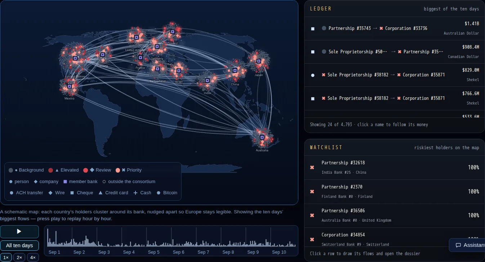
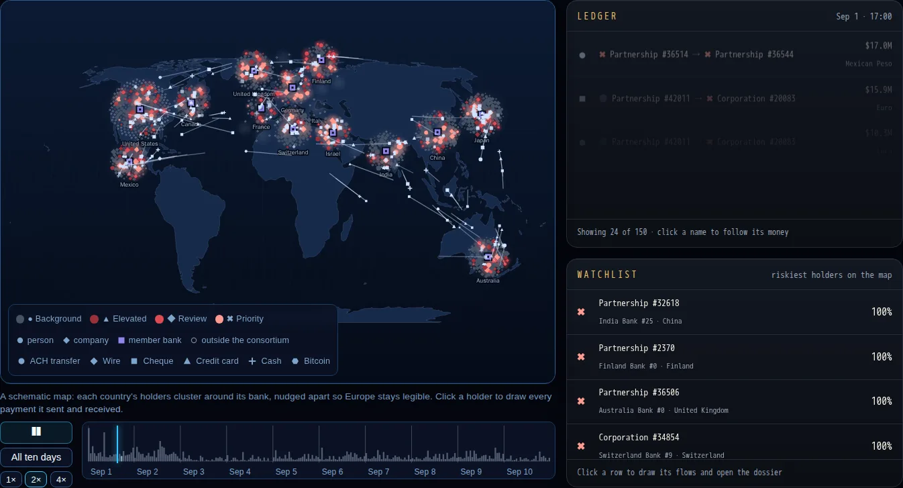
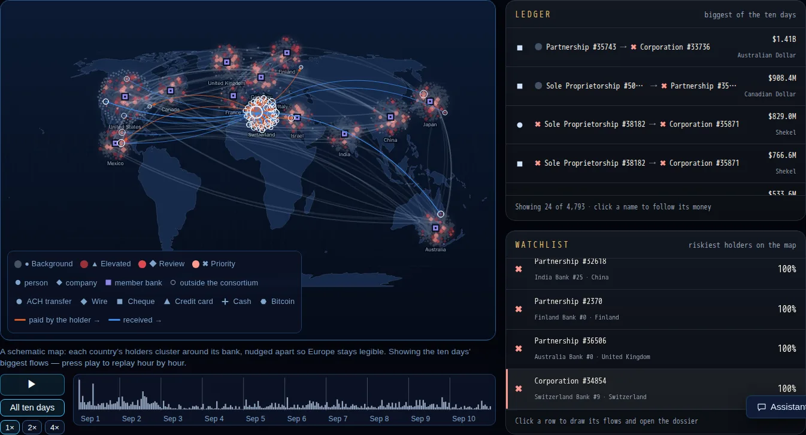
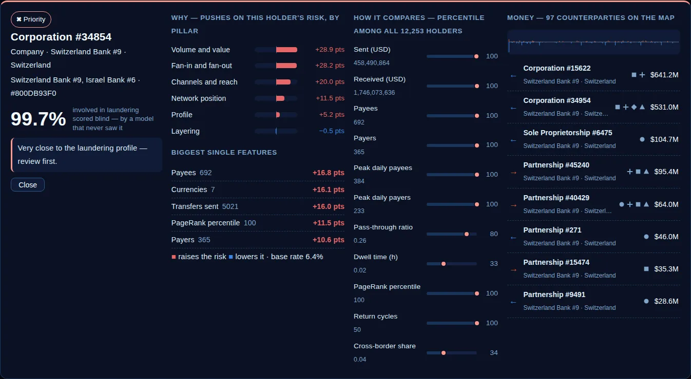
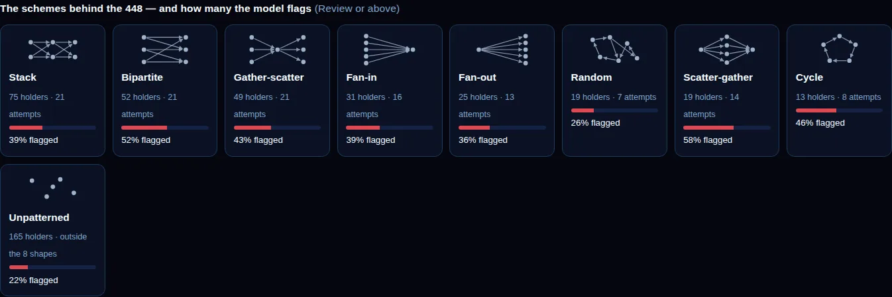
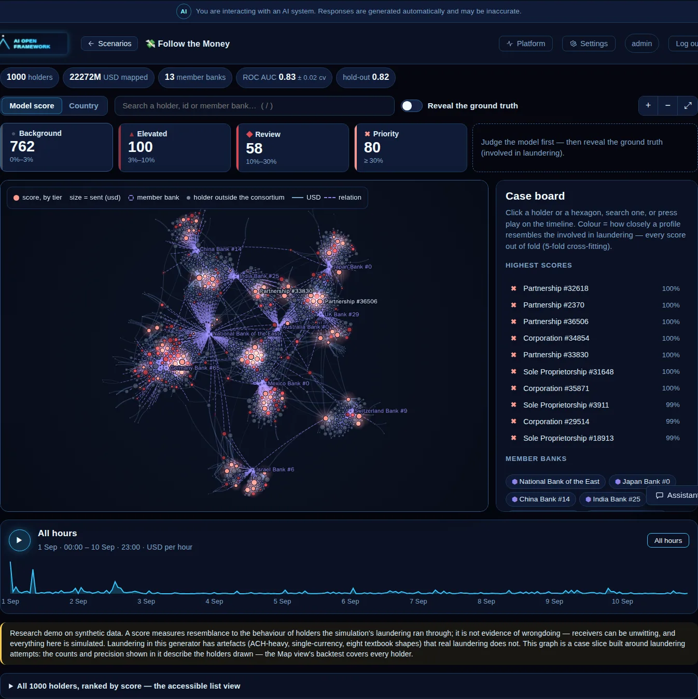

# 💸 Follow the Money — transaction monitoring for a bank consortium

> Domain: **Banking & finance** · Kind: `tabular_ml` (binary classification + a network) · Scenario: [`scenarios/aml_money_trail/scenario.yaml`](../../scenarios/aml_money_trail/scenario.yaml)

Money laundering hides in the *shape* of payments: a burst of payees, a stack of pass-through
accounts, money that comes back where it started. A single bank sees only its own side of the
picture. This scenario plays the role of an **inter-bank monitoring utility** shared by 13 member
banks: from ten days of payments between **people and companies** it asks a model which account
holders behave like the ones a laundering scheme runs through — and why — and draws the money
hopping between banks on a world map.

It is deliberately **not** the [Enron case](enron_fraud_network.md): there, a few real insiders
and a corporate scandal; here, thousands of simulated holders, payment flows across 33 countries
and a labelled world in which the laundering schemes are known.

<p align="center">
  
</p>
<p align="center"><sub>Every glowing mark is an account holder — a circle for a person, a diamond for a company — scored by a model that never saw its own label; arcs are the ten days' biggest payments.</sub></p>

| | |
|---|---|
| **Question** | From how an account holder moved money over ten days — how much, how fast, to and from how many parties, through which formats and countries — how closely does it resemble the holders laundering ran through? |
| **Data** | IBM **AMLworld HI-Small** — a *synthetic* world of individuals, companies and banks with every transfer labelled (Altman et al., NeurIPS 2023, CDLA-Sharing-1.0). See [the data README](../../scenarios/aml_money_trail/sample_data/README.md) |
| **Rows** | 12,253 holders with an account at one of 13 member banks (4,101 sole proprietorships, 4,189 partnerships, 3,941 corporations, 22 individuals) |
| **Label** | Involved in ≥ 1 laundering transfer the consortium can see — **448 holders (3.7 %)**; involvement, not guilt (receivers can be unwitting mules) |
| **Inputs** | 28 behaviour features: holder type, accounts/banks/countries, transfers and USD in/out, pass-through ratio, dwell time, payees/payers, peak daily fan-in/fan-out, reciprocity, payment-format mix, cross-border share, night share, PageRank, 3-hop return cycles |
| **Model** | LightGBM, selected over logistic regression by cross-validated ROC AUC |
| **5-fold CV ROC AUC** | **0.83** on the training split (hold-out 0.82); **0.84 ± 0.015** over repeated CV of all rows, ≈ 0.81 without the payment-format mix; PR AUC ≈ 0.31 (≈ 8× the 3.7 % base rate) |
| **Out of fold, all 12,253** | ROC AUC **0.841**: every holder scored by a model that never saw its own outcome. *Review* tier and above (≥ 10 %): 462 holders, 34 % of them involved, 35 % of all positives; *Priority* (≥ 30 %): 167 holders, 54 % involved |
| **Tabs** | Scenario · Data & BI · ML Predictions · ML Insights · **Money Trail** (a **World map** and a **Network graph** view of the same scored network) |
| **New platform capabilities** | The generic `money_trail` tab, **hourly periods** (`YYYY-MM-DDTHH`) in a scenario's network, and the Enron network explorer reused as its second view |

## The Money Trail tab

Two views of the same scored network, switched at the top of the tab: the **World map** (below) and the
[**Network graph**](#the-network-graph-view) — the same force-directed link-analysis board as the
[Enron case](enron_fraud_network.md).

### World map

A world map with each country's holders clustered around its member bank (a schematic — the clusters
are nudged apart so Europe stays legible).

| On the map | Meaning |
|---|---|
| **Circles / diamonds** | Holders: a circle is a *person* (individual or sole proprietorship), a diamond a *company* (corporation or partnership). Colour = risk tier on a validated one-hue red ramp (Background → Elevated → Review → Priority), scored by a model that never saw the holder's own label; size = USD sent |
| **Violet squares** | The 13 member banks |
| **Hollow grey rings** | Holders *outside* the consortium — counterparties the utility sees only because a payment touches a member bank |
| **Particles** | While playing, one particle per payment hopping from payer to payee, hour by hour over 1–10 September 2022. **Its shape is the payment format** — ● ACH, ◆ wire, ■ cheque, ▲ card, ✚ cash, ⬢ Bitcoin — so nothing rests on colour alone |
| **Arcs** | Paused, the hour's payments as static arcs; on "All ten days", the biggest flows overall |

<p align="center">
  
</p>
<p align="center"><sub>Replaying hour by hour: every payment is a mark hopping payer → payee; its shape is the payment format.</sub></p>

- **Ledger** — the hour's biggest payments (payer → payee, format, USD, currency); click a name to follow its money.
- **Watchlist** — the riskiest holders on the map; click one to open its dossier.
- **Dossier** — every payment it sent (orange, arrowed) and received (blue) is drawn on the map; SHAP
  rolled into six pillars (profile, volume and value, layering, fan-in and fan-out, channels and
  reach, network position), the biggest single features, its percentile on 11 features among all
  12,253 holders, its counterparties, and an hour-by-hour strip of dollars sent and received.
<p align="center">
  
</p>
<p align="center"><sub>Following one holder: orange arcs are payments it sent, blue ones payments it received.</sub></p>

<p align="center">
  
</p>

- **Reveal what happened** — outlines every holder that was really involved (solid = the model flagged
  it at *Review* or above, dashed = missed), and opens the **typology gallery**: the eight schemes the
  generator planted (fan-out, fan-in, cycle, bipartite, scatter-gather, gather-scatter, stack,
  random) with how many holders each has and how many the model flags. Click a scheme to light it
  up on the map; select a holder and its whole scheme is outlined in gold.

<p align="center">
  
</p>
<p align="center"><sub>After the reveal: the schemes the generator planted and how many holders of each the model flags (Review tier or above).</sub></p>

### The Network graph view

The Enron network explorer, fed with the payment network: every holder a glowing node (colour = risk tier,
size = USD sent), the 13 member banks as violet hexagons joined to the holders that hold accounts there,
holders outside the consortium as small grey dots, and a line per pair of holders that paid each other
(the six payment formats merged into one edge, its label listing the biggest formats). It keeps everything
the explorer offers — search, tracing the shortest path between two holders, colouring by **country** as
communities, the case board of the highest scores, the SHAP dossier by pillar, the **hour-by-hour replay**
of the ten days and a **ground-truth reveal** (solid rings = flagged, dashed = missed).

<p align="center">
  
</p>
<p align="center"><sub>The same scored network as a graph: each bank is the hub of its account holders; red halos are the holders the model scores highest.</sub></p>

The graph is a **case slice** (1,000 holders built around laundering attempts), so its tier counters and
backtest describe the holders drawn — 17 % of them are positive against 3.7 % overall. The World map's
backtest covers all 12,253 holders.

## What a score is — and is not

A score is *resemblance to the behaviour of holders involved in laundering*. It is a case for an
analyst to review, never a conclusion: receivers can be unwitting, and everything here is
simulated. Three properties of the data are stated on the tab and in the chat context:

1. **Generator artefacts.** ~87 % of laundering transfers go by ACH against 12 % of all transfers,
   laundering never changes currency, and the schemes follow eight textbook shapes. The AUC is a
   property of this simulation, not of what a real bank would achieve.
2. **A partial view.** The consortium sees only transfers that touch a member bank. 440 more holders
   launder only through transfers it cannot see and are labelled clean.
3. **A small base rate.** 3.7 % positives: a 20 % probability is already a strong outlier, so the
   review tiers are set from the out-of-fold scores, not from 50 %.

## The data science

Behaviour alone (dwell time, fan-in/fan-out, pass-through, bursts) reaches ROC AUC ≈ 0.76; the
payment-format mix adds ≈ 0.03; network position alone ≈ 0.65. Every feature is label-free — the
data script prints each one's single-feature AUC (the best is 0.685) to catch leaks — and
transfers dated after 10 September were dropped because the generator's tail is 59 % laundering
and would leak the label through timing. Full table in the
[data README](../../scenarios/aml_money_trail/sample_data/README.md).

## How it is built

- **Data**: `scripts/prepare_aml_money_trail_dataset.py` (sources pinned by SHA-256) writes the
  CSV and the network `aml_money_trail_network.json` (`ai_circus_shared.network_graph`, now with
  hourly periods): banks as `entity` nodes, holders as `row`/`context` nodes, one flow edge per
  payer, payee and payment format carrying USD per hour.
- **Schema**: `MoneyTrailExtra` in `libs/shared/.../scenario_schema.py` — flows, countries, tiers,
  pillars, holder-type feature, typology and case columns — validated (network, out-of-fold
  scores, real columns) like the other tabular showpieces.
- **Serving**: unchanged — etl-tabular restricts the graph to the cleaned rows, prediction serves
  `GET /graph/{slug}` and `GET /model/{slug}/out-of-fold` (probabilities only above 5,000 rows;
  the dossier's SHAP comes from a live `/predict`).
- **UI**: `ui-react/src/MoneyTrailView.tsx` (the single generic renderer; the scenario supplies
  only wording; its **Network graph** view is `NetworkExplorerView` fed with a config derived by
  `networkExplorerExtras()` — payment formats merged per pair by `mergeFlowKinds()`, hourly period labels
  and ticks, and only the rows the graph draws), `moneyTrailScene.ts` (canvas map, particles, hit-testing; the pixel ratio drops
  to 1 on slow software canvases) and `moneyTrailModel.ts` (pure functions).

## Run it yourself

```bash
cd services/training && uv run python ../../scripts/prepare_aml_money_trail_dataset.py --diagnostics --ablation
make k3s-build k3s-import   # the scenario is read by every tabular service: rebuild them together
make k3s-pipeline           # etl-tabular -> training Jobs for the new scenario
```

Then open the app as admin, pick **Follow the Money** under *Banking & finance* and press play on
the **Money Trail** tab.

## Credits

Altman, Egressy, Blanuša, Atasu — *Realistic Synthetic Financial Transactions for Anti-Money
Laundering Models*, NeurIPS 2023 ([arXiv:2306.16424](https://arxiv.org/abs/2306.16424)); IBM
AMLworld data under the Community Data License Agreement – Sharing 1.0. Every holder and bank in
the tab is generated; none refers to a real person or company.
