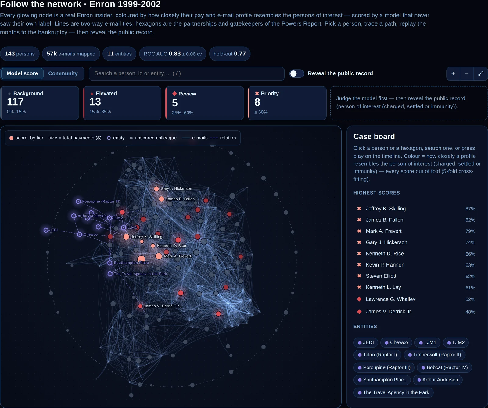
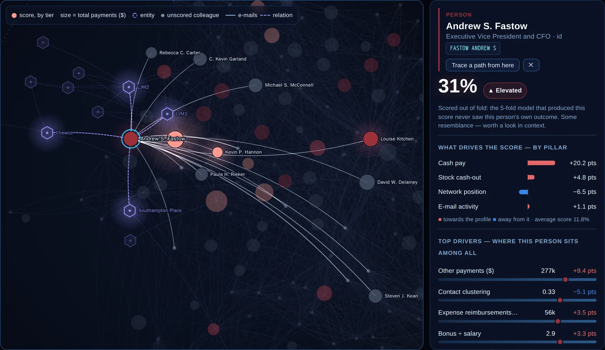
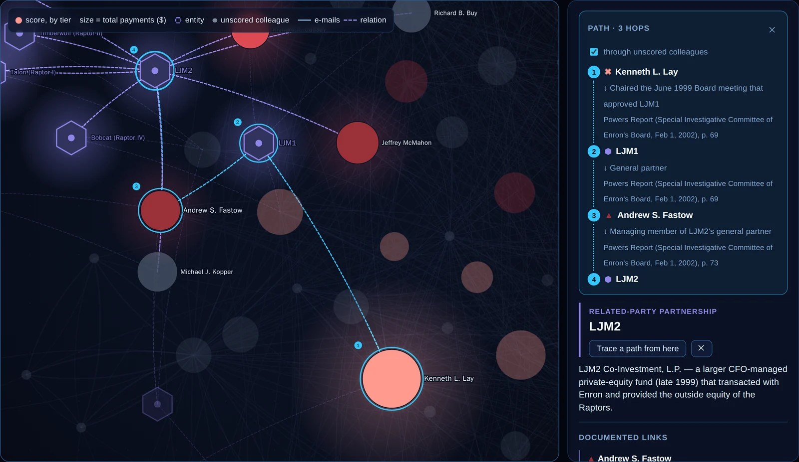
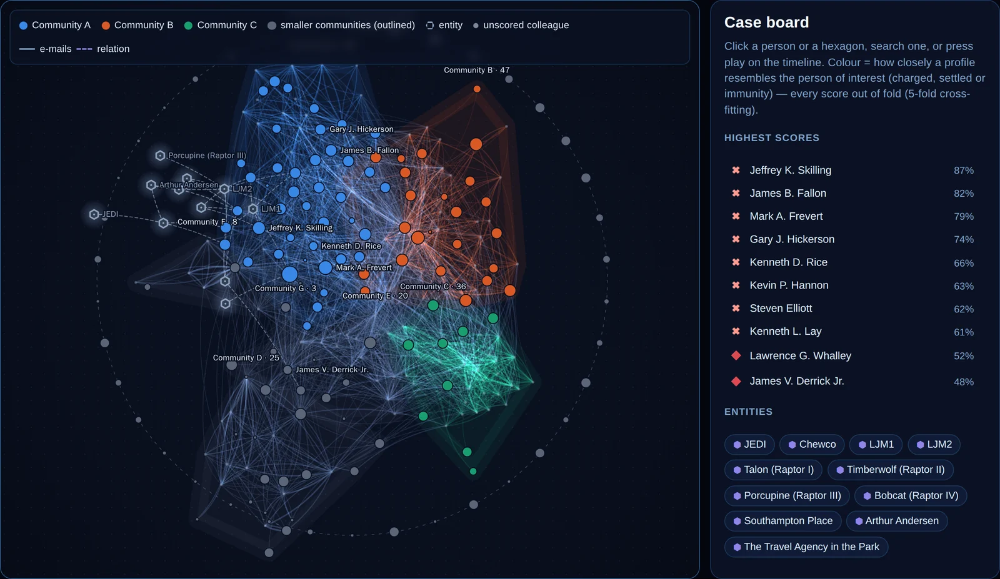
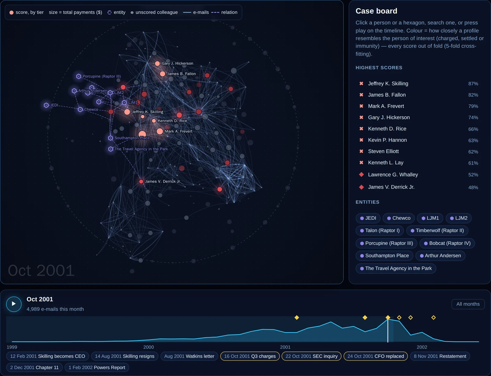
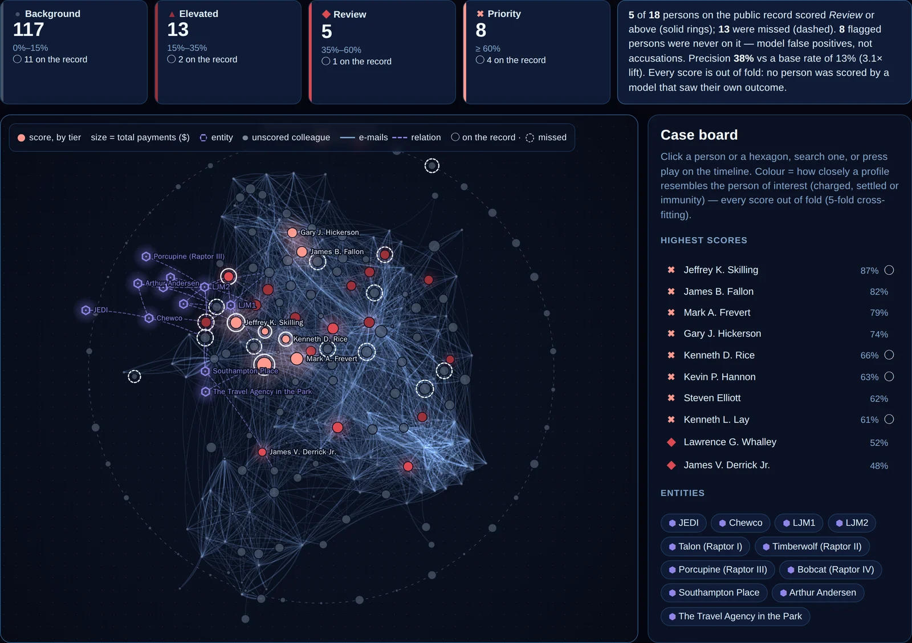
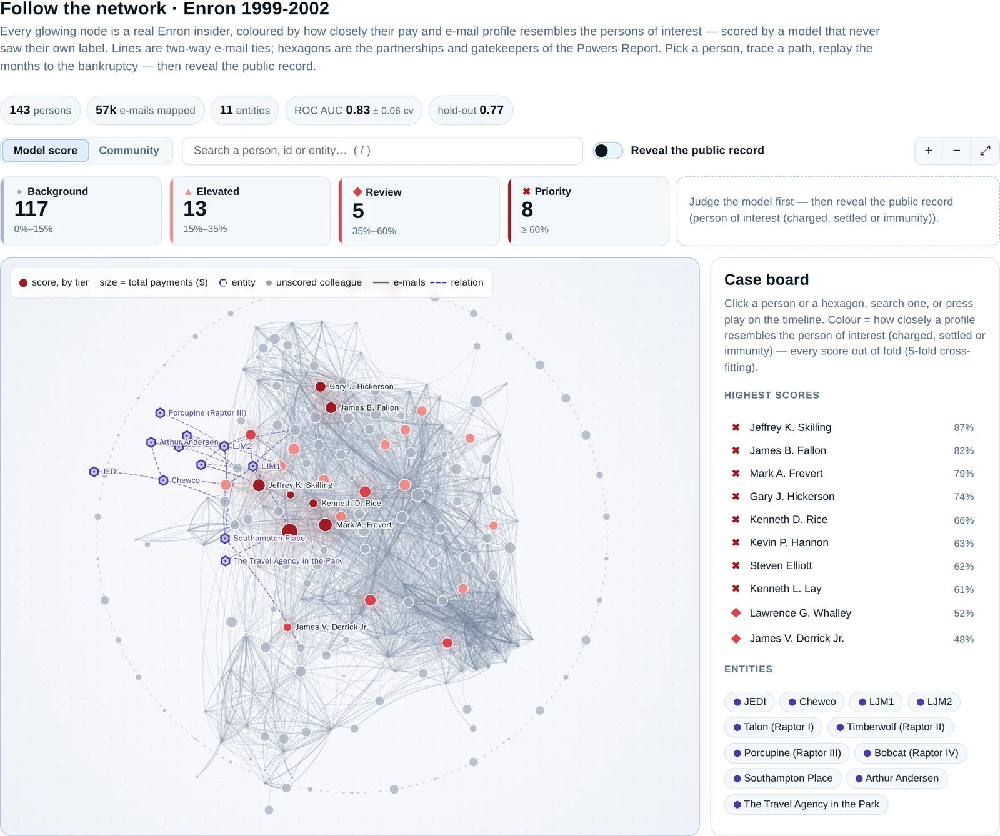

# 🕸️ Enron: Follow the Network — link analysis for financial-crime investigation

> Domain: **Public sector** · Kind: `tabular_ml` (binary classification + a network) · Scenario: [`scenarios/enron_fraud_network/scenario.yaml`](../../scenarios/enron_fraud_network/scenario.yaml)

Fraud is rarely one person. Investigators at securities regulators, supervisors and prosecutors'
forensic teams work with *link analysis*: who is paid how much, who talks to whom, which
partnerships sit behind the numbers. This scenario puts that workflow on the real public record
of the Enron collapse (2001) — **143 insiders' pay** from the bankruptcy court's schedule,
**250,000 e-mails** from the FERC corpus turned into a company-wide network, and the
**off-balance-sheet partnerships** documented by the Board's own investigation (the Powers
Report) — and asks a model which profiles resemble those of the **18 persons of interest**, and
why.

<p align="center">
  
</p>
<p align="center"><sub>Every glowing node is a real insider, scored by a model that never saw their own label; hexagons are the partnerships and gatekeepers of the Powers Report.</sub></p>

| | |
|---|---|
| **Question** | From what an insider was paid and where they sat in the company's e-mail network, how closely does their profile resemble the persons of interest'? |
| **Data** | The ud120 insider-pay dataset (court record *In re Enron Corp.*), the FERC/CMU e-mail corpus (headers only) and the Powers Report (SEC EDGAR) — see [the data README](../../scenarios/enron_fraud_network/sample_data/README.md) |
| **Label** | 18 persons of interest: indicted, settled with the SEC or testified for immunity (USA Today, 2005) — **not** a list of convictions |
| **Inputs** | 14 pay and stock fields, 3 pay ratios, 8 label-free network features (contacts, PageRank and betweenness percentiles, clustering, crisis-period and after-hours shares) |
| **Model** | LightGBM tuned for small tables (`lightgbm_small_data`), selected over logistic regression |
| **5-fold CV ROC AUC** | **0.83 ± 0.06** on the 114-person training split (logistic regression: 0.65) |
| **Hold-out (29 people, ~4 positives)** | ROC AUC **0.77** — a single hold-out this small swings a lot |
| **Out of fold, all 143** | ROC AUC **0.81**: every person scored by a model that never saw their own outcome |
| **Tabs** | Scenario · Data & BI · ML Predictions · ML Insights · **Network** |
| **New platform capabilities** | A network per tabular scenario (`dataset.graph`, `GET /graph/{slug}`), the generic `network_explorer` tab, and out-of-fold scores (`model.out_of_fold_scores`, `GET /model/{slug}/out-of-fold`) |

## Contents

- [The Network tab](#the-network-tab)
- [What a score is — and is not](#what-a-score-is--and-is-not)
- [The data science](#the-data-science)
- [How it is built](#how-it-is-built)
- [Run it yourself](#run-it-yourself)
- [Credits](#credits)

---

## The Network tab

A dark "investigation board": a force-directed map of the company's two-way e-mail ties
(1999-2002). On opening, the network unfolds from the centre and settles; after that it never
moves on its own, so the picture you learn stays put.

| On the board | Meaning |
|---|---|
| **Glowing circles** | The 143 insiders. Colour = risk tier on a validated one-hue red ramp (Background → Elevated → Review → Priority), glow ∝ score; size = total payments |
| **Violet hexagons** | Curated entities — JEDI, Chewco, LJM1, LJM2, the four Raptors, Southampton Place, Arthur Andersen, The Travel Agency in the Park |
| **Dashed violet lines** | Documented relations ("general partner of", "required reviewer of every LJM transaction", …), each with the Powers Report page it comes from |
| **Blue web** | E-mail ties; thickness and brightness by volume |
| **Small grey dots** | 100 *unscored colleagues* — Enron staff outside the pay table, anonymised, kept only because they connect scored people |
| **Outer orbit** | Insiders with no two-way e-mail tie in the corpus (many non-employee directors) |

Click a person — or search one (`/`) — and the camera eases onto their ego network; their ties
light up with messages flowing along them, and the **dossier** explains the score: SHAP
contributions rolled up into four pillars (cash pay, stock cash-out, network position, e-mail
activity), the top drivers with the person's percentile among all insiders, profile facts,
their strongest ties and every documented relation with its citation.

<p align="center">
  
</p>
<p align="center"><sub>The CFO who ran the partnerships scores only 31%: his own mailbox is not in the corpus. The documented relations carry what the model cannot see.</sub></p>

**Trace a path** between any two nodes — the shortest chain of e-mail ties and documented
relations, preferring the documented ones and scored people over anonymous colleagues:

<p align="center">
  
</p>

**Community** colours the board by the communities detected in the e-mail graph (Louvain): the
three largest in validated hues, the rest outlined in grey — every hull is labelled.

<p align="center">
  
</p>

The **timeline** replays the network month by month, from January 1999 to the bankruptcy —
ties fade in and out, messages flow along the active ones, and the milestones (Skilling becomes
CEO, his resignation, the Watkins letter, the Q3 2001 charges, the SEC inquiry, the CFO's
replacement, the restatement, Chapter 11, the Powers Report) pop up as they pass.

<p align="center">
  
</p>

Finally, **reveal the public record**: rings pop onto the persons of interest, highest score
first — solid when the model flagged them at *Review* or above, dashed when it missed them —
with the counts, the precision and the lift over the base rate.

<p align="center">
  
</p>

### Investigate a person

The **Investigate a person** switch above the board opens a person-centred workspace (*Investigate ›* in
any dossier jumps straight there). The chosen person sits at the centre of a radial **ego network**:
their strongest two-way contacts around them (stronger tie = closer), documented relations as dashed
hexagon links, and mail flowing along every tie as particles — cyan sent, white received. Beyond the
ring, the **routes to the nearest persons of interest** (or, with the toggle, to the model-flagged
tier) fan out; click a route to light it up. The side panel gives the out-of-fold score and SHAP
pillars, an *exposure* read-out (direct ties, share of their e-mail exchanged with persons of
interest and its peer percentile, hops to the nearest, how many within two hops), and per-tie
monthly bars. The timeline replays *this person's* mail month by month, the red part being the
share exchanged with persons of interest. Click a contact to inspect the tie, click again to
re-centre (*‹ Back* retraces).

**＋ New individual** invents someone who is not in the data: set their pay and e-mail profile,
pick who they e-mail (and how much), and the deployed model scores them live while the stage draws
their routes to the persons of interest. The features that *are* ties — contact count, e-mail volume,
clustering (exact, from the contacts' own ties) and a rough centrality (volume-weighted mean of the
contacts') — are derived for you and can be overridden; the scenario declares them with
`ui_extras.tie_features`. *What if… ›* clones a real person's profile and ties as the starting
point. Nothing is stored. As everywhere here, proximity to a person of interest is not evidence of
anything — colleagues e-mail each other.

Light theme:

<p align="center">
  
</p>

## What a score is — and is not

- A score is **resemblance** to the pay-and-e-mail profile of 18 persons of interest. It is not
  evidence of anything, and the tab and the assistant say so.
- "Person of interest" means indicted, settled with the SEC (usually without admitting
  wrongdoing) or testified in exchange for immunity. Some charges were dismissed; one conviction
  was vacated on the defendant's death. **A high score for anyone else is a model false positive.**
- Names are real because the record is public and the dataset is the canonical teaching set —
  but colleagues outside the pay table are anonymised, and no e-mail content or address is used.
- The honest result is a *triage* tool, not a detector: the top of the board concentrates the
  executives with extraordinary pay (precision 38% at *Review* or above, 3× the base rate), while
  many defendants — Broadband executives, traders, the finance staff behind the partnerships —
  look like everyone else on pay and e-mail. That is exactly where the documented relations,
  the paths and an investigator's judgement come in.

## The data science

- **Honest scores.** On 143 rows the deployed model is refit on everyone, so its own scores of
  those people are near-memorised (every person of interest near 1). The Network tab uses
  **out-of-fold** scores instead: training cross-fits the selected model (5 folds) and records
  every person's probability and SHAP contributions from the fold that never saw them —
  prediction serves them at `GET /model/{slug}/out-of-fold`.
- **De-leaked features.** The classic ud120 features `from_poi_to_this_person`,
  `from_this_person_to_poi` and `shared_receipt_with_poi` count e-mails with people *already
  known* to be persons of interest — they are computed from the label and were dropped. So was
  "is a corpus custodian" (FERC chose whose mailbox to collect).
- **Label-free network features** from networkx on the company-wide two-way e-mail graph (4,448
  people, 43,766 ties): contacts, PageRank and betweenness percentiles, clustering, share of
  e-mail in Aug–Dec 2001 and after hours.
- **Ablation** (5-fold CV repeated 10×, training's own pipeline):

| Inputs | Logistic regression | LightGBM (small data) |
| --- | --- | --- |
| Money only (pay + stock + ratios) | 0.739 ± 0.119 | 0.821 ± 0.091 |
| Network only (label-free) | 0.720 ± 0.087 | 0.732 ± 0.124 |
| **Money + network (deployed)** | 0.746 ± 0.118 | 0.818 ± 0.081 |
| Money + ud120's e-mail counts (leak the label) | 0.726 ± 0.120 | 0.803 ± 0.089 |
| Diagnostic: "has any e-mail trail" alone | 0.628 ± 0.031 | 0.628 ± 0.031 |
| Money + network, only the 111 with an e-mail trail | 0.673 ± 0.155 | 0.725 ± 0.116 |

  Pay carries most of the signal; the network alone reaches ~0.73 without any label knowledge.
  **Sampling bias**: every person of interest has some e-mail trail while 32 others (mostly
  non-employee directors) have none — worth AUC 0.63 on its own — and the crisis-period share
  depends on whose mailbox was collected and kept.
- **Data quality**: the two rows ud120 shifted by one column (Belfer, Bhatnagar) are corrected
  from the court PDF, and every row's payment and stock components are checked to add up.

## How it is built

- `scripts/prepare_enron_fraud_network_dataset.py` — pinned, checksum-verified sources; the pay
  pickle is opcode-checked before unpickling; networkx network features; the graph file; every
  entity relation and title quote-checked against the Powers Report text, which also gives the
  page for its citation. Two runs produce byte-identical files.
- **`dataset.graph`** — a scenario can ship a network next to its rows
  (`ai_circus_shared.network_graph.NetworkGraph`: `row` / `entity` / `context` nodes, typed
  edges with per-month series). etl-tabular validates it and restricts it to the cleaned rows;
  prediction serves it, tenant-scoped, at `GET /graph/{slug}`.
- **`network_explorer`** — the generic tab (`NetworkExplorerView.tsx`, canvas renderer
  `networkScene.ts` on d3-force + d3-zoom in a lazy chunk, pure model `networkModel.ts`); all its
  wording comes from the YAML, so an AML or procurement network needs no UI code. It requires
  `model.out_of_fold_scores`, because it reveals real outcomes next to the scores.
- **Palettes** validated with the dataviz validator: the shared ordinal red ramp for tiers
  (`riskPalette.ts`, also used by the Watchlist), violet entities, three community hues.
- **Performance**: dirty-flag rendering, sprites for glows and particles, a cached background and
  pattern grid, frame pacing and a one-time drop to 1× pixel density on machines that cannot
  keep up (no GPU).

## Run it yourself

On a running cluster (see the main [README](../../README.md#getting-started)):

```bash
make k3s-pipeline
```

Regenerating the data (downloads ~493 MB of e-mail headers once, cached in `~/.cache/ai-circus/enron/`):

```bash
cd services/training && uv run --with 'networkx>=3.4,<4' python ../../scripts/prepare_enron_fraud_network_dataset.py --ablation
```

## Credits

- Insider pay: *In re Enron Corp.*, Case No. 01-16034, "Payments to Insiders" (Exhibit 3b.2), via
  the Udacity ud120 dataset and [angelmtenor/data-science-keras](https://github.com/angelmtenor/data-science-keras) (MIT).
- E-mail: the [Enron Email Dataset](https://www.cs.cmu.edu/~enron/) released by FERC and prepared
  by CMU (mirror: Hugging Face `corbt/enron-emails`). Please be sensitive to the privacy of the
  people involved — most were not involved in any wrongdoing.
- Entities and relations: *Report of Investigation by the Special Investigative Committee of the
  Board of Directors of Enron Corp.* (William C. Powers, Jr., chair), February 1, 2002 — filed
  with the SEC as exhibit 99.2 to Enron's Form 8-K.
