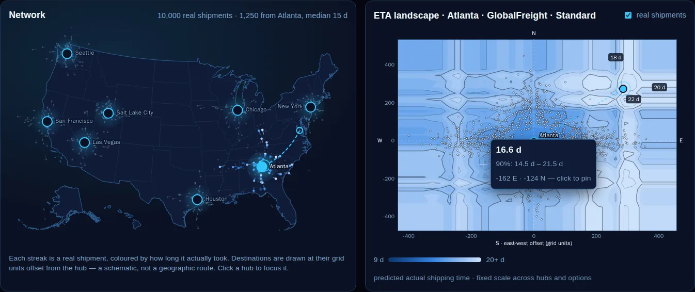
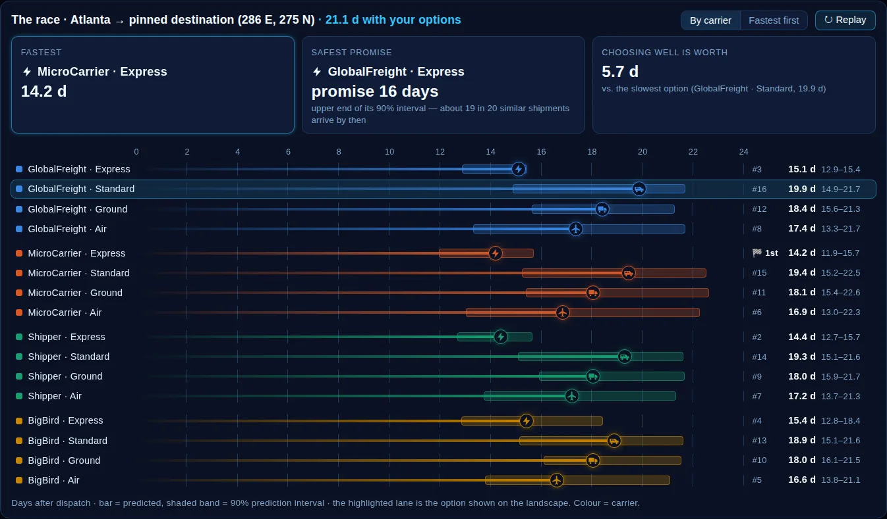
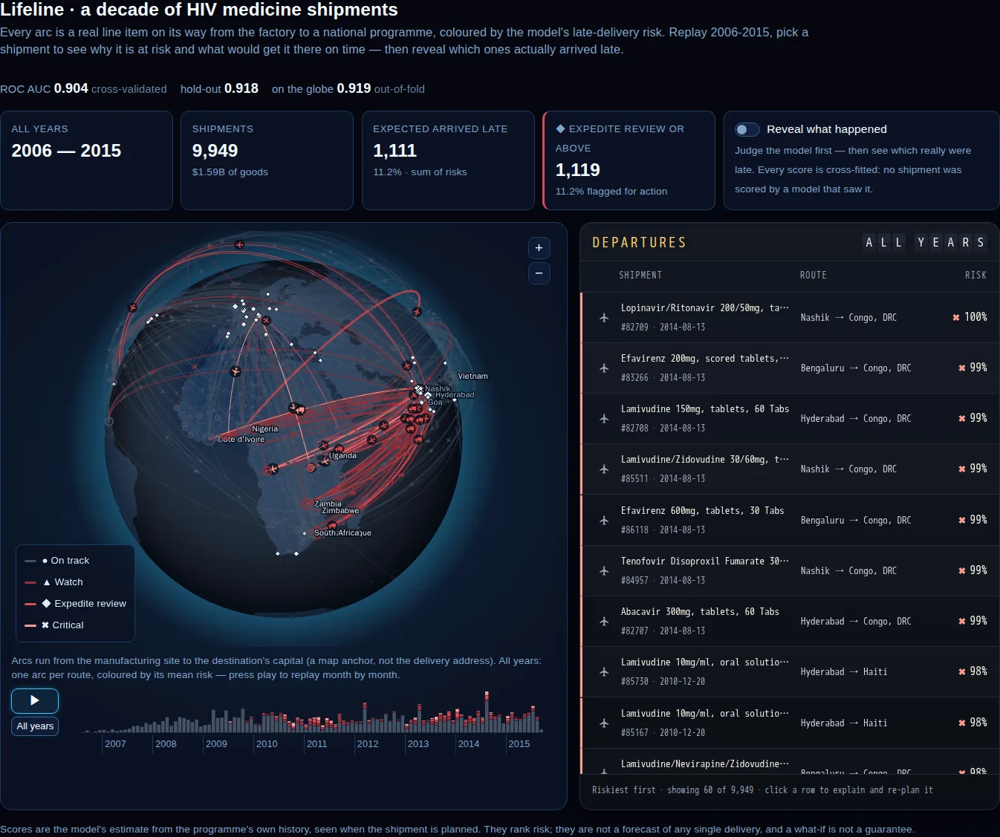
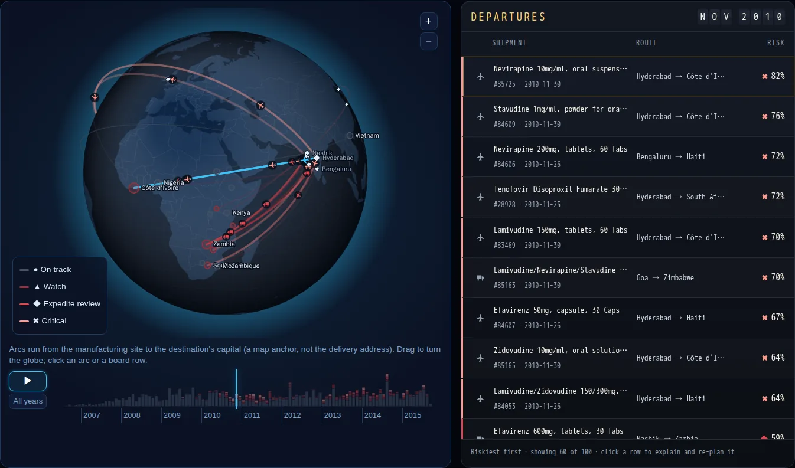
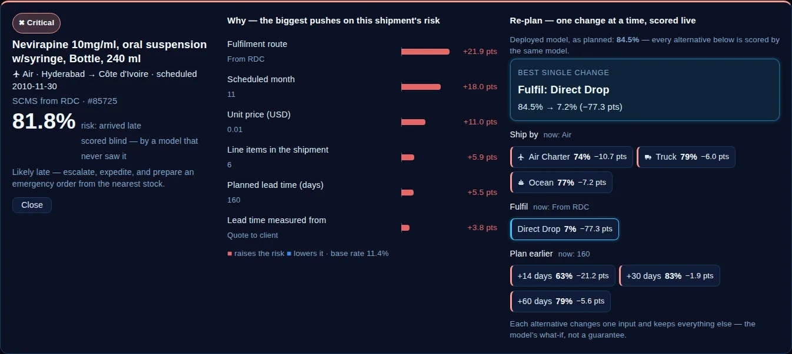
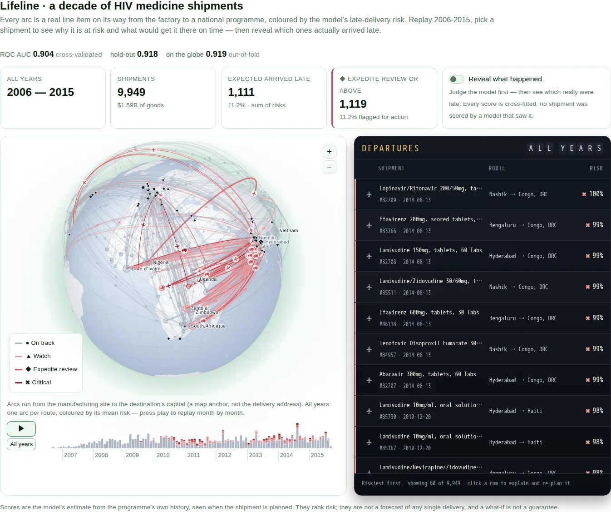

# Logistics: Dispatch Tower & Lifeline Globe

> Domain: **Logistics** · two `tabular_ml` scenarios, each with a showpiece 5th tab:
> [`supply_chain`](../../scenarios/supply_chain/scenario.yaml) (regression → **Dispatch Tower**) and
> [`global_health_shipments`](../../scenarios/global_health_shipments/scenario.yaml) (classification → **Lifeline Globe**).

Both tabs are generic renderers driven by a `ui_extras` block in `scenario.yaml` — any
future ETA or shipment-risk scenario gets them with YAML only
(`ai_circus_shared.scenario_schema.DispatchTowerExtra` / `ShipmentGlobeExtra`).

---

## Supply Chain Shipping ETA — the Dispatch Tower

  

| | |
|---|---|
| **Question** | How long will this shipment take — and which carrier and service level should we book, and what delivery date can we promise? |
| **Model** | LightGBM regressor (hold-out R² ≈ 0.66) + two LightGBM quantile models for a 90% prediction interval |
| **Data** | 10,000 synthetic shipments (AWS SageMaker supply-chain workshop): origin hub, east-west / north-south offset to the destination, carrier, priority, order size |

The tab has three linked views, all scored live by the scenario's own `/predict`:

1. **Network** — the eight hubs on a US map with the dataset's real shipments streaking
   out of them, coloured by their *actual* duration. The data only knows a destination
   as a grid offset from its hub, so destinations are drawn at that offset — a
   schematic, and the tab says so. Click a hub to focus it.
2. **ETA landscape** — a 33 × 33 grid of destinations around the focused hub
   (≈1,100 records, one batched call, ~140 ms) for the chosen carrier, priority and order
   size, drawn as filled isochrones (d3-contour) on a *fixed* colour scale, so switching
   hub or option never silently re-scales it. Hover reads the prediction and its
   interval; click pins a destination.
3. **The race** — every carrier × priority combination (16 lanes) to the pinned
   destination. Vehicles run to their predicted day with the 90% interval shaded behind
   them; the verdict cards name the **fastest option**, the **safest promise** (the
   lowest upper bound of the interval: about 19 in 20 similar shipments arrive by then)
   and **what choosing well is worth** in days.

  

---

## Global Health Shipments — the Lifeline Globe

  

| | |
|---|---|
| **Question** | Which planned shipments of HIV/AIDS medicines and test kits will reach the country late — and what change would get them there on time? |
| **Model** | LightGBM classifier chosen over logistic regression on 5-fold CV ROC AUC (**0.904 ± 0.004**; logistic 0.80), hold-out 0.918 |
| **Data** | 9,949 real line items of USAID's PEPFAR Supply Chain Management System, 2006-2015, 42 countries — US public domain ([data README](../../scenarios/global_health_shipments/sample_data/README.md)) |
| **Label** | `delivered_late`: delivered to the client after the scheduled date (11.9%, median 12 days late) |

Every model input is known when the shipment is planned: destination, fulfilment route
(direct drop from the vendor vs. a regional distribution centre), shipment mode, the
goods (product group, adult/pediatric, dosage form, quantity, value, prices), how many
line items travel together, the **planned lead time** and the scheduled year and month.
Freight cost, insurance, weight and the delivery itself are not.

### What the tab does

- **Globe** — every shipment is an arc from its manufacturing site to the destination's
  capital (a map anchor, not the delivery address), lifted higher for longer routes and
  hidden correctly behind the globe; vehicles (plane, truck, ship) travel along them.
  *All years* shows one arc per route coloured by its mean risk; **Play** replays the
  programme month by month. Drag to turn it, click a destination to filter.
- **Departures board** — the window's shipments riskiest first on a split-flap board
  (the month header flips like an airport board).
- **Dossier** — pick a shipment: its SHAP drivers, then **Re-plan**: every one-change
  alternative (ship by air charter / truck / ocean, switch fulfilment route, plan 14 /
  30 / 60 days earlier) scored live, best move first.
- **Reveal what happened** — the backtest: which shipments really arrived late, and how
  many of them the flagged tiers caught.

  

  

### Honest scores

The globe reveals every shipment's real outcome next to its score, so its scores are
**cross-fitted** (`model.out_of_fold_scores`): each shipment is scored by a copy of the
model that never saw it (out-of-fold ROC AUC 0.919). The refit deployed model's own,
in-sample scores would flag 89% of the late shipments at the *Expedite review* tier;
the honest number is:

| Flagged (*Expedite review* or above, P ≥ 0.35) | Late shipments caught | Precision | Lift over the 11.9% base rate |
|---|---|---|---|
| 1,119 of 9,949 (11.2%) | 694 of 1,182 (**59%**) | **62%** | 5.2× |

At this size the out-of-fold artifact carries probabilities only (per-row SHAP stops at
5,000 rows — `tabular_ml.MAX_OUT_OF_FOLD_EXPLAINED_ROWS`); the dossier explains and
re-plans with the deployed model, and says which number is which.

### Caveats

- The model describes this programme's history: performance shifted strongly by year
  (2010-2011 peak), so the scheduled year is an input.
- The scheduled date is the one on record at delivery — if some were revised after a
  delay, a long planned lead time partly reflects that revision.
- A re-plan changes one input and keeps the rest: the model's what-if, not a guarantee
  (e.g. a faster mode rarely helps when the delay is upstream at the vendor).

  

