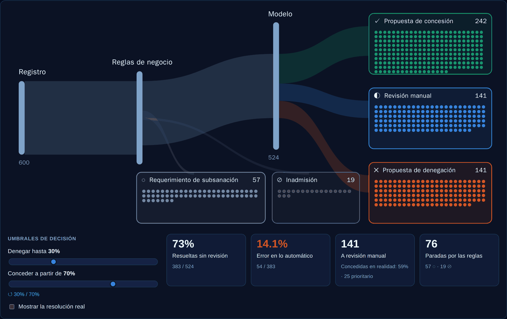
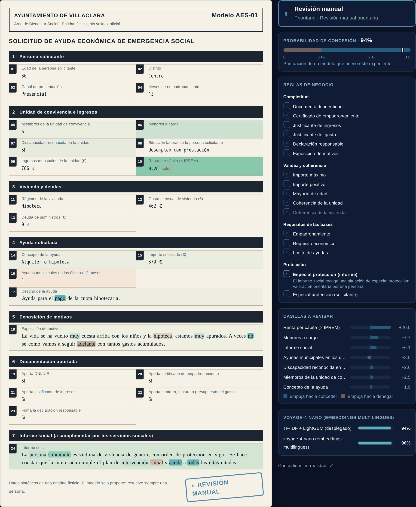
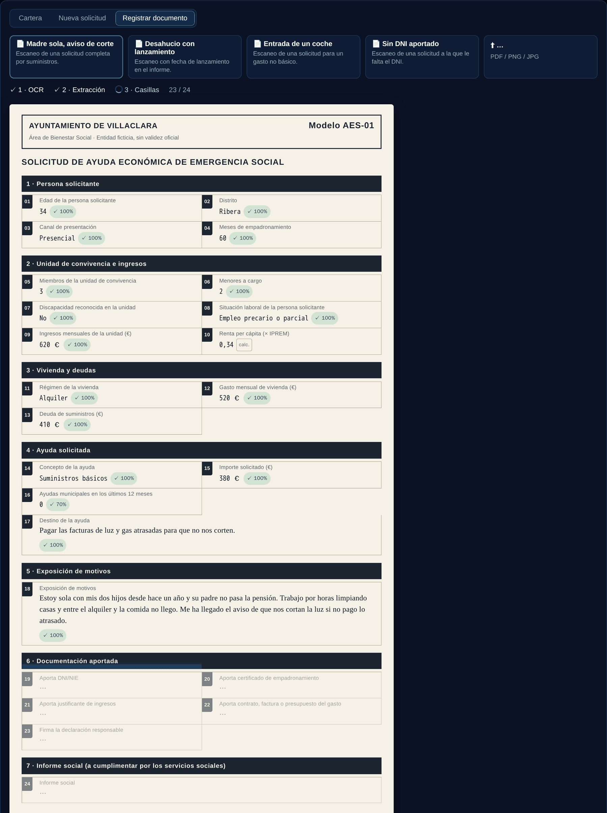
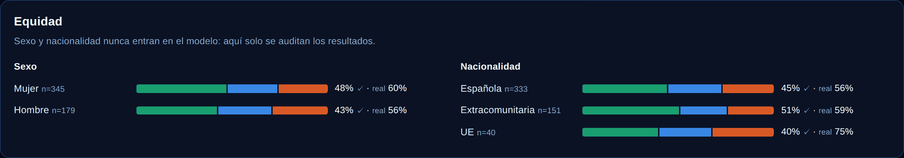

# 🤝 Emergency Social Aid — rules, a model and a person

> Domain: **Public sector** · Kind: `tabular_ml` (binary classification, free text + structured data, **business rules before the model**) · Scenario: [`scenarios/prestaciones_sociales/scenario.yaml`](../../scenarios/prestaciones_sociales/scenario.yaml) · UI in **Spanish**

The (fictional) Ayuntamiento de Villaclara gives *Ayudas Económicas de Emergencia Social* — up to
1,500 € for rent, utility bills, food, school supplies or medical expenses. Every application is a
basic form: **numbers** (income, household, months in the census), **categories** (employment, housing,
concept of the aid) and **three free-text boxes** (the applicant's own account, what the money is for,
the social worker's report). The scenario answers what an intelligent-document-processing desk would be
asked: *which applications can wait for a person, which can't, and which boxes explain the proposal?*

<p align="center">
  
</p>
<p align="center"><sub>Every dot is an application. The rules stop what is incomplete or doesn't meet the requirements; the model sorts the rest. Drag the thresholds and the trays re-sort live.</sub></p>

| | |
|---|---|
| **Question** | Does an application that has passed the rules deserve a grant? The model returns P(granted); two thresholds turn it into *propuesta de concesión*, *revisión manual* or *propuesta de denegación*. |
| **Data** | **600 synthetic applications** (no public row-level corpus of benefit applications exists — benefits open data is aggregate only). Facts and resolutions are generated with a seed; the three text boxes were written **once, offline, by an LLM from those facts** (never from the resolution), checked by a leak guard. |
| **Rules** | 16 deterministic rules in 4 families, evaluated **before** the model: they stop 76 of 600 applications (13%), which are kept for analytics but never trained on. |
| **Model** | One LightGBM (`lightgbm_small_data`) over numeric + categorical + three TF-IDF text boxes (Spanish stop-words, negations *kept*). |
| **5-fold CV ROC AUC** | **0.856 ± 0.028** on the 419-application training split (default LightGBM: 0.856 — no gain, so the small-data settings stay) |
| **Hold-out (105)** | ROC AUC **0.887** · accuracy 82.9% · out-of-fold AUC over all 524 trainable rows **0.879** |
| **Ablation** | structured only 0.838 · text only 0.770 · **both 0.884** (5-fold CV, the same rows) |
| **Transformer challenger** | voyage-4-nano embeddings of the three boxes + the same LightGBM: CV 0.863 ± 0.034 · hold-out 0.885 — **+0.008, below the 0.01 bar**, so TF-IDF stays deployed |
| **Tabs** | Scenario · Data & BI · ML Predictions · ML Insights · **Mesa de valoración** |
| **New platform capabilities** | `business_rules` + `decision_policy`, `text_language`, multi-box challenger, `ui_extras: case_desk`, scanned intake (`/extract-record`) |

## Design: why rules, a binary model and a policy

- **Rules first.** A missing ID or a value out of range is not a prediction problem — it is a *requirement*
  (art. 68 of Ley 39/2015: the applicant gets 10 days to fix it). Putting those cases through a model
  would teach it the rules' own outcome. So rules run first, the model never trains on what they decide,
  and a record they stop is still scored but shown as *"modelo no aplicado"*.
- **Four rule families**, all declared in YAML (`dataset.business_rules`): **completitud** (a document or
  box is missing → *requerimiento de subsanación*), **validez y coherencia** (an amount over 1,500 €, more
  minors than household members → subsanación), **requisitos** (under 6 months in the census, income over
  1.5 × IPREM, more than two aids in 12 months → *inadmisión*) and **protección** (gender violence, a court
  eviction date → forced *manual review* whatever the score).
- **Three outcomes without a multiclass model.** The corpus is tagged *granted / denied*; the third outcome
  is **selective prediction**: below 30% → deny, above 70% → grant, in between a person decides.
  Everything is a **proposal** — access to essential public benefits is a high-risk use under the EU AI
  Act (Annex III) and an administrative act must state its reasons (art. 35 of Ley 39/2015).
- **Fairness by exclusion, and by audit.** Sex and nationality are never model inputs
  (`protected_features_excluded`); they are kept (`audit_columns`) only to report outcome rates per group.

## The Mesa de valoración tab

1. **The circuit** (canvas). The registry's 600 dots ride through the rules and the model into five trays.
   Colours — grant green, review blue, deny orange — are the first three slots of a palette validated for
   colour-vision deficiency; the two rule-stopped trays are recessive grey, and every tray also carries a
   glyph and a label. Scores are **out-of-fold**: from a model that never saw that application.
2. **The thresholds.** Two sliders re-sort the trays live. KPIs show the trade-off a manager actually
   tunes: share resolved without review, **error in the automated trays** against the real resolution,
   and the manual-review workload. *Show the real resolution* recolours dots by what really happened
   and rings the proposals it contradicts.
3. **The application as an official sheet.**

<p align="center">
  
</p>

   Each numbered box is tinted by its SHAP contribution (green pushes towards granting, orange towards
   denying); the text boxes highlight the words that moved the score; the side panel stamps the rules
   one by one, shows the probability against both thresholds and lists the boxes that weigh most — for a
   manual-review case, *"casillas a revisar"*: the strongest pushes in opposite directions. The TF-IDF model
   and its challenger are compared on the same application.
4. **Registrar documento** — scanned intake.

<p align="center">
  
</p>

   Four fictional **scans** (image-only PDFs: skewed, noisy, stamped) go through the platform's Spanish OCR
   (tesseract `spa`), then an LLM maps the text onto the boxes. It must **quote** where each value comes
   from; categorical values must be an option, numbers must parse and sit in range, and a quote the OCR
   text does not contain is flagged *unverified* with a lower confidence. Boxes appear one by one with
   their confidence; what could not be read stays marked *"no leído"*. Then rules → model → stamp — the
   scan without an ID is stopped by rule C1 before the model. Every box stays editable and re-scores.
5. **Nueva solicitud** — a blank form or six personas (a mother of two facing a power cut, an eviction with
   a court date, undeclared income, a car down-payment…), and **Equidad** — outcome rates by sex and nationality.

The dock **assistant** reads what is on screen (the open application's boxes, fired rules, probability,
decision and thresholds) and answers in Spanish — *"¿por qué va a revisión manual?"*, *"¿qué falta aquí?"*.

## The data science

- **Why text and numbers together.** Structured data alone reaches 0.838, text alone 0.770, both 0.884:
  the text adds what no form box captures (urgency, a court date, an expense that isn't a basic need).
  The most important inputs: income per head in IPREM units, the applicant's account, the social report,
  prior aids and minors.
- **Why TF-IDF is deployed and not the transformer.** Every term maps back to a word, so the proposal can
  be motivated **box by box and word by word**; an embedding's 1,024 dimensions cannot. voyage-4-nano is
  clearly multilingual (it aligns Spanish with English sentences and groups Spanish paraphrases that share
  no words) but it blurs **negation** — "tenemos ingresos suficientes" and "no tenemos ingresos suficientes"
  sit at cosine 0.93 — which TF-IDF bigrams (`no tenemos`, `sin ingresos`) keep apart. It is trained next to
  the deployed model every run and compared on any application; promoting it would be a human decision.
- **Spanish text.** `dataset.text_language: es` swaps TF-IDF's stop-word list for a Spanish one that keeps
  *no, sin, ni, nunca, muy, poco*.
- **Honest scores.** The deployed model is refit on all rows, so on 524 applications its own scores of them
  are optimistic. The circuit, the KPIs and the equity panel use **out-of-fold** scores
  (`model.out_of_fold_scores`) — required by the `case_desk` extra.

<p align="center">
  
</p>

## How it is built

| Piece | Where |
|---|---|
| Rules + policy, pure and tested | [`libs/shared/src/ai_circus_shared/business_rules.py`](../../libs/shared/src/ai_circus_shared/business_rules.py); schema in `scenario_schema.py` (`BusinessRules`, `DecisionPolicy`, `CaseDeskExtra`) |
| Rules before `dropna()`, blocked rows kept | `etl-tabular` `core/etl.py` · training drops them (`rules_excluded_rows`) |
| `rules` / `gate` / `decision` on every prediction, per-row gates in the dataset sample | `prediction` `api.py` |
| Scanned intake | `assistant` `core/extraction.py` (`POST /extract-record/{slug}`, `GET /intake-samples/{slug}/{file}`) |
| The tab | `ui-react` `CaseDeskView.tsx`, `CaseDeskCircuit.tsx`, `CaseSheet.tsx`, `caseDeskLogic.ts` |
| Corpus + scans | `scripts/generate_prestaciones_sociales_dataset.py`, `scripts/generate_prestaciones_sample_documents.py` |

## Run it yourself

```bash
make k3s-pipeline                                    # ETL (rules before the model) + training
make k3s-text-embeddings SCENARIOS=prestaciones_sociales   # host GPU: embeds the 3 boxes, retrains the challenger
```

Regenerate the corpus (the texts need the cluster's llm-gateway on `localhost:4000`):

```bash
cd services/training
uv run python ../../scripts/generate_prestaciones_sociales_dataset.py structure   # seeded facts + resolutions
LLM_GATEWAY_API_KEY=… uv run python ../../scripts/generate_prestaciones_sociales_dataset.py texts --model gemini-flash
uv run python ../../scripts/generate_prestaciones_sociales_dataset.py build       # CSV + ablation
cd ../form-agent && uv run python ../../scripts/generate_prestaciones_sample_documents.py   # the four scans
```

## Credits

Original content: the entity, its rules ("bases reguladoras"), every application and every scanned
document are **fictional**. The IPREM (600 €/month in 2026) is the real Spanish public-income indicator;
the legal references (Ley 39/2015, EU AI Act) are real, the rules built on them are invented for the demo.
