# 🚢 Titanic Survival — an explained ML tutorial

> Domain: **Tutorials** · Kind: `tabular_ml` (binary classification) · Scenario: [`scenarios/titanic/scenario.yaml`](../../scenarios/titanic/scenario.yaml)

On 15 April 1912 the RMS Titanic sank on her maiden voyage and more than 1,500 of the 2,224
people aboard died. This scenario turns the real passenger list into a complete, **explained**
machine-learning tutorial. It walks every step from the raw CSV to an explained survival
probability, then puts all 891 passengers back aboard an illustrated liner so you can explore
who survived, what the model predicted for each of them, and why.

<p align="center">
  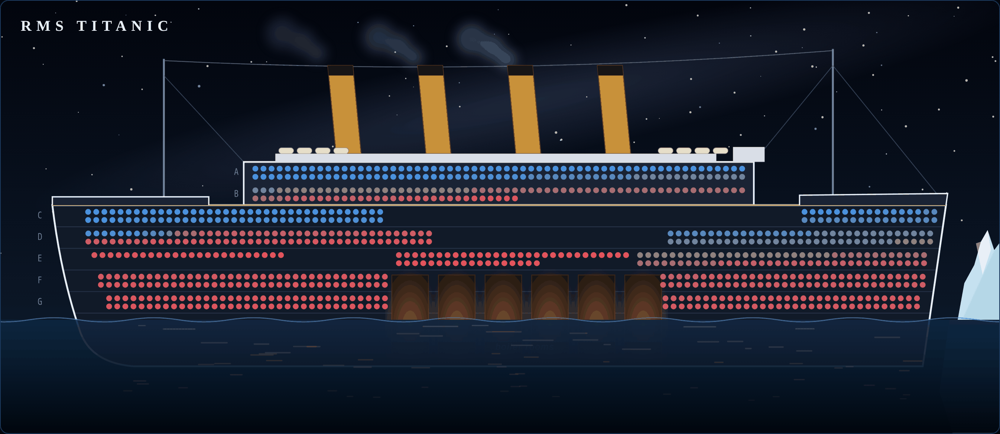
</p>
<p align="center"><sub>Every dot is a real passenger, berthed by ticket class and coloured by the model's survival probability.</sub></p>

It is ported from the 2018 Keras notebook in
[angelmtenor/data-science-keras](https://github.com/angelmtenor/data-science-keras/blob/master/notebooks/titanic.ipynb)
and modernised: engineered features, a small-data gradient-boosting model chosen by
cross-validation, SHAP explanations, and honest hold-out metrics.

| | |
|---|---|
| **Question** | Did a passenger survive the sinking? We predict a probability, not a yes/no. |
| **Data** | Kaggle *Titanic — Machine Learning from Disaster*, labelled file: 891 passengers (the crew are not included) |
| **Model** | LightGBM tuned for small tables (`lightgbm_small_data`), selected over logistic regression |
| **5-fold CV ROC AUC** | **0.885 ± 0.015** (logistic regression: 0.872 ± 0.016) |
| **Hold-out (179 passengers)** | ROC AUC **0.873** · accuracy 82.1% · precision 81.4% · recall 69.6% |
| **The 2018 Keras DNN** | ROC AUC 0.86 · accuracy 82.7% |
| **Tabs** | Scenario · **Tutorial** · Data & BI · ML Predictions · ML Insights · **Voyage** |
| **Extra infrastructure** | None. It uses the existing `prediction`/`training`/`etl-tabular` services; model artifacts are ~350 KB |

## Contents

- [The Voyage tab](#the-voyage-tab)
- [The Tutorial tab](#the-tutorial-tab)
- [The data science](#the-data-science)
- [How it is built](#how-it-is-built)
- [Run it yourself](#run-it-yourself)
- [Adding the next tutorial](#adding-the-next-tutorial)
- [Credits](#credits)

---

## The Voyage tab

A night cutaway of a four-funnel liner: decks A–G, lifeboats on the boat deck, glowing boiler
rooms, steam from the three working funnels, the ship's lights reflected on a flat-calm sea,
and the iceberg dead ahead. All 891 passengers are aboard, berthed where their class slept:
1st class high up amidships, 2nd class aft, and 3rd class (steerage) on the lowest decks at the
bow and stern. They are scored by the deployed model in one batched `/predict` call
(probabilities only, about 2.5 s); a passenger is SHAP-explained when you click them.

<p align="center">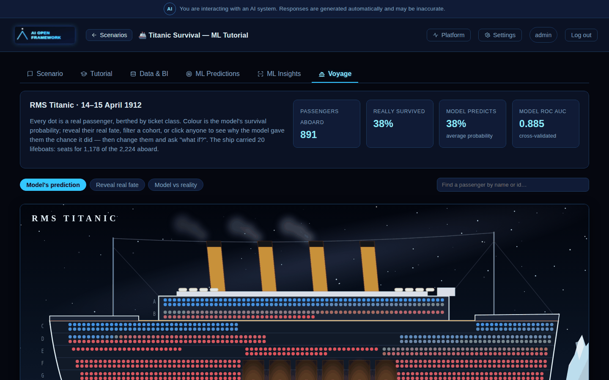</p>

### Three ways to colour the ship

| Mode | What you see |
|---|---|
| **Model's prediction** | Survival probability on a red → grey → blue scale. Within each class the most likely survivors are berthed first, so every deck reads as a gradient. |
| **Reveal real fate** | What actually happened: survivors filled blue, victims as hollow red rings, so fate is never encoded by colour alone. The reveal sweeps from bow to stern, the way the ship went down. |
| **Model vs reality** | Only the model's mistakes light up: survivors it had written off (blue) and victims it expected to live (red). Everyone it got right fades into the hull. |

<p align="center">
  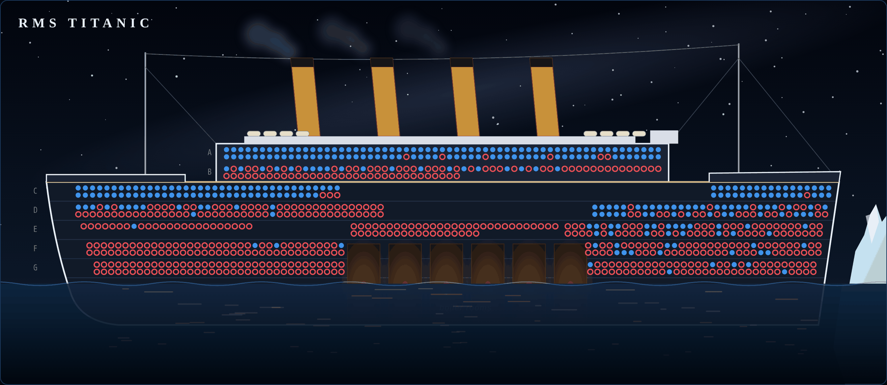
  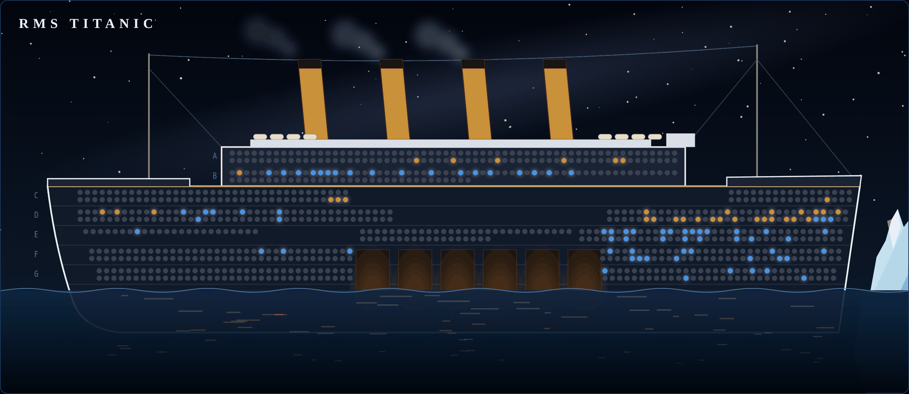
</p>

The class cards under the ship already tell the story: the model expects 62% / 47% / 24% of 1st /
2nd / 3rd class to survive, and the real rates were 63% / 47% / 24%.

### Select a cohort

Filter chips (class, sex, title, port) and range sliders (age, fare per person) dim everyone
outside the cohort and compare its average model probability with its real survival rate. For
example, **3rd-class women** are 144 passengers: the model expects 52%, 50% really survived, and
at the 50% cut-off it gets 111 of the 144 right. You can also search any passenger by name or
`PassengerId`.

### One passenger, explained

Click anyone (or find them by name) to see their probability as a **SHAP waterfall**. It starts
from the model's average passenger and shows how much each fact about this person pushed the
probability up or down, in percentage points. The bars add up exactly to their prediction.

<p align="center">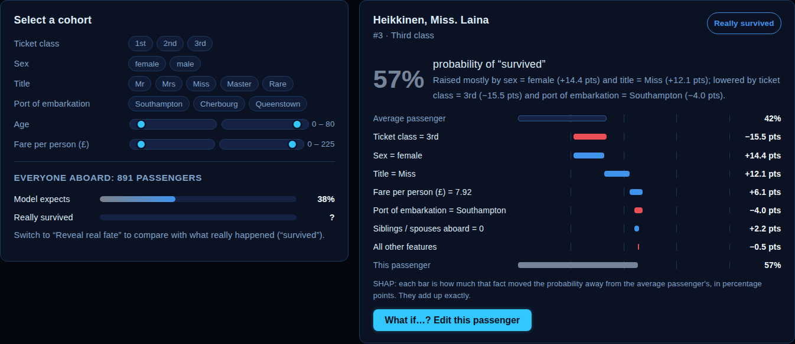</p>

Laina Heikkinen (#3), a 26-year-old travelling alone in 3rd class, gets **57%**. Being a woman
(+14.4 pts) and a "Miss" (+12.1 pts) raise her chance; her 3rd-class ticket costs her 15.5
points. She survived.

### What if…?

**What if…? Edit this passenger** turns any passenger into a live what-if form, marked by a ★ on
the ship. You can also board one of the personas: Jack and Rose (fictional, inspired by the
1997 film), a 3rd-class mother of four, an Irish girl boarding at Queenstown, and others. The
model re-scores and re-explains every change as you type.

<p align="center">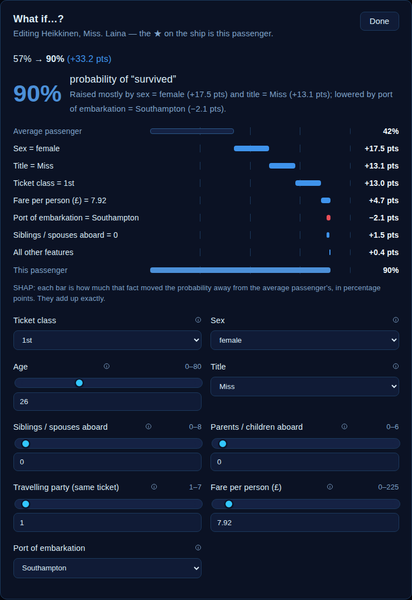</p>

Move Laina to 1st class and nothing else changes: **57% → 90% (+33.2 pts)**.

---

## The Tutorial tab

A tutorial scenario opens on its tutorial: eleven chapters of plain-language explanation, each
backed by live charts and widgets computed from this platform's own dataset and deployed model.
None of it is a screenshot.

<p align="center">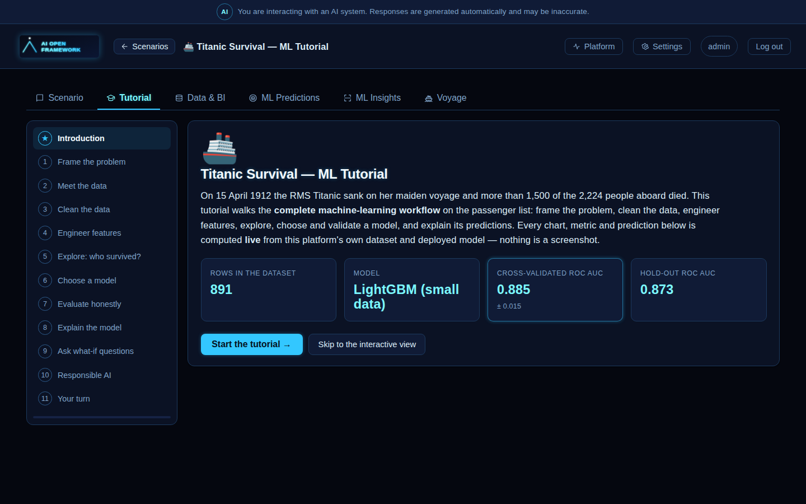</p>

| # | Chapter | Live content |
|---|---|---|
| 1 | Frame the problem: probability vs yes/no; why ROC AUC over accuracy | Class balance, and the 61.6% "nobody survived" baseline |
| 2 | Meet the data: the raw columns | Preview of the model-ready rows |
| 3 | Clean the data: every imputation is a modelling decision | Table of missing values and what was done |
| 4 | Engineer features: Title, travelling party, fare per person | Survival rate by title and by party size |
| 5 | Explore: who survived? | Survival by sex, by class × sex, age distribution, fare by class |
| 6 | Choose a model: pipeline, candidates, the CV protocol, Green Code | The **real training leaderboard** |
| 7 | Evaluate honestly | Hold-out **ROC curve** and **confusion matrix** |
| 8 | Explain the model: what SHAP means | Global SHAP importance |
| 9 | Ask what-if questions | The original notebook's passengers, **scored live** |
| 10 | Responsible AI: why sex is a feature here and not in churn | – |
| 11 | Your turn | A link to the Voyage tab |

<p align="center">
  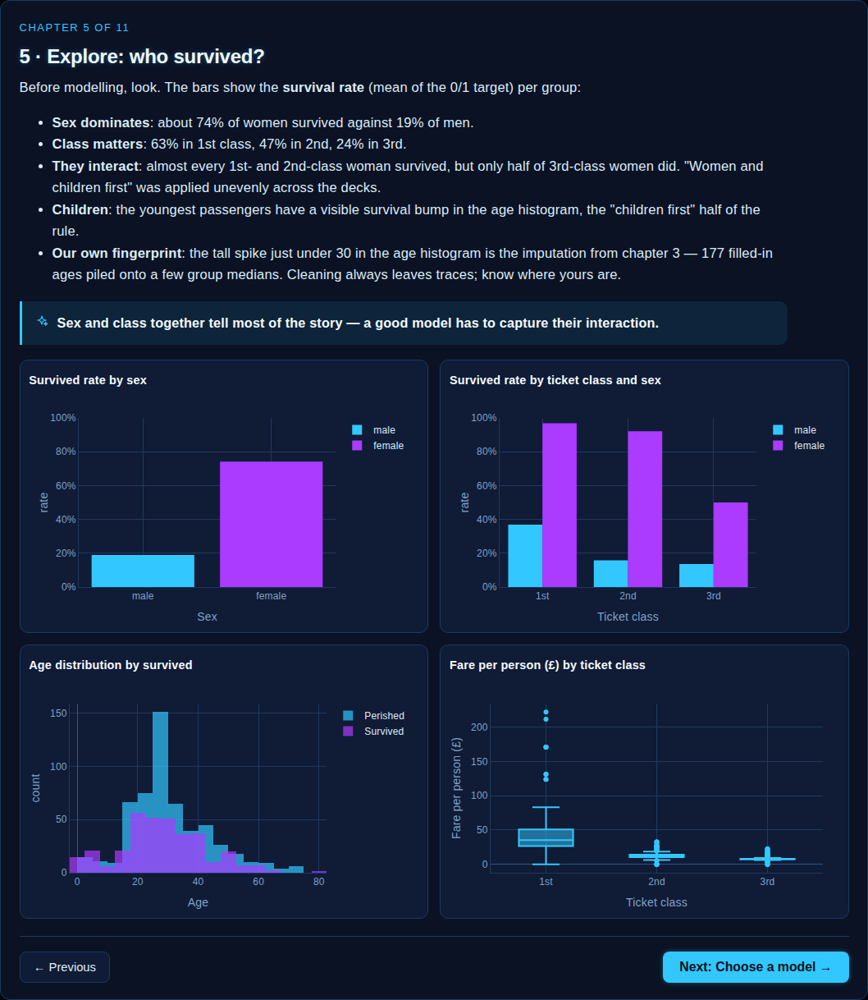
  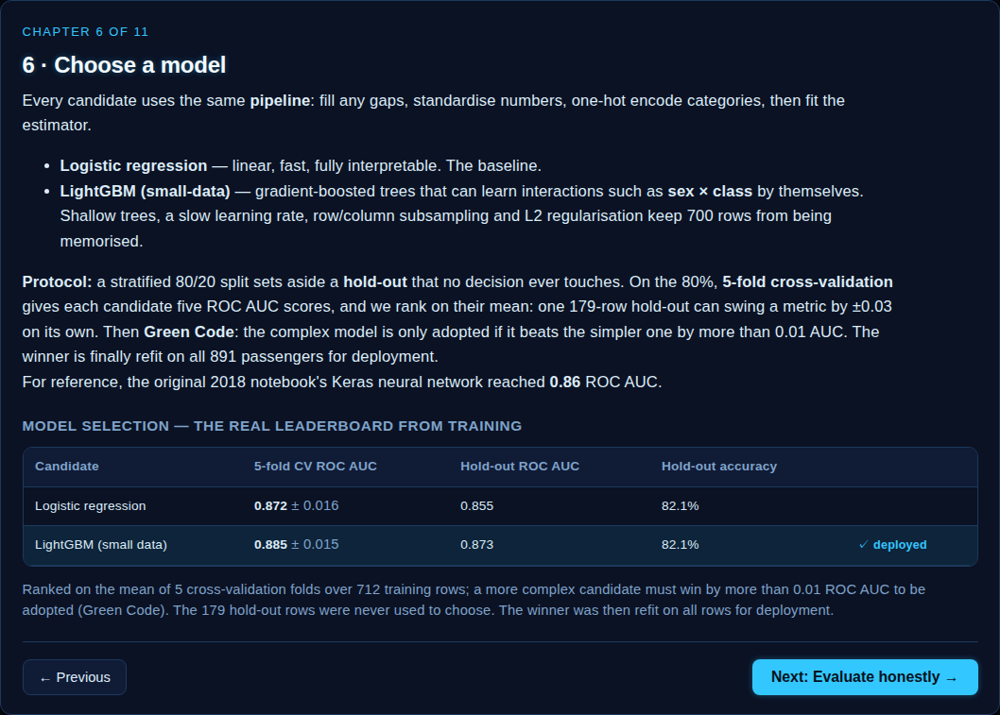
</p>
<p align="center">
  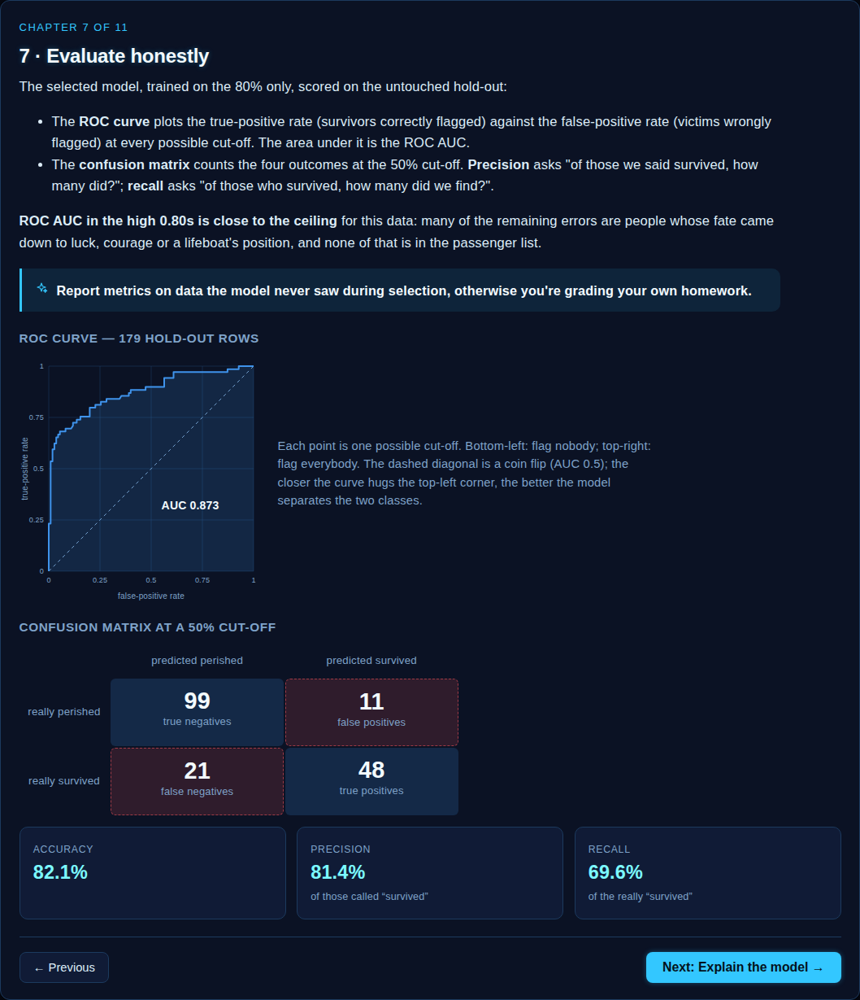
  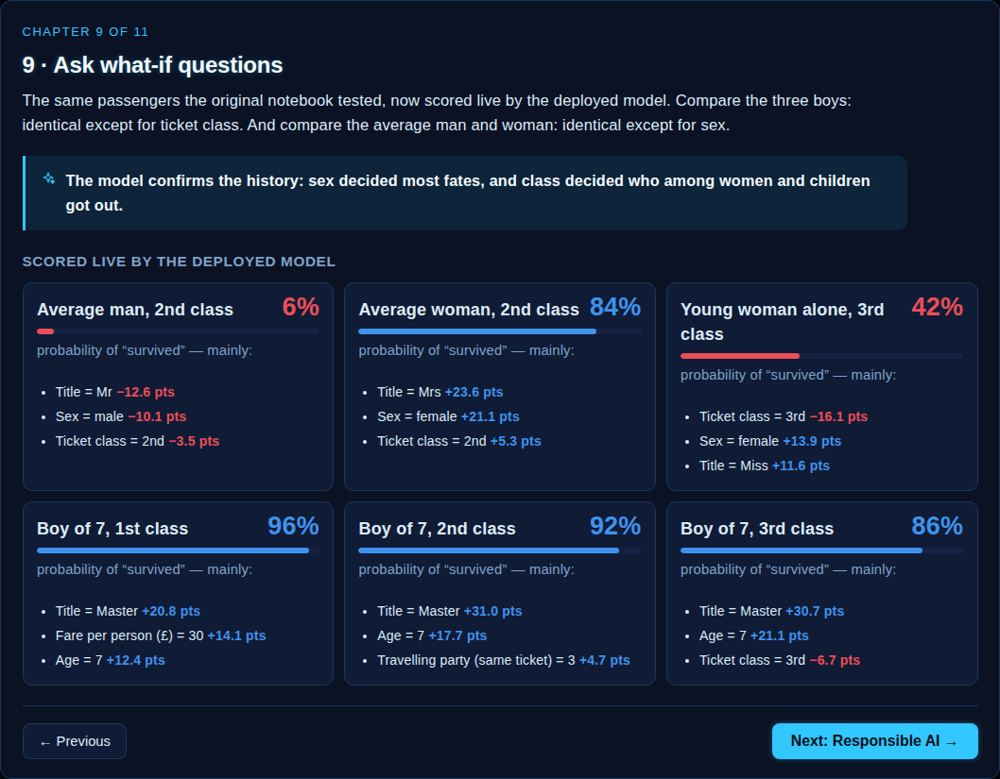
</p>

Chapter 9 re-runs the original notebook's what-if passengers through the deployed model. The
average 2nd-class man gets 6% and the average 2nd-class woman 84%, identical except for sex. A
7-year-old boy gets 96% / 92% / 86% in 1st / 2nd / 3rd class. Sex decided most fates, and
class decided who among the women and children got out.

---

## The data science

### Preparation

[`scripts/prepare_titanic_dataset.py`](../../scripts/prepare_titanic_dataset.py) turns the
verbatim Kaggle file (checked in next to the scenario, SHA-256-pinned) into the model-ready
`sample_data/titanic.csv` that `etl-tabular` seeds:

| Step | Why |
|---|---|
| **Title** parsed from `Name` (Mr / Mrs / Miss / Master / Rare) | One feature carrying sex, age group (a *Master* is a boy), marital status and rank. It is the strongest single feature. |
| **Age**: 177 missing values filled with the median of the same title *and* class | A missing "Master" in 3rd class is a child, not the overall median of 28. (Fitted on all rows: a small, disclosed leak the tutorial points out.) |
| **TicketGroup**: passengers sharing a ticket number | Families, friends and servants who travelled, and often died, together |
| **FarePerPerson** = fare / TicketGroup | `Fare` is per ticket, so a big family on a cheap ticket looked rich |
| **Cabin dropped** | 77% missing, and recorded far more often for survivors: a label leak |
| `Pclass` / `Embarked` given readable labels | `1st`, `Southampton`, …; the two missing ports are filled with Southampton |
| `Name` kept as a **display column** only | Shown and searchable in the UI, never a model input |

### Model selection

Both candidates share one scikit-learn pipeline (impute → standardise numbers → one-hot encode
categories → estimator):

1. A stratified **80/20 split** sets aside 179 passengers that no decision ever touches.
2. **5-fold stratified cross-validation** on the other 712 ranks the candidates by mean ROC AUC.
   One 179-row hold-out can swing a metric by ±0.03 on its own; five folds cannot.
3. **Green Code**: the complex model is adopted only if it beats the simpler one by more than
   **0.01 AUC**.
4. The winner is scored on the hold-out, **then** refit on all 891 passengers for deployment.

| Candidate | 5-fold CV ROC AUC | Hold-out ROC AUC | Hold-out accuracy | |
|---|---|---|---|---|
| Logistic regression | 0.872 ± 0.016 | 0.855 | 82.1% | |
| **LightGBM (small data)** | **0.885 ± 0.015** | **0.873** | 82.1% | ✓ deployed (+0.013 > 0.01) |
| *2018 Keras DNN (for reference)* | – | 0.86 | 82.7% | |

`lightgbm_small_data` is a new, reusable training candidate:
300 trees, learning rate 0.03, 8 leaves, depth 4, `min_child_samples` 10, 80% row and 70%
column subsampling, L2 = 2. The plain `lightgbm` defaults memorise a table this small: 0.860
CV ROC AUC against 0.885.

How the feature work paid off (CV ROC AUC, same boosted model): about 0.873 with the raw columns,
**0.885** with Title and the travelling-party features. Adding the cabin (or a "has cabin" flag)
gained nothing and would have leaked the label. Scores in the high 0.80s are close to the
ceiling for this data without leaky features such as the survival of a passenger's own ticket
group.

On the hold-out, at a 50% cut-off: 99 true negatives, 11 false positives, 21 false negatives,
48 true positives. Globally, **title, sex, ticket class, fare per person and age** carry most
of the model's SHAP importance.

### Honest numbers

The metrics above are the **model card** that `training` records *before* the final refit, and
`prediction` serves them at `GET /model/{slug}/card`: per-candidate CV and hold-out scores, the
hold-out ROC curve and confusion matrix, and global SHAP importance. The platform's generic
`/dataset/{slug}/evaluation` endpoint scores the deployed (refit) model on rows it was trained
on, so it is optimistic. The Tutorial therefore reads the model card instead. The Voyage tab
also scores passengers the model was refit on, which the tutorial says openly.

### Responsible AI

The churn scenario drops `Gender`, because a bank would use that model to make decisions about
people today. This one uses sex and age **on purpose**: it *describes* who was saved in 1912
under "women and children first". A model trained on history reproduces its biases. It
predicts who *was* saved, never who *should* have been.

---

## How it is built

Everything specific to Titanic is **data** in its `scenario.yaml`. The two new tabs are generic
renderers that any future scenario can reuse:

| Piece | Where | Reusable as |
|---|---|---|
| `tutorial:` block → Tutorial tab | [`TutorialView.tsx`](../../ui-react/src/TutorialView.tsx) | Any `tabular_ml` scenario: markdown chapters, `default_charts`-style charts, and widgets (`dataset_preview`, `class_balance`, `model_card`, `roc_curve`, `confusion_matrix`, `feature_importance`, `examples`) |
| `ui_extras: {kind: voyage_explorer}` → Voyage tab | [`VoyageView.tsx`](../../ui-react/src/VoyageView.tsx), [`voyageScene.tsx`](../../ui-react/src/voyageScene.tsx) | Any binary classifier whose rows are people aboard a vessel: `zone_by`, `zones`, `filters`, `range_filters`, `name_column`, `personas` |
| `model.selection_metric` + `model.cv_folds` | `training` | k-fold CV selection on ROC AUC / accuracy / R² for any scenario (default: one hold-out, as before) |
| Model card | `training` metadata → `prediction` `GET /model/{slug}/card` | Every tabular scenario retrained since this change |
| `dataset.display_columns` | `etl-tabular`, `prediction`, `ui-react` | Any scenario: descriptive columns shown next to the row id, never trained on |
| `industry: tutorial` | Scenario picker **Domain** filter | New domains: `tutorial`, `society_ethics` |

```yaml
# scenarios/titanic/scenario.yaml (abridged)
industry: tutorial
dataset:
  index_col: "PassengerId"
  display_columns: ["Name"]
model:
  candidates: ["logistic_regression", "lightgbm_small_data"]
  accuracy_gain_threshold_for_complexity: 0.01
  selection_metric: roc_auc
  cv_folds: 5
ui_extras:
  kind: voyage_explorer
  zone_by: Pclass
  zones: [{key: "1st", label: "First class"}, {key: "2nd", ...}, {key: "3rd", ...}]
  filters: [Sex, Title, Embarked]
  range_filters: [Age, FarePerPerson]
  name_column: Name
tutorial:
  steps:
    - title: "7 · Evaluate honestly"
      body: |
        The selected model, trained on the 80% only, scored on the untouched hold-out…
      widgets: [roc_curve, confusion_matrix]
```

**Every dataset view now leads with the record's identity.** The scenario's `index_col`
(`PassengerId`, `CustomerId`, …) plus any `display_columns` come first in the Data & BI table and
in batch predictions, and they are searchable. `etl-tabular` also de-duplicates on *id + values*
rather than on values alone, which previously dropped 106 distinct Titanic passengers who
happened to share every feature.

<p align="center">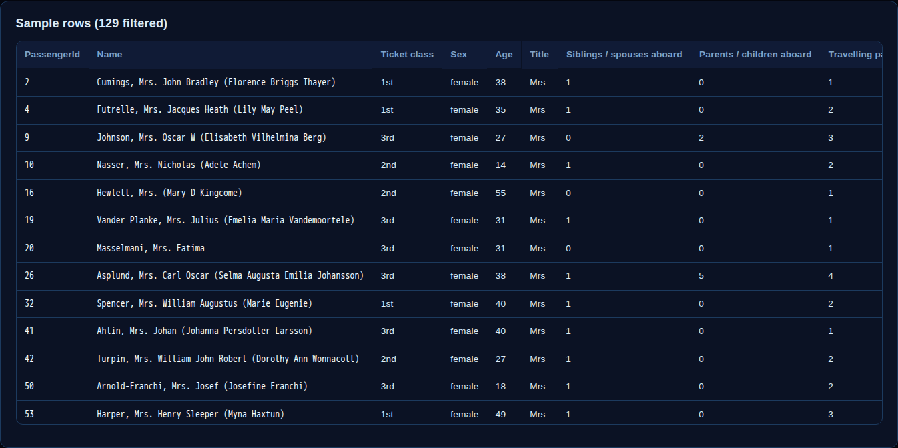</p>

**Footprint.** Titanic adds no pods or services. The model and its SHAP explainer are about
350 KB, preloaded by `prediction` at start-up like every other model. Both tabs are lazy-loaded
chunks (Voyage ~13 KB gzipped — it also carries `toxic_leadership`'s office scene — and Tutorial
~6 KB, plus their CSS), so no other scenario downloads them. The Voyage tab scores all 891
passengers in one batched call without SHAP (about 2.5 s), explains a passenger when clicked, and
caches both for the session, so re-opening it is instant. The survival
colours (#3f93eb / #ea4f58, grey midpoint) were validated for colour-vision deficiency and
contrast against the scene's night sky.

---

## Run it yourself

On a running cluster (see the main [README](../../README.md#getting-started)):

```bash
make k3s-pipeline
```

Then open <http://aiopen.localhost>, set **Domain → Tutorials** and open **Titanic Survival — ML
Tutorial**.

<p align="center">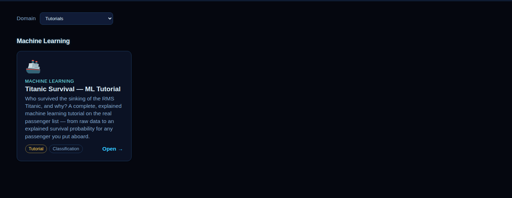</p>

To change the feature recipe, edit the script and regenerate the seed file, then re-run the
pipeline:

```bash
services/training/.venv/bin/python scripts/prepare_titanic_dataset.py
```

---

## Adding the next tutorial

A tutorial is a YAML file:

1. Add `scenarios/<slug>/` with the data under `sample_data/` and a `scenario.yaml` whose
   `industry` is `tutorial`.
2. Write the `tutorial:` chapters: markdown `body`, an optional `takeaway`, `charts`, and
   `widgets`. The schema rejects unknown chart columns and invalid example records at seed time.
3. Optionally, set `model.cv_folds` / `model.selection_metric` for a small dataset, and add a
   `ui_extras` tab that suits the story.
4. Restart `platform-registry` (it seeds scenarios), then run `make k3s-pipeline`.

The second tutorial, [Toxic Management & Work Environment](toxic_leadership.md), follows exactly this recipe and adds
free text (`type: text` features), a transformer challenger and an LLM rubric check. Good
candidates from the same notebook collection are *Student Admissions* and *House Prices*. The
**Society & Ethics** domain is ready for fairness-oriented datasets.

## Credits

- Data: [Kaggle — Titanic: Machine Learning from Disaster](https://www.kaggle.com/competitions/titanic)
- Original notebook: [angelmtenor/data-science-keras — titanic.ipynb](https://github.com/angelmtenor/data-science-keras/blob/master/notebooks/titanic.ipynb)
- Explanations: SHAP (Lundberg & Lee, 2017); model: LightGBM (Ke et al., 2017)
