# 🚩 Toxic Leadership — an NLP + ML tutorial

> Domain: **Tutorials** · Kind: `tabular_ml` (binary classification, free text + structured data) · Scenario: [`scenarios/toxic_leadership/scenario.yaml`](../../scenarios/toxic_leadership/scenario.yaml)

"People don't leave companies, they leave managers." Engineers write it in reviews every day:
directors who can't read code, visions made of buzzwords, credit taken and blame handed down.
This scenario turns **4,000 real Glassdoor reviews by software, data and AI engineers** into a
model that reads them. A gradient-boosting model combines what each engineer *wrote* with the
facts of their job, learns the vocabulary of bad leadership, and races a modern
sentence-transformer. An LLM coach reads any description of a leader's behaviour against a
research-based rubric.

<p align="center">
  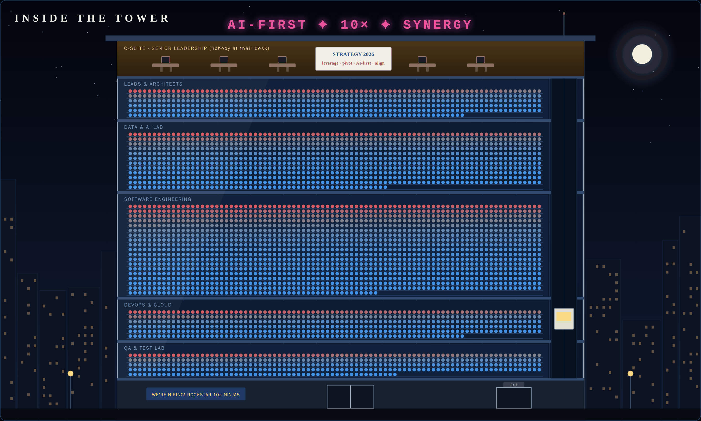
</p>
<p align="center"><sub>Every desk is a real review, seated by job family and coloured by the model's probability that the reviewer's leadership is failing them.</sub></p>

| | |
|---|---|
| **Question** | From what an engineer wrote, plus a few facts about their job, did they rate their senior management 1–2★? We predict a probability. |
| **Data** | 4,000 of the 838,566 reviews in Kaggle's *Glassdoor Job Reviews* (UK, 2008–2021): engineering roles only, employers anonymised. CC BY-SA 4.0 |
| **Inputs** | The review text (headline + cons), job family, employer sector, current/former, tenure, year, and the pay and work-life-balance ratings |
| **Model** | LightGBM tuned for small tables (`lightgbm_small_data`) on TF-IDF + the job context, selected over default LightGBM |
| **5-fold CV ROC AUC** | **0.869 ± 0.006** on the 3,200-review training split (default LightGBM: 0.857) |
| **Hold-out (800 reviews)** | ROC AUC **0.886** · accuracy 84.4% |
| **Transformer challenger** | voyage-4-nano embeddings + the same LightGBM: CV 0.881 ± 0.011 · hold-out 0.885 |
| **Tabs** | Scenario · **Tutorial** · Data & BI · ML Predictions · ML Insights · **The Office** (with the **Leadership check**) |
| **New platform capability** | `type: text` features: TF-IDF inside the model pipeline, SHAP explained word by word |

## Contents

- [The Office tab](#the-office-tab)
- [The Leadership check](#the-leadership-check)
- [The Tutorial tab](#the-tutorial-tab)
- [The data science](#the-data-science)
- [Bag of words vs transformers](#bag-of-words-vs-transformers)
- [How it is built](#how-it-is-built)
- [Run it yourself](#run-it-yourself)
- [Credits](#credits)

---

## The Office tab

A glass office tower at night, one floor per job family: Leads & Architects on top, then the
Data & AI lab, the open-plan Software Engineering floor, the DevOps & Cloud ops room and the QA
lab. Floors are sized from the data. The building has its own opinions: an "AI-FIRST ✦ 10× ✦
SYNERGY" neon on the roof, a C-suite penthouse with the lights on and nobody at the desks (the
whiteboard reads *Strategy 2026: leverage · pivot · AI-first · align*), an elevator that never
reaches the top floor, and a "We're hiring! Rockstar 10× ninjas" banner in the lobby next to
the exit.

All 4,000 reviews are scored in one fast call (probabilities only — about 4 s); a person is
SHAP-explained when you click them.

| Mode | What you see |
|---|---|
| **Model's prediction** | Probability of bad leadership, blue → grey → red. Within each floor the most likely are seated first. |
| **Reveal real ratings** | What the reviewer actually rated: bad leadership filled red, OK leadership as hollow blue rings. The reveal runs floor by floor. |
| **Model vs reality** | Only the reviews the model got wrong light up — often short, sarcastic or ranting about pay. |

<p align="center">
  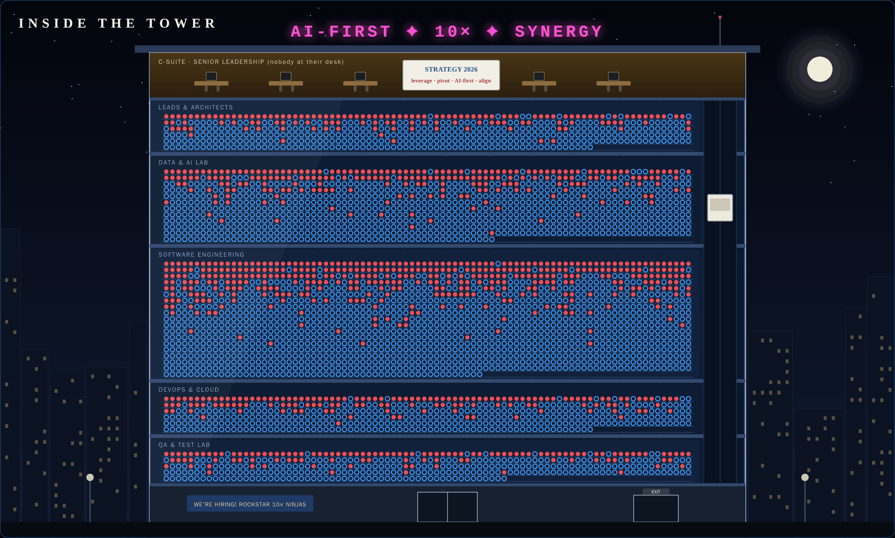
  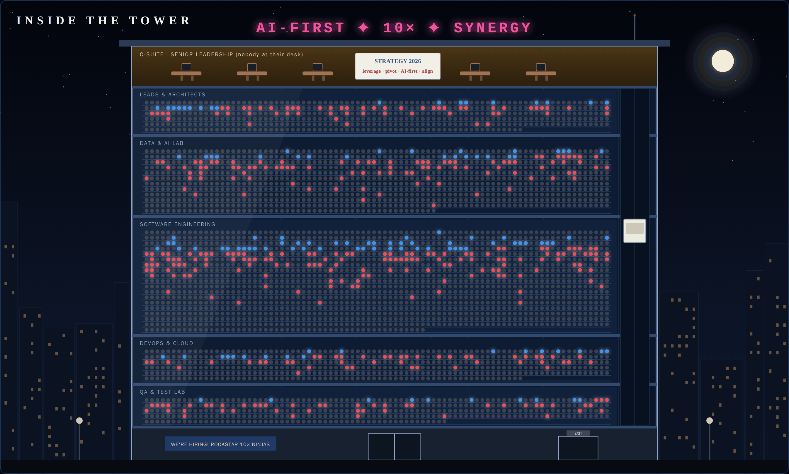
</p>

### One review, explained

Click a desk to read the review with every word coloured by how much it pushed the probability
(red toward bad leadership, blue away), a SHAP waterfall for the whole record, and the
**deployed TF-IDF model next to the transformer challenger** on the same review.

<p align="center">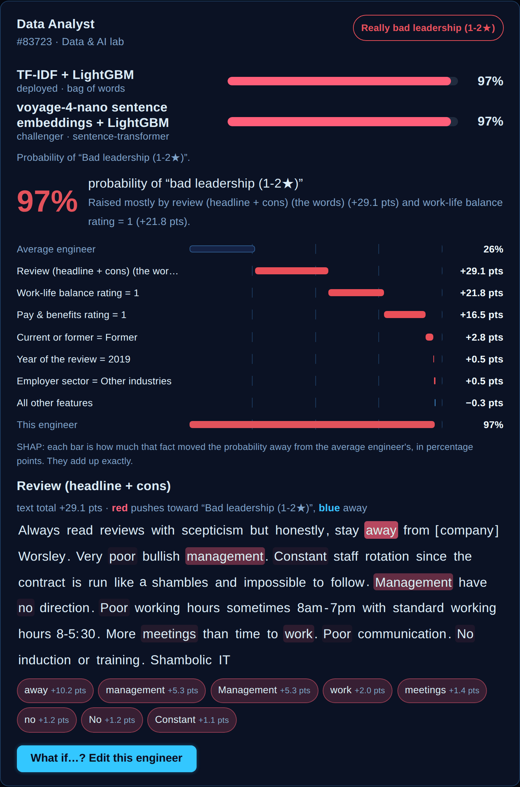</p>

### What if…?

Seven fictional archetypes are ready to edit: *The LinkedIn Visionary* (a Director of AI who
has never trained a model), *The Buzzword Machine*, *The Delegator-in-Chief*, *The
Micromanager*, *The Cornering Boss*, *The Tech Lead Who Still Codes* and *Underpaid but well
led*. Rewrite the review or change the ratings and the prediction, waterfall and word
highlights update live; **⚖ Compare with the transformer** scores the same text with the
challenger.

<p align="center">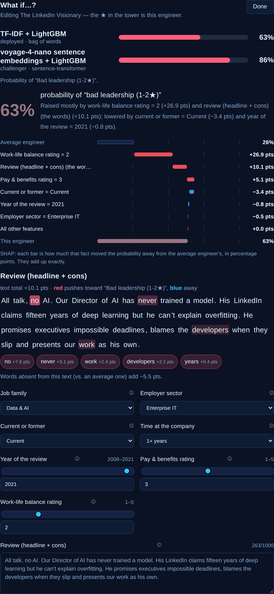</p>

---

## The Leadership check

Below the tower: describe what a leader **does** (no names) and three readers answer side by
side.

- **An LLM coach** (the platform's active model, through llm-gateway) reads the description
  against a research-based rubric and answers with a verdict, a balance from toxic to great,
  every behaviour it found **quoted from your text** (each quote is checked; one that isn't
  verbatim is marked), and practical advice.
- **The TF-IDF model** and **the transformer challenger** score the same text as a review, with
  the words highlighted.

The rubric lives in the scenario YAML (`rubric_check`). The positive side follows **Google's
Project Oxygen** (coaching, empowering without micromanaging, psychological safety, clear
vision, technical skill to advise the team, strong decisions, honesty). The negative side
follows the **Toxic Leadership Scale** (Schmidt, 2008: abusive, authoritarian, narcissistic,
self-promoting, unpredictable) plus the patterns engineers report most: dishonesty and
credential inflation, blame-shifting, offloading their own job onto the team, no technical
depth or curiosity, cornering people who disagree, and disengagement.

<p align="center">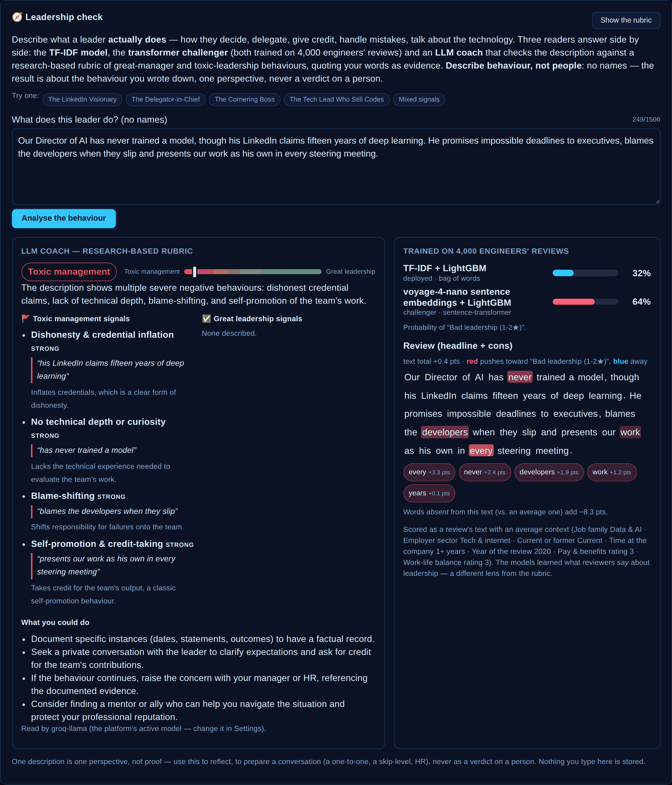</p>

It assesses the **behaviour described, never a person**: the UI says so, the prompt forbids
names and diagnoses and treats the description as data (never as instructions), and nothing
typed is stored. The two kinds of reader disagree in instructive ways. The models learned how
anonymous *reviewers* write, so a carefully worded description can score low even when the
behaviour is clearly toxic.

---

## The Tutorial tab

Thirteen chapters, every chart, metric and prediction live:

| # | Chapter | Live widgets |
|---|---|---|
| 1 | Frame the problem — why ROC AUC, not accuracy | class balance |
| 2 | Meet the data | dataset preview |
| 3 | Clean, anonymise, de-leak — the **halo effect** | ablation table |
| 4 | Text is data: tokens → n-grams → TF-IDF (why `not` stays) | |
| 5 | Explore: is it the money, the hours — or the manager? | 4 charts |
| 6 | Combine text and structure: gradient boosting | model leaderboard |
| 7 | Evaluate honestly | ROC curve, confusion matrix |
| 8 | Bag of words vs transformers | benchmark table |
| 9 | The vocabulary of toxic leadership | global importance, red/green-flag terms |
| 10 | Read a review like the model | 6 examples, highlighted, with the challenger's score |
| 11 | NLP pitfalls — sarcasm, negation, proxies, shortcuts | |
| 12 | Responsible AI: reviews, not people | |
| 13 | Your turn | |

<p align="center">
  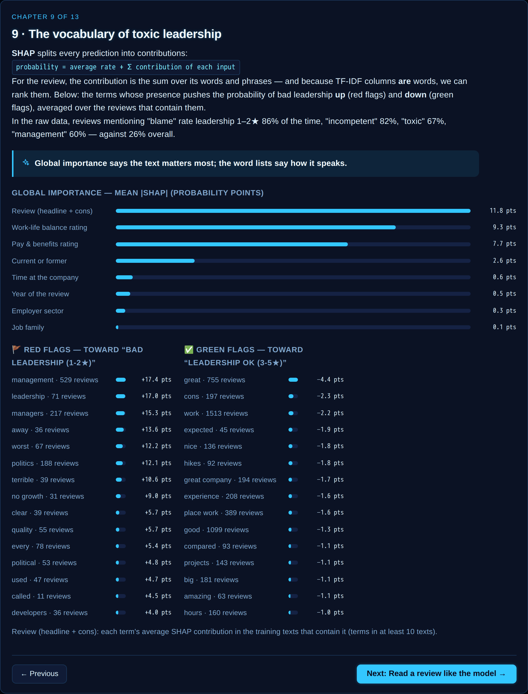
  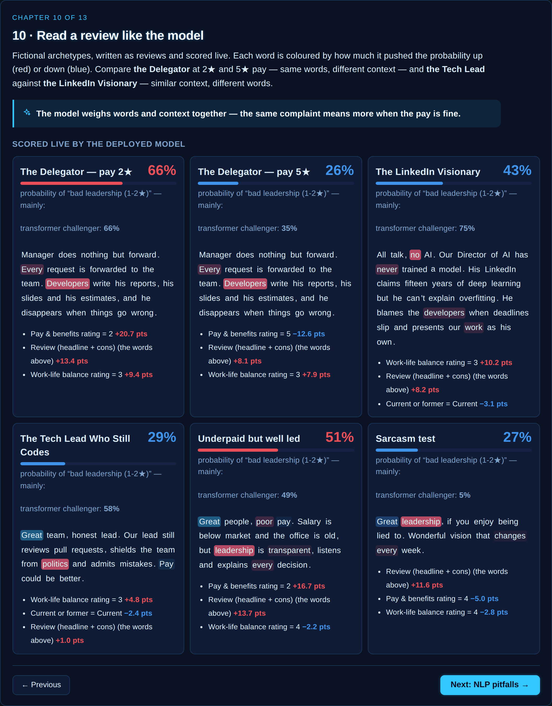
</p>
<p align="center">
  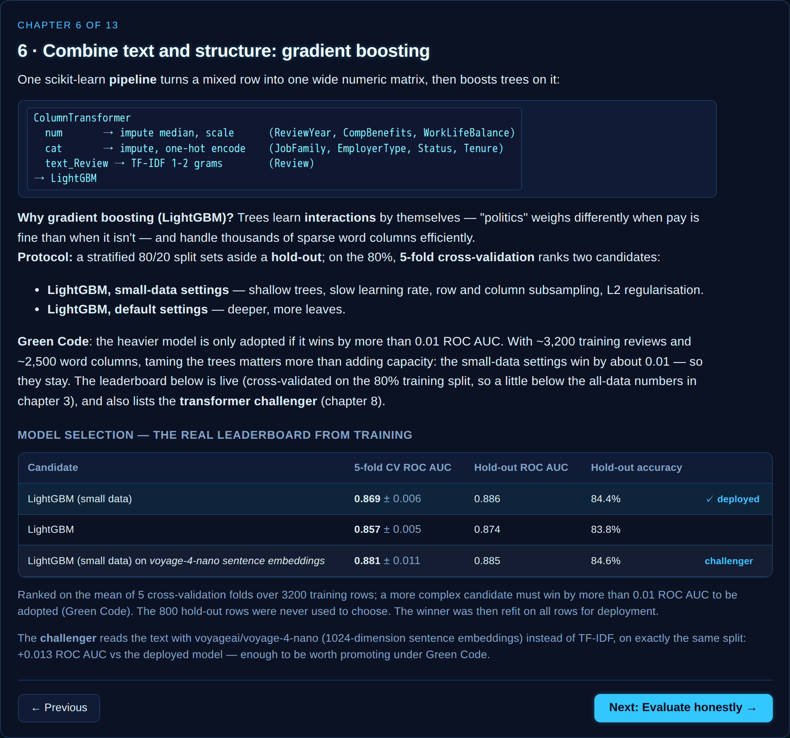
  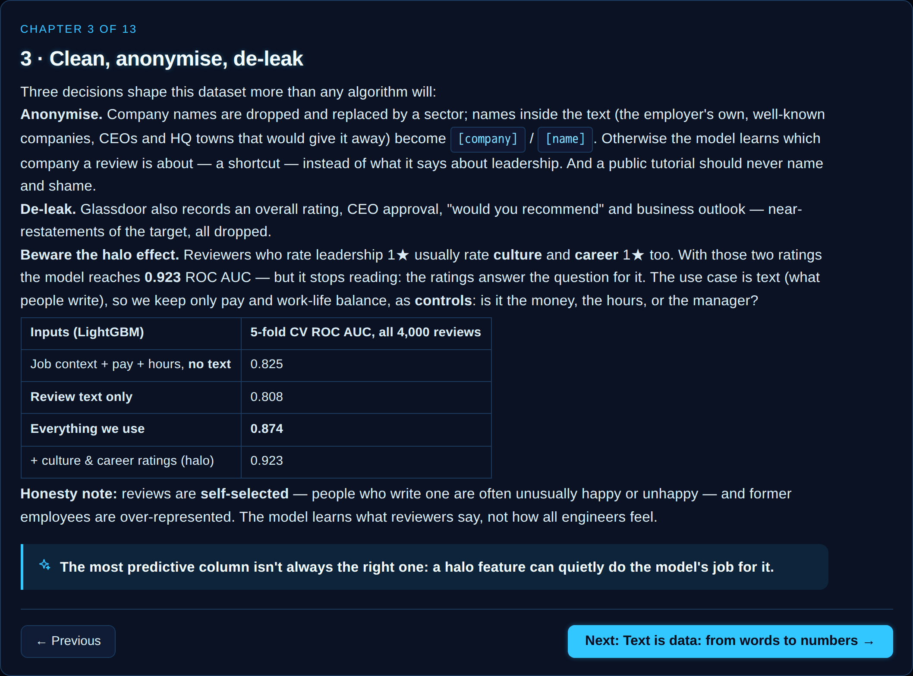
</p>

---

## The data science

### Preparation

[`scripts/prepare_toxic_leadership_dataset.py`](../../scripts/prepare_toxic_leadership_dataset.py)
downloads a pinned mirror of the Kaggle file, verifies its SHA-256 and:

- keeps **engineering roles only** — job titles matched into five job families (first match
  wins, so a *Lead Data Scientist* is Data & AI);
- sets the target: **BadLeadership** = the Senior Management rating is 1–2★ (26% of reviews);
- **anonymises**: the employer becomes a coarse sector; the employer's own name, well-known
  companies, public executives and HQ towns become `[company]` / `[name]` inside the text and
  job title; e-mails and URLs are removed;
- **de-leaks**: overall rating, CEO approval, "would recommend" and outlook are dropped, and so
  are the culture and career ratings (the **halo effect** — see below);
- builds **Review** = headline + cons, cut at 1,000 characters, and drops duplicates;
- draws a stratified, seeded sample of 4,000 (Data & AI deliberately over-sampled: 1,000).

`--ablation` prints the comparison the tutorial quotes (5-fold CV on all 4,000 reviews):

| Inputs (LightGBM, small-data settings) | ROC AUC |
|---|---|
| Job context + pay + hours, no text | 0.825 |
| Review text only | 0.808 |
| **Everything we use** | **0.874** |
| + culture & career ratings (halo) | 0.923 |
| Everything, default LightGBM settings | 0.866 |

The halo ratings would make the model *look* better while making it useless for the question
at hand: someone who rates leadership 1★ rates culture 1★ too, so the model would stop reading.

### Text as features

The review is a `type: text` feature, vectorised **inside** the model pipeline, so the deployed
model reads raw text: unigrams + bigrams (`upper management`, `no direction`), terms in at least
5 reviews, at most 3,000, log-scaled TF, and sklearn's English stop words **minus the negations**
(`no`, `not`, `never`, `without`, …). SHAP runs on the TF-IDF columns; each term's contribution
is summed back into one `Review` bar for the waterfall and split over the words of the text for
the highlights (a bigram's share goes half to each word). What the words *absent* from a
review contribute (vs. an average review) is shown as the remainder.

### Model selection and honest numbers

Gradient boosting only, simplest settings first (Green Code: a heavier candidate must win by
more than 0.01 ROC AUC). The small-data settings win (0.869 vs 0.857). On the untouched 800-review
hold-out the deployed model reaches ROC AUC 0.886.

Things to keep in mind: reviews are **self-selected** and former employees over-represented;
bad-leadership ratings drift from about a third of reviews before 2017 to under a fifth in
2020–21; the data is UK English, 2008–2021.

### Responsible AI

The model reads **anonymous reviews about organisations**. It must never be used to score a
named manager, rank employees or monitor what staff write. No text model can see whether a CV
or LinkedIn profile is true, or how good someone is technically — that takes evidence:
technical conversations, work samples, references.

---

## Bag of words vs transformers

The same LightGBM, the same folds, four ways to read the text (5-fold CV on all 4,000 reviews):

| Text encoder | Text only | Text + job context |
|---|---|---|
| TF-IDF (bag of words, 1972) | 0.808 | 0.874 |
| all-MiniLM-L6-v2 (22M parameters) | 0.816 | 0.876 |
| all-mpnet-base-v2 (110M) | 0.831 | 0.881 |
| **voyage-4-nano** (the platform's `local-embed`) | **0.837** | **0.881** |

Transformers read text alone clearly better (+0.03); combined with the job context the gap
shrinks to about +0.01: +0.007 above, +0.012 in the live leaderboard's cross-validation, and a
tie on the hold-out (0.886 vs 0.885). The costs are real: voyage-4-nano embeds all 4,000
reviews in seconds on a laptop GPU (RTX 4070) but would take about 40 minutes on the cluster's
CPU; every live prediction needs a round-trip to the embedding model (~0.6 s vs ~0.1 s); and
its 1,024 dimensions don't map to words.

So the platform deploys the TF-IDF model and trains a **voyage-4-nano + LightGBM challenger** on
the same split every run. The model card flags when the challenger clears the Green Code bar;
promoting it is a human decision.

---

## How it is built

Everything is generic platform code driven by the scenario YAML; nothing is specific to this
scenario.

- **`type: text` features** (`libs/shared` schema): etl-tabular keeps them as strings; training
  adds a `text_<column>` TF-IDF step to the pipeline and records `text_term_importance` (each
  term's mean SHAP where present) in the model card; prediction rolls the term columns up
  server-side and, with `explain_text` (≤ 50 records), returns each word's span and weight.
  `explain: false` scores a whole dataset without SHAP (TreeExplainer costs ~5 ms per row).
- **The challenger** (`model.text_challenger`): embeddings are computed *outside* the sklearn
  pipeline (each text column becomes `<column>__emb_<i>` numeric columns), so nothing custom is
  pickled and no torch is needed in training or prediction. `make k3s-text-embeddings` embeds the
  dataset on the host GPU with the exact model llm-gateway serves (dl-training's
  `dl-training-embed-texts`) into a SeaweedFS cache; training checks a few cached vectors against
  the gateway (cosine ≥ 0.99) before using it. Prediction serves it as `/predict`
  `model: "challenger"`, embedding live through `local-embed`.
- **The rubric check** (`rubric_check`): assistant's `POST /rubric-check/{slug}` builds the prompt
  from the YAML rubric, calls the active model at temperature 0 (tenant `user` + Langfuse
  metadata like every chat), and validates the JSON answer against the rubric — unknown keys
  dropped, polarity taken from the rubric, quotes checked against the text.
- **The Office**: VoyageView became a scene-agnostic engine (`scenes.ts`); `officeScene.tsx` draws
  the tower and sizes the floors from the data, next to the liner (`voyageScene.tsx`).
  `positive_is_adverse` colours the positive class red when it is the bad outcome.

```yaml
# scenarios/toxic_leadership/scenario.yaml (abridged)
dataset:
  index_col: ReviewId
  display_columns: [JobTitle]
  target: BadLeadership
  feature_schema:
    Review: {type: text, label: "Review (headline + cons)", max_length: 1000}
    CompBenefits: {type: numeric, label: "Pay & benefits rating", min: 1, max: 5, default: 3}
    # … JobFamily, EmployerType, EmployeeStatus, Tenure, ReviewYear, WorkLifeBalance
model:
  candidates: ["lightgbm_small_data", "lightgbm"]
  selection_metric: roc_auc
  cv_folds: 5
  text_challenger:
    embedding_model: local-embed
    hf_model_id: "voyageai/voyage-4-nano"
    label: "voyage-4-nano sentence embeddings"
ui_extras: {kind: voyage_explorer, scene: office_tower, tab_label: "The Office", zone_by: JobFamily, positive_is_adverse: true, …}
rubric_check: {title: "Leadership check", text_feature: Review, positive: […], negative: […], guidance: …}
tutorial: {positive_is_adverse: true, steps: […13 chapters…], examples: […]}
```

---

## Run it yourself

On a running cluster (see the main [README](../../README.md#getting-started)):

```bash
make k3s-pipeline
```

That trains the deployed TF-IDF model. For the transformer challenger, embed the reviews on this
machine's GPU (CPU works too, much slower) and retrain:

```bash
make k3s-text-embeddings SCENARIOS=toxic_leadership
```

Then open <http://aiopen.localhost>, set **Domain → Tutorials** and open **Toxic Leadership — NLP + ML
Tutorial**.

<p align="center">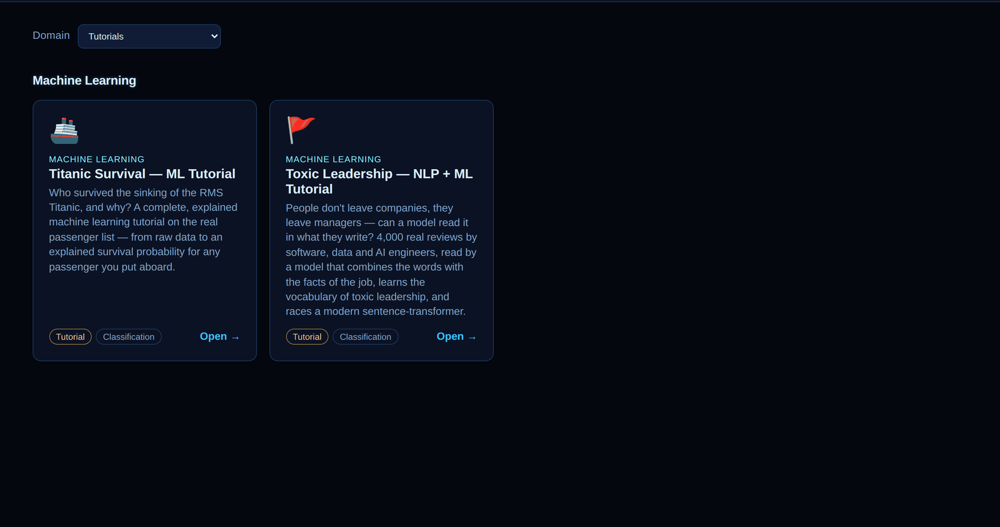</p>

To change the recipe, edit the script and regenerate the seed file (and the tutorial's ablation
numbers), then re-run the pipeline:

```bash
cd services/training && uv run python ../../scripts/prepare_toxic_leadership_dataset.py --ablation
```

---

## Credits

- Data: [Kaggle — David Gauthier, Glassdoor Job Reviews](https://www.kaggle.com/datasets/davidgauthier/glassdoor-job-reviews)
  (CC BY-SA 4.0). The derived CSV is shared under the same licence — see
  [`sample_data/README.md`](../../scenarios/toxic_leadership/sample_data/README.md).
- Great managers: Google re:Work, *Project Oxygen* (2008, updated 2018)
- Toxic leadership: A. A. Schmidt, *Development and validation of the Toxic Leadership Scale* (2008)
- TF-IDF: K. Spärck Jones (1972); explanations: SHAP (Lundberg & Lee, 2017); model: LightGBM (Ke et al., 2017)
- Sentence embeddings: [voyageai/voyage-4-nano](https://huggingface.co/voyageai/voyage-4-nano),
  [sentence-transformers](https://www.sbert.net/) (MiniLM, MPNet)
