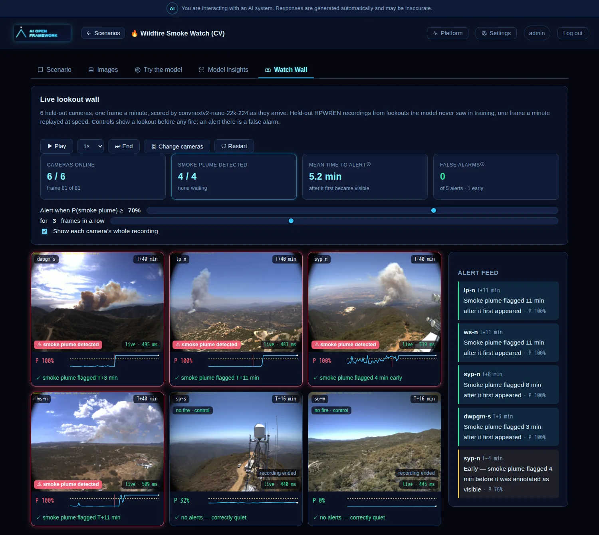
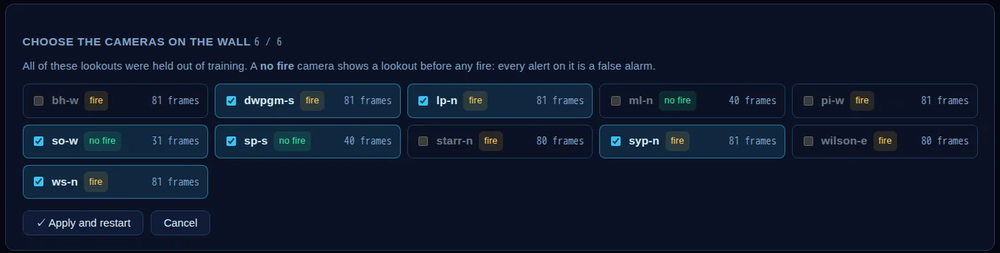
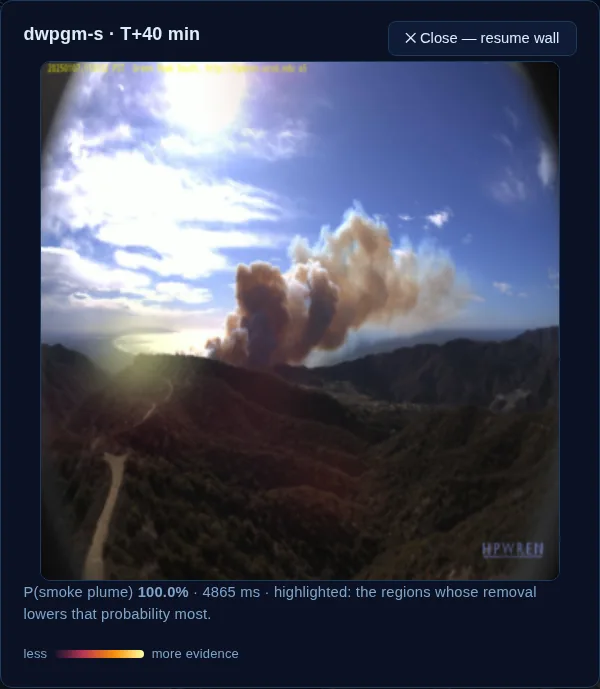

# 🔥 Wildfire Smoke Watch — a wall of lookout cameras that raises the alarm

> Domain: **Public sector** · Kind: `deep_learning` (image classification over frame sequences) · Scenario: [`scenarios/wildfire_smoke_watch/scenario.yaml`](../../scenarios/wildfire_smoke_watch/scenario.yaml)

Fire lookouts watch a horizon for the first thin column of smoke. This scenario replaces the
watcher with a small model and puts six real lookout cameras side by side: they replay recorded
ignitions at speed, every frame is scored by the deployed model **as it arrives**, and an alert is
raised when smoke persists for two frames in a row. The wall then measures what a real operator
would care about — how many minutes after the plume first became visible each camera spoke up, and
whether any camera cried wolf first. Some feeds are **no-fire controls** (a lookout before any fire:
every alert on one is a false alarm), and you choose which six of the eleven held-out cameras play.

<p align="center">
  
</p>
<p align="center"><sub>The default wall: four fires and two no-fire controls, at the end of their recordings. Images courtesy of <a href="https://www.hpwren.ucsd.edu/">HPWREN</a>, UC San Diego.</sub></p>

| | |
|---|---|
| **Question** | Is there a smoke plume anywhere in this lookout frame — and how quickly does a live alarm catch a fire that nobody has reported yet? |
| **Data** | **HPWREN Fire Ignition images Library (FIgLib)** — fixed lookout cameras in Southern California. Each recording is **81 frames, one a minute, from 40 minutes before to 40 minutes after** the plume first becomes visible; the frame file name (`<unix_ts>_<±offset seconds>.jpg`) *is* the ground truth. 25 recordings are used, one per lookout station (~1.7 GB, downloaded once, pinned by SHA-256, **never committed**). |
| **Split** | **By lookout, not by frame.** 12 lookouts train (843 frames), 2 validate/calibrate (140), and **11 are held out (757 frames) — stations the model has never seen**: 8 fires plus 3 **no-fire controls** (the pre-ignition half of a lookout, `clear_only`; the wall shows only the first 25 frames, stopping 15 minutes before the annotated start). The Watch Wall shows six at a time. The scenario's own tests refuse a YAML in which a station appears in two places. |
| **Model** | `facebook/convnextv2-nano-22k-224` fine-tuned (15.0 M parameters) at 320 px, **60 MB ONNX**, served by the same CPU-only `dl-inference` pod as the other vision scenarios — no extra container, no extra memory ceiling. |
| **Target** | `Clear` / `Smoke` per frame |

## What the Watch Wall shows

All six feeds advance on one clock (one frame per 0.7 s, so the 81-frame recording plays in about a
minute; a control has fewer frames and shows *recording ended* once it runs out). Each tick, every tile's current frame is sent to `dl-inference`'s `POST /predict` and the
tile says honestly where its number came from:

- **`live · 230 ms`** — the model really scored this frame just now.
- **`replay`** — the answer wasn't back in time, the speed is above 4×, or the service is down; the
  tile uses the model's precomputed score for that frame instead. Same model, same frame — but the
  UI never claims an inference it didn't make.

An **alert** is the alarm switching on after *N* consecutive frames at or above the threshold
(defaults: 70 %, 3 frames; both are sliders). It is timed against the recording's ground truth:
**minutes after the plume first became visible** (the detection delay). An alert up to 5 minutes
*before* that is an **early detection** — the annotation is when a person first saw the plume, so
the model may fairly see it sooner — and anything earlier is a **false alarm**; on a control, any
alert is one. Each tile ends with a one-line verdict (`✓ flagged T+11 min`, `✓ correctly quiet`, …). **🎛 Change cameras** opens a picker over all eleven held-out
lookouts (fires tagged `fire`, controls `no fire`); the default wall is four fires and two controls.
Drag the threshold and every KPI recomputes instantly; tick *Show each camera's whole
recording* to overlay the entire probability curve; click a tile to pause the wall and trace where
the model sees smoke (an occlusion heatmap — about 4 s on the CPU pod).

<p align="center">
  
</p>

<p align="center">
  
</p>

## What it gets right, and what it doesn't

Measured on the eleven unseen lookouts, **every frame included** — even the first minutes after
ignition, when the plume is a few pixels and no model (or person) can tell:

| | |
|---|---|
| Frame accuracy / macro-F1 | **89.3 %** / 0.890 |
| AUROC | **0.914** |
| Default wall (4 fires + 2 controls), 70 %, 3 frames | **4 / 4 fires detected**, mean **5.2 min** after the plume first appeared; **both controls silent; 0 false alarms**, 1 early detection (`syp-n`, 4 min before its annotation) |
| Same wall at the old 50 %, 2 frames | the same fires, but **4 false alarms** on `syp-n` before its ignition |
| Calibration | ECE 0.076 — the temperature fit on two validation lookouts made it *worse* than the raw model (0.045); read the probabilities as a ranking, not as frequencies |

Things to know about those wall numbers:

- **The alert rule was tuned on what you see.** I chose 70 % / 3 frames *after* watching `syp-n` raise
  false alarms at 50 % / 2, on the same held-out cameras the wall shows. So the wall is optimistic;
  an honest estimate needs a threshold fixed on the two validation lookouts, or a fresh set of cameras.
- **`syp-n` is a hard lookout.** A white cumulus-like puff sits on its left horizon for the whole
  recording (already there at −36 min) and a bird crosses the sky at −22 min, where the model hits 99 %.
  The model does see real haze rising from about −7 min, a few minutes before the annotation.
- **`ml-n` is not a clean control after −15 min.** Its smoke probability jumps to 83 % at −14 min and
  98 % at −1 min: a real plume was visible before the annotated start. The wall therefore stops every
  control 15 minutes before the annotation (`control_margin_seconds`), so none can reach a fire.
- **They move between training runs.** GPU training is not bit-for-bit repeatable. An earlier run of
  the same recipe, on a different six-fire wall, detected 6 / 6 with no false alarms and a 10.2 min mean.
- **A camera already ringing at ignition counts as detected at once**, and an early alert counts as a
  detection with a negative delay, which pulls the mean down.

Why the model is not better, and why that is the honest answer:

- **The first minutes are ambiguous by construction.** Offset 0 is when a human annotator first
  saw the plume. Frames in the next 10 minutes are left out of training and validation (teaching a
  network to "see" smoke that is a handful of pixels teaches it to hallucinate), but they stay in
  the wall and in the test score — so the delay you see is the real one.
- **The wall's fires differ in difficulty.** `pi-w` and `bh-w` have faint plumes; `dwpgm-s`, `lp-n`, `syp-n` and `ws-n` are unmistakable. Swap them in with the picker to see the model struggle.
- **Twelve training lookouts is a small world.** Haze, low sun, cloud and dust differ per mountain
  top. More recordings would help; the YAML lists them, no code changes.
- **The data had to be chosen by eye.** In many FIgLib recordings the plume stays a few dozen pixels
  even after 40 minutes, which a 320 px whole-frame classifier cannot resolve. Most of the 25
  recordings used are ones where a plume is clear by roughly the 25-minute mark. A production system
  would use full-resolution tiles (the SmokeyNet approach) and a much larger model.

## How it fits the framework

No scenario-specific code. A new **data source type**, `http_frame_sequences`, reads per-camera
`.tgz` archives (each digest-checked, cached in the tenant's SeaweedFS bucket under `raw/`); the
trainer publishes the held-out frames **in recording order** with each frame's camera (`group`) and
frame offset in seconds (`seq`); and the generic `camera_wall` tab in `ui-react` renders any
scenario with that shape. `dl-inference` warms a `camera_wall` model first at start-up, because it
fires a request per camera per tick. See [`scripts/prepare_figlib_sequences.py`](../../scripts/prepare_figlib_sequences.py)
to choose recordings and regenerate the pinned `source:` block.

```bash
make dl-train SCENARIOS=wildfire_smoke_watch   # ~3 min on a laptop GPU; downloads the 25 archives first
make k3s-dl-build k3s-dl-up                    # the optional deep-learning overlay (dl-inference)
```

## Credits and terms

Images courtesy of the **High Performance Wireless Research and Education Network (HPWREN)**,
UC San Diego — <https://www.hpwren.ucsd.edu/>. Their terms ask for a credit reference to that
address in derivative work and provide the data as-is; keep it next to any screenshot or video of
this scenario. Dobbins et al., *FIgLib & SmokeyNet: Dataset and Deep Learning Model for Real-Time
Wildland Fire Smoke Detection*, Remote Sensing 2022. No frame is stored in this repository.

**Demonstration only.** This is not a fire detection system and must never stand in for a lookout,
a 911 call or an official alert.
