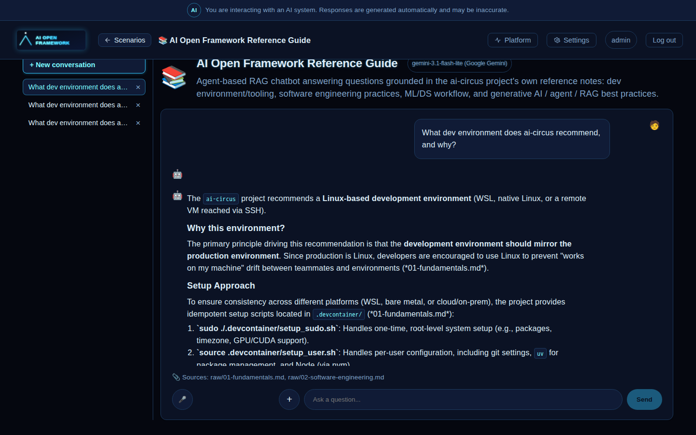

# Kubernetes (k3s) — local single-node dev

Dev-parity manifests for running this platform on a local [k3d](https://k3d.io/) cluster
(k3s-in-Docker) instead of `docker compose` — **not** a production/multi-node setup. Images are
built locally and imported straight into the cluster's containerd (no registry, no
`imagePullSecrets`), and k3d's bundled Traefik serves the exact same `*.localhost` hostnames the
compose setup uses, so `make verify`'s checks are reusable unchanged.

## Why k3d

The rest of this repo's tooling is Docker-based (`docker build`, `docker compose`) — k3d runs k3s
*inside* Docker, so `k3d image import` reuses the same local image cache `make k3s-build` already
populated, with none of bare k3s's systemd install footprint or `k3s ctr images import`
tarball round-trip.

## Prerequisites

- Docker (already required for the rest of this repo)
- [`k3d`](https://k3d.io/#installation)
- [`kubectl`](https://kubernetes.io/docs/tasks/tools/#kubectl)
- `.env` and `infra/traefik/console.htpasswd`/`infra/seaweedfs/s3.json` already bootstrapped —
  run `make bootstrap` first if you haven't (see root README's "Getting started")

## Layout

```
k8s/
  base/            # namespace, shared config, infra (postgres/logto/qdrant/seaweedfs),
                    # every backend Deployment + Service + IngressRoute, kustomization.yaml
  jobs/             # etl-tabular / training / etl-vectorize — one-shot batch.Job manifests,
                    # applied manually via `make k3s-pipeline`, not part of `make k3s-up`
```

Plain YAML + a single Kustomize base — no overlays, no Helm chart. This is deliberately as flat
as a working setup allows: dev-parity for one local cluster doesn't need per-environment overlays.

## Workflow

```bash
make k3s-cluster    # create the local k3d cluster (idempotent) — port 80, ./scenarios bind-mounted
make k3s-build      # docker build every service image, tagged ai-circus/<service>:local
make k3s-import     # import those images into the k3d cluster's containerd
make k3s-secrets    # generate the per-workload/traefik-basicauth/seaweedfs-s3-config Secrets
make k3s-up         # kubectl apply -k k8s/base
make k3s-wait       # wait for every pod to actually be Ready (not just Running)
make k3s-pipeline   # optional: run the churn ETL -> training pipeline as k8s Jobs
make k3s-verify     # reuse `make verify`'s curl checks against this cluster
```

Or run the first six of those in one shot with `make k3s-all` (still run `make k3s-pipeline`/
`make k3s-verify` yourself afterward — they're not part of it since they're optional/verification
steps, not "getting the cluster up").

### Pausing vs. tearing down

Not working the demo but staying in WSL? `k3d cluster stop/start` stops the cluster's containers
(freeing CPU/RAM) without deleting any pod, volume, or Secret state — much cheaper than deleting
and redoing `k3s-all` later:

```bash
make k3s-pause     # stop the cluster's containers — state is kept
make k3s-resume    # start it back up — run `make k3s-wait` after to confirm pods are Ready
```

This is different from `make k3s-down` (deletes the applied k8s manifests, cluster keeps running)
and `k3d cluster delete ai-circus` (deletes the cluster itself, full wipe including volumes) —
see "Tear down" below.

Open `http://aiopen.localhost` once `k3s-verify` passes — same login flow as the docker-compose
setup. **Before logging in**, start a standing port-forward so the browser can reach
`platform-registry`'s loopback-only API (`ui-react`'s bundled default for
`VITE_PLATFORM_REGISTRY_URL` is `http://localhost:8010`, matching docker-compose.yml's
`127.0.0.1:8010` host-published port — `k3s-verify`'s own port-forward only lives for that one
command, so real browser use needs its own):

```bash
kubectl -n ai-circus port-forward svc/platform-registry 8010:8000 &
```

Without it, login fails client-side with a generic `Failed to fetch` (the `/llm-settings/
active-model` call gets `ERR_CONNECTION_REFUSED` — check the browser devtools Network tab, not
just `make k3s-verify`, which only exercises curl-reachable Traefik routes and won't catch this).
Re-run `make k3s-secrets` any time `.env`/`infra/traefik/console.htpasswd`/
`infra/seaweedfs/s3.json` change; re-run `make k3s-build k3s-import` and
`kubectl -n ai-circus rollout restart deployment/<service>` after code changes.

To actually tear down (not just pause — see above): `make k3s-down` deletes the applied manifests
(StatefulSet PVCs are retained by k8s convention), or `k3d cluster delete ai-circus` for a full
wipe including all volumes.

## Verified

The full `k3s-cluster` -> `k3s-verify` -> `k3s-pipeline` sequence above, plus a real browser
session (login, an ML prediction with SHAP, and a RAG chat turn), all pass against this manifest
set on a local k3d cluster:

| Login | ML prediction (SHAP) | RAG chat |
| --- | --- | --- |
|  |  |  |

## Design notes

- **Secrets are never committed.** `make k3s-secrets` (`scripts/k3s_generate_secrets.sh`) creates
  them from local, gitignored files — the same rule `.env` itself follows. `.env` stays the single
  file you edit, but the script fans it out into one small Secret per workload (`postgres-
  credentials`, `prediction-secrets`, `rag-agent-secrets`, ...), each containing only the keys that
  workload's docker-compose.yml `environment:` block actually uses — not one `app-env` blob handed
  to every pod, so compromising one service doesn't leak every credential in the system. Each pod's
  `envFrom` points at its own Secret, plus a small number of explicit `env:` overrides for keys
  docker-compose.yml itself renames (e.g. `LLM_GATEWAY_API_KEY` from `.env`'s `LITELLM_MASTER_KEY`)
  or that must be a k8s-internal literal (e.g. `LOGTO_JWKS_URL`).
- **`./scenarios` is a `hostPath` volume**, mounted at `/app/scenarios` in every pod that needs
  it — the k8s-native equivalent of docker-compose.yml's read-only bind mount, viable here because
  this is single-node local dev. `make k3s-cluster` bind-mounts the repo's `scenarios/` directory
  into every k3d node at `/scenarios` for this to resolve.
- **Traefik `IngressRoute`/`Middleware` CRDs**, not plain `Ingress` — k3s ships Traefik already,
  and its CRDs let the `Host(...)` rules and the `admin-basicauth` gate (on `admin.logto.localhost`
  and `console.objectstore.localhost`) carry over almost verbatim from docker-compose.yml's own
  Traefik labels.
- **`securityContext.runAsNonRoot: true` always needs `runAsUser: 1000` alongside it**, for every
  `services/*` Deployment/Job. Each of those Dockerfiles sets `USER app` (a name, not a UID), and
  the kubelet can't verify "non-root" from a name alone — it refuses to start the container with
  `Error: container has runAsNonRoot and image has non-numeric user (app), cannot verify user is
  non-root`, surfacing as `CreateContainerConfigError` (a *different* root cause than the missing-
  secret-key version of that same status — see the `k3s-deploy-verify` skill's gotchas). `1000` is
  the UID `useradd --create-home` assigns `app` in every one of those Dockerfiles (confirmed via
  `docker run --rm <image> id`); `postgres`/`logto`/`qdrant`/`seaweedfs`/`ui-react`/`agui-voice`
  deliberately skip `runAsNonRoot` instead (see their manifests' comments) since they either need
  root for entrypoint chown/bind logic or (`agui-voice`) have no non-root `USER` yet.
- **`ui-react` needs no separate build.** Its backend base URLs are baked in at `docker build` time
  via `VITE_*` args, defaulting to the same `*.localhost` hostnames this cluster's Traefik also
  serves — so the same image `make k3s-build` produces works unchanged. A runtime-injected
  `/config.js` (see `ui-react/src/config.ts`) would only be needed for a cluster using different
  hostnames — out of scope here.
- **Optional Ollama and the one-shot pipeline services are intentionally excluded** from
  `k8s/base/`'s default `k3s-up` — Ollama mirrors compose's own opt-in `profiles: ["ollama"]`
  (add a Deployment/PVC for it yourself if you need the free local LLM fallback here too), and the
  pipeline services are `k8s/jobs/*` applied only via `make k3s-pipeline`, matching their
  one-shot, non-`k3s-up` nature in docker-compose.yml too (`profiles: ["pipeline"]`).
- **`rag-agent`/`form-agent` readiness/liveness probes are deliberately loose**
  (`timeoutSeconds: 5`, `failureThreshold: 6`) — their FastAPI startup makes a live call to
  `llm-gateway` (embedding dimension probe), which queues behind every other scenario service
  doing the same thing during a cold `k3s-up` on a single-node cluster. The default 1s probe
  timeout flakes under that concurrent cold-start load and CrashLoopBackOffs the pod even though
  the app itself starts fine.
